## Customer Due Diligence (CDD)

Every Polymesh account must pass a **minimal identity verification** before the account is permitted to transact with regulated securities on the network. This minimal verification is called **customer due diligence (CDD)**.

Verifying your identity for CDD purposes means working with a CDD service provider. They will verify the information you send and write an identity claim to the chain for you.

## Assign account

When you first create an account it will show as an unassigned key. This means there is no onchain identity associated with it.

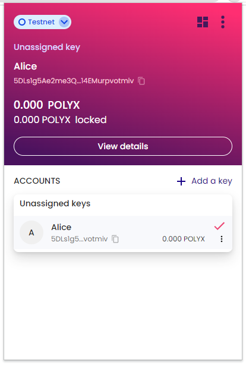

The `Assign` button appears when you hover over an unassigned signing key. The associated link will take you to the account context tab in the Polymesh Portal [Polymesh Mainnet](https://portal.polymesh.network/) or [Polymesh Testnet](https://portal.polymesh.live/) dashboard. From here, you can select `Verify Identity` to begin the onboarding process.

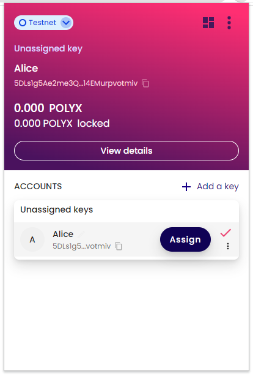

When connecting to Polymesh Portal for the first time you will be prompted to authorize it to communicate with your wallet. Select a compatible wallet and click on it. 

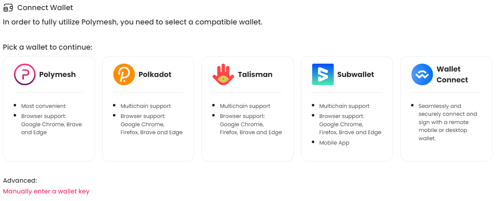
Note: You can enter a key manually by clicking on 'Manually enter a wallet key'. Manually entered keys that are not stored in the connected wallet and only allow view-only functionality. To fully utilize Polymesh, you need to connect a key stored in a supported wallet.

On the next screen, select the wallet address to connect and click on 'Proceed'.
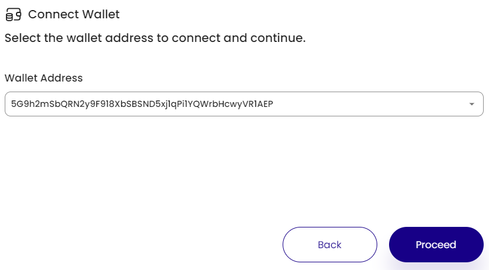

## Complete the Customer Due Diligence process

When connecting to the Polymesh Portal for the first time you will be prompted to authorize it to communicate with your Polymesh Wallet. Press `Authorize` in the wallet popup to allow the page to connect and then click on the wallet you installed then select the account you wish to connect.

Click the `Verify Identity` button to begin the onboarding process.
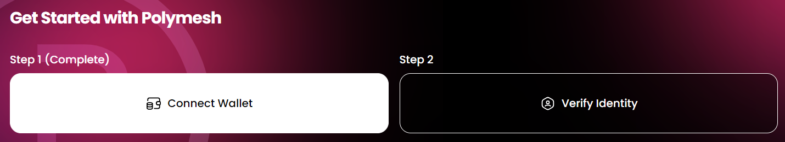

You will be presented with the below screen. Click on the CDD provider's card you wish to onboard with.
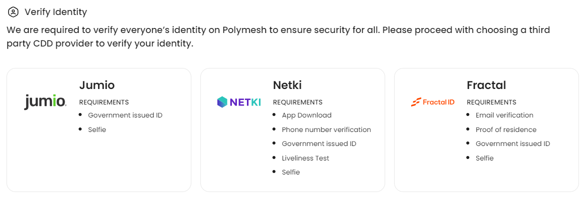

Follow the instructions on the screen to onboard with the chosen CDD provider. Once you finish the onboarding application, the portal will show the Pending status for the identity verification.

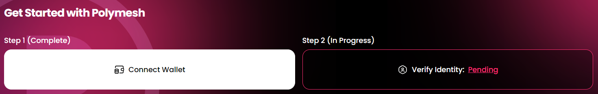
Once your completed application is submitted it usually takes up to 2 business days for the provider to verify your identity.

Once the CDD provider finishes the identity verification, you will see the following card at the bottom of the portal indicating that the onboarding process has finished.
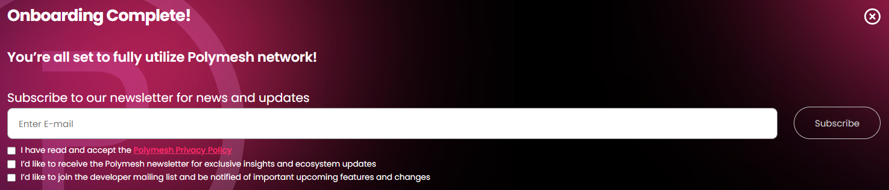

### Testnet Mock Customer Due Diligence process

(For Mainnet skip to the next [section](#mainnet-customer-due-diligence-process))

On [Polymesh Testnet Portal](https://portal.polymesh.live/) you will be presented with the below screen, allowing you to select the "Polymath Mock CDD" provider. Review the displayed wallet address and confirm it is the account you wish to onboard. If it is not, open the wallet extension and select the account you want to onboard as the primary key associated with your identity.

When satisfied, select "MockId (TESTNET)".

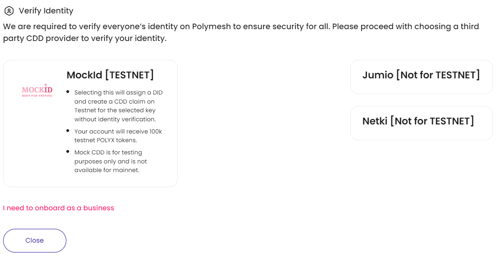

A Mock CDD claim will be automatically generated.

Continue to the [Success](#success) section.

### Mainnet Customer Due Diligence process

On Polymesh Mainnet Portal [Polymesh Mainnet](https://portal.polymesh.network/) after clicking on 'Verify Identity' you will be presented with a screen similar to below, allowing you to select your preferred CDD provider. 
Select your chosen provider and follow the instructions on the screen to onboard with the chosen CDD provider. 

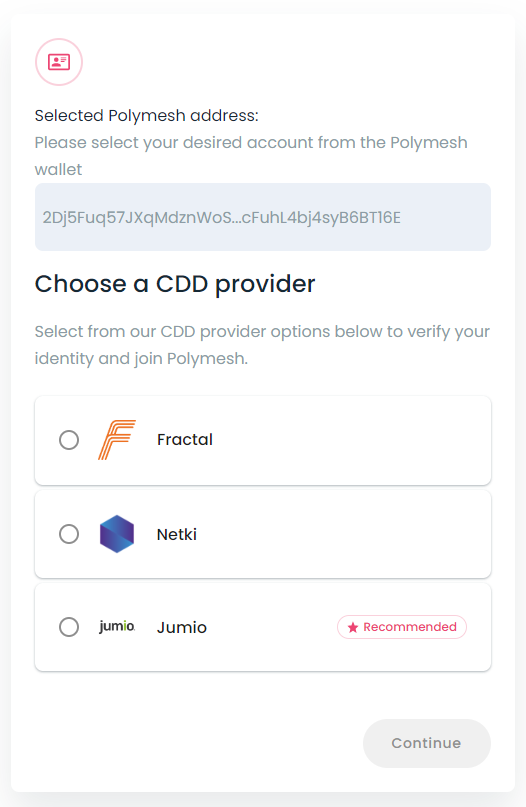

Once you finish the onboarding application, the portal will show the Pending status for the identity verification.

Application processing time may vary depending on multiple factors. Please allow 48 hours for processing. You can also review the status of your application by visiting https://onboarding.polymesh.network/login

**DO NOT SUBMIT APPLICATIONS TO MULTIPLE PROVIDERS AT THE SAME TIME!**

### Success

When you next open the wallet extension you will see a [DID](/docs/introduction/identity/#polymesh-account-what-isare-your-usernames) (long hexadecimal string starting with 0x) associated with your selected account at the top of your wallet with the word **Verified** next to it.

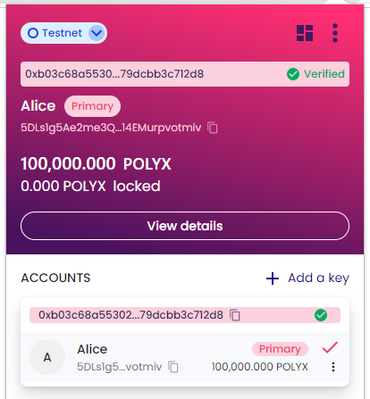

**Congratulations! You have completed customer due diligence.**

As a bonus, **on testnet**, your account will automatically be credited with POLYX allowing you to start to transact onchain.

:::tip

Everyone who participates in materially-important transactions on Polymesh must complete customer due diligence (CDD), at a minimum. Asset originators can and usually will augment this minimum requirement with additional KYC requirements but they may not circumvent this minimum requirement.

Since we will use the Testnet for exercises as we discover Polymesh, it is recommended that you complete your CDD now.

:::

## Links

- [Polymesh Portal Mainnet](https://portal.polymesh.network)
- [Polymesh Portal Testnet](https://portal.polymesh.live)
- [Onboarding Mainnet](https://portal.polymesh.network)
- [Onboarding Testnet](https://portal.polymesh.live)
- [Customer due diligence](/docs/kyc/know-your-customer/)
