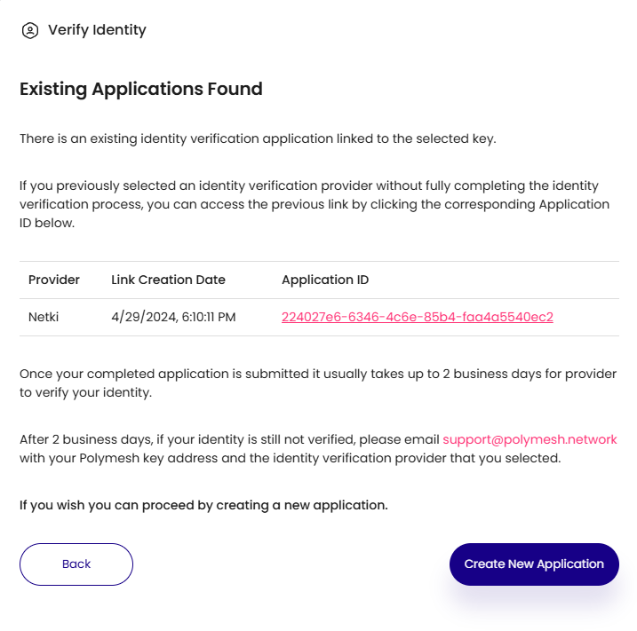
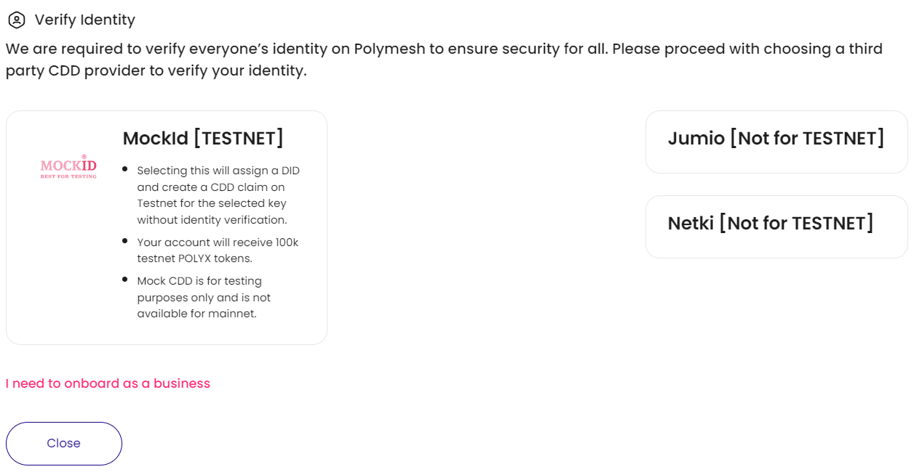

## Customer Due Diligence (CDD)

Every Polymesh account must pass a **minimal identity verification** before being permitted to transact on the network. This verification is called **customer due diligence (CDD)**.

Verifying your identity for CDD purposes involves applying through a CDD service provider. They will verify the information you submit and write an identity claim to the blockchain for you.

:::note

Everyone who participates in transactions on Polymesh must complete onboarding. This is not a substitution for KYC requirements of regulated assets. Asset issuers will typically enforce additional KYC requirements. Asset issuers cannot circumvent the minimum requirement for a key to be associated with an on-chain identity with a valid CDD claim.

:::

## Assign Account

When you first create an account, it will display as an unassigned key, meaning there is no on-chain identity associated with it.

If using the Polymesh wallet the `Assign` button appears when you hover over an unassigned signing key. Clicking it will take you to the Polymesh Portal on either the [Polymesh Mainnet](https://portal.polymesh.network/) or [Polymesh Testnet](https://portal.polymesh.live/).

When connecting to Polymesh Portal for the first time, you will be prompted to select a wallet to connect. Choose your wallet from the list of available options and authorize the wallet connection to the Portal.

**Note:** You can also enter a key manually by clicking on 'Manually enter a wallet key.' Manually entered keys that are not stored in the connected wallet only allow view-only functionality. To fully utilize Polymesh, connect a key stored in a supported wallet.

On the next screen, select the wallet address to connect and click 'Proceed.' Once connected, the Portal will display information specific to that key.

## Complete the Customer Due Diligence Process

Click the `Verify Identity` (or `Complete Onboarding`) button to begin the onboarding process.

You will be presented with a list of CDD service providers to choose from. Click on the CDD provider's card to proceed with onboarding.

Follow the on-screen instructions to onboard with the chosen CDD provider. This will involve being redirected to the CDD providers website or application. Once you complete the onboarding application, the Portal will show a "Pending" status for identity verification.

After submitting your application, it may take up to two business days for the provider to verify your identity. You can return to the portal anytime to check if the application has been approved. Clicking on the "Verify Identity" button when the status is pending will display information related to your application.

Once the CDD provider completes the verification, you will see a card at the top of the Portal indicating that onboarding is complete.

### Testnet Mock Customer Due Diligence Process

On the [Testnet instance of the Polymesh Portal](https://portal.polymesh.live/), you will instead see a screen that allows you to select the "MockId [TESTNET]" provider. Selecting this option will automatically create a DID, assign a CDD claim, and seed the account with POLYX tokens for testing without an identity verification process.

## Links

- [Polymesh Portal Mainnet](https://portal.polymesh.network)
- [Polymesh Portal Testnet](https://portal.polymesh.live)
- [Customer Due Diligence](/docs/kyc/know-your-customer/)
