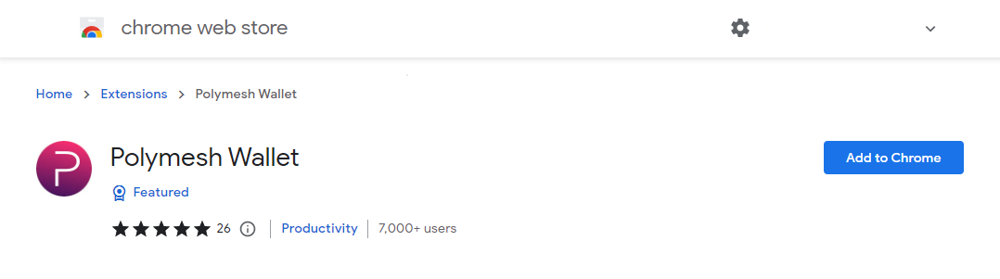
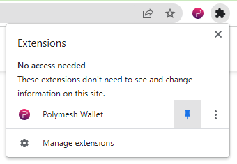
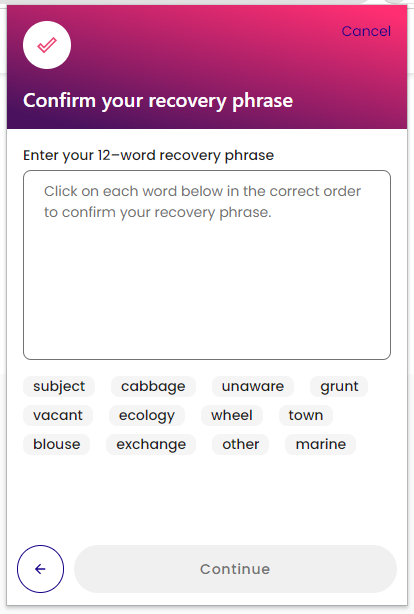
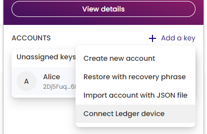

## Get the Wallet

Polymesh supports a range of compatible wallets that leverage public-key cryptography using the Ed25519 curve, with support for Ed25519, SR25519, and ECDSA keys. These wallets enable you to manage your Polymesh account, securely store private keys, and interact with the Polymesh blockchain.

Typically, blockchain wallets are either **hot wallets** (connected to the internet, like browser extensions or mobile apps) or **cold wallets** (offline, like hardware devices). With **non-custodial wallets**—where only you control your private keys—keeping your private key and recovery phrase secure is essential, as access to these is required to manage your account.

Below is a selection of **Polymesh-compatible, non-custodial wallet options** to help you get started.

### Hot Wallets (Browser Extensions)

- [Polymesh Wallet](#the-polymesh-wallet)
- [Talisman Wallet](https://www.talisman.xyz/)
- [Subwallet](https://subwallet.app/)
- [Polkadot.js Wallet](https://polkadot.js.org/extension/)

### Hot Wallets (Smartphones)

- [Nova Wallet](https://novawallet.io/)
- [Subwallet](https://subwallet.app/)

### Cold Wallets

- [Ledger Hardware Wallet](#connect-a-ledger-hardware-wallet)

## The Polymesh Wallet

The **Polymesh Wallet** is a **Google Chrome extension** that securely holds your account information and private signing keys. The Polymesh Wallet lets you manage accounts and interact with Polymesh and Polymesh decentralized apps (dApps).

Currently, it's available as a Chrome extension, supporting Google Chrome and Chromium-based browsers (such as Brave and Microsoft Edge).

Get the Polymesh Wallet extension [here](https://chrome.google.com/webstore/detail/polymesh-wallet/jojhfeoedkpkglbfimdfabpdfjaoolaf) or search for "Polymesh Wallet" in the Chrome Store and click "Add to Chrome."

Once installed, find the Polymesh icon in the plugins tray. It may appear under the plugin icon if not pinned. Click it to launch the "welcome screen."

## Create a New Account

Accept the Privacy Policy and Terms of Use, then click `Create new account`.

You will be presented with a 12-word mnemonic, which is a recovery phrase that can be used to regenerate the private signing key stored in the wallet. It's essential to store this phrase in a safe and confidential location to retain access to your key.

On the next screen, you'll need to enter the words **_in the correct order_** to confirm you have recorded the phrase accurately.

Check the box to confirm that you've saved the recovery phrase, press `Continue`, and select the words in the correct order.

Give your account a name and set a password. This password will help protect your account and encrypt your keys in local storage.

Your new account is now created with one unassigned key.

At the top of the window, you can see which network you're connected to by default. Here, we're connected to Testnet.

:::tip

- When connected to Mainnet, addresses will start with a **2**.
- When connected to Testnet, addresses will start with a **5**.

:::

## Connect a Ledger Hardware Wallet

As an alternative to storing your password-encrypted private key in the browser wallet extension, you may prefer to use a hardware wallet to manage your private key offline. The Polymesh Wallet extension supports signing with [Ledger Hardware Wallets](https://support.ledger.com/article/4641803176221-zd). To install the Polymesh Ledger app, search for it in the Manager, App Catalog section of Ledger Live and install it on your device.

Once installed, open the Polymesh app on your Ledger device.

:::tip

If you don't enter the Polymesh Ledger app first, you'll see a screen saying "Your Ledger is not connected."

:::

Instead of selecting `Create new account` (as described above), you can select `Connect your Ledger` when setting up your first wallet or click `+ Add a key` and then `Connect Ledger device` if you've previously set up an account.

If prompted by a browser popup, select your hardware wallet and click “Connect.”

You can then name your Ledger account and select `Continue` to import it to your wallet. The Advanced settings on the import screen let you choose an alternate derivation path, enabling multiple accounts on the same Ledger device. The default for the first account import is Account type 0, Address index 0—think of it as a formula for generating child accounts.

Now, when signing transactions, you must connect your Ledger, open the Polymesh app, and you'll be prompted to sign the transaction with your Ledger device.

:::info

Due to limited storage on the Nano S, not all transaction types are supported. See the README.md at [https://github.com/LedgerHQ/app-polymesh](https://github.com/LedgerHQ/app-polymesh) for details on available transactions in the "Light" app.

:::

:::info

When imported, Ledger accounts are assigned the genesis hash of the chain selected in the wallet at the time of import (i.e., Mainnet or Testnet). It's best not to share accounts across Mainnet and Testnet, as some dApps may not display accounts imported for Testnet on a Mainnet instance, and vice versa.

:::

## Links

- [Polymesh Wallet](https://chrome.google.com/webstore/detail/polymesh-wallet/jojhfeoedkpkglbfimdfabpdfjaoolaf)
- [Polymesh Portal](https://portal.polymesh.network/)
- [Ledger Polymesh App GitHub](https://github.com/LedgerHQ/app-polymesh)
- [Ledger Polymesh App support page](https://support.ledger.com/article/4641803176221-zd)
