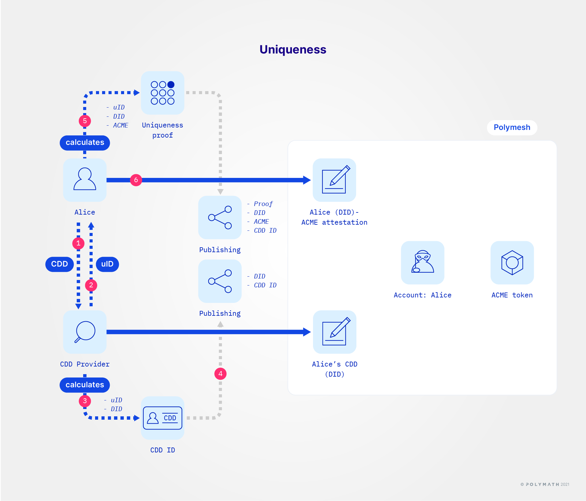

As always, everything that can be done via the Token Studio Dashboard can be integrated with internal systems using the SDK. Use this to automate and scale repetitive processes.

Let's see how ACME's share distribution would be performed using methods in the SDK. What we want to achieve is for ACME to issue 20,000 shares of ACME Corp to Alice the individual. As CEO, Alice will act for ACME.

## Preconditions

We assume that:

- ACME, the company, already has a Polymesh account, `acme`;
- Alice, ACME Co's CEO and acting agent, holds a secondary private key for `acme` that allows her to act on its behalf;
- Alice the CEO can [instantiate](/sdk-docs/classes/API/Client/Polymesh/#connect) a Polymesh client whenever she needs to act with:

<Tabs groupId="code-language">

<TabItem value="ts" label="TypeScript">

```ts
const signingManagerCeo: LocalSigningManager = await LocalSigningManager.create(
  {
    accounts: [
      {
        mnemonic: 'word31 word32 ...',
      },
    ],
  }
);
const apiCeo: Polymesh = await Polymesh.connect({
  nodeUrl: 'wss://testnet-rpc.polymesh.live', // or your preferred node
  signingManager: signingManagerCeo,
});
```

</TabItem>

<TabItem value="js" label="JavaScript">

```js
const signingManagerCeo = await LocalSigningManager.create({
  accounts: [
    {
      mnemonic: 'word31 word32 ...',
    },
  ],
});
const apiCeo = await Polymesh.connect({
  nodeUrl: 'wss://testnet-rpc.polymesh.live', // or your preferred node
  signingManager: signingManagerCeo,
});
```

</TabItem>
</Tabs>

- The ACME token has already been created and has been retrieved and instantiated with the following:

<Tabs groupId="code-language">

<TabItem value="ts" label="TypeScript">

```ts
const asset: Asset = await apiCeo.assets.getAsset({
  ticker: 'ACME',
});
```

</TabItem>

<TabItem value="js" label="JavaScript">

```js
const asset = await apiCeo.assets.getAsset({
  ticker: 'ACME',
});
```

</TabItem>

</Tabs>

- `acme` is the owner of the ACME token. `acme` will also be the token's primary issuance agent;
- Alice has an account, `alice`, that represents her as an individual;
- Alice the individual also can [instantiate](/sdk-docs/classes/API/Client/Polymesh/#connect) a Polymesh client whenever she needs to act with:

<Tabs groupId="code-language">

<TabItem value="ts" label="TypeScript">

```ts
const signingManagerAlice: LocalSigningManager =
  await LocalSigningManager.create({
    accounts: [
      {
        mnemonic: 'word1 word2 ...',
      },
    ],
  });

const apiAlice: Polymesh = await Polymesh.connect({
  nodeUrl: 'wss://testnet-rpc.polymesh.live', // or your preferred node
  signingManager: signingManagerAlice,
});
```

</TabItem>

<TabItem value="js" label="JavaScript">

```js
const signingManagerAlice = await LocalSigningManager.create({
  accounts: [
    {
      mnemonic: 'word1 word2 ...',
    },
  ],
});

const apiAlice = await Polymesh.connect({
  nodeUrl: 'wss://testnet-rpc.polymesh.live', // or your preferred node
  signingManager: signingManagerAlice,
});
```

</TabItem>
</Tabs>

Now that we went throught the preconditions, let's continue preparing the distribution.

## Publish the investor uniqueness claims



### The what?

This part is heavier in terms of cryptography. If in doubt about some elements, please refer to the [Identity chapter](/docs/introduction/identity/). As mentioned in the identity introduction, Polymesh enables a way for asset originators to ascertain the uniqueness of the investors in their asset. This is achieved by publishing on-chain a commitment. This is this commitment that we are going to publish for both ACME and Alice. We are going to inspire ourselves from this [example script](https://github.com/PolymeshAssociation/CDD-Scripts/blob/83ff952ab88b0aeaeaaed9cda35556dc1cc79f74/index.js#L305-L330).

Let's first clearly identify what is off-chain and what is on-chain:

- Off-chain:
  - investor's uID, which is ACME's, or Alice's, unique identifier in the PUIS system.
  - investor's private key, obviously.
- On-chain:
  - Did: the account number the CDD provider created to identify (one of) ACME's, or Alice's, account on-chain.
  - CddId: the identifier the CDD provider published when going through due diligence for ACME, or Alice.
  - Investor's address, or primary public key for the account.
  - ACME, the name of the token.

Each investor is going to publish on-chain an attestation that is called an _investor uniqueness claim_, by using all the elements listed above.

### Prepare your code

We need some extra work because, at its base, the [confidential identity](https://github.com/PolymeshAssociation/cryptography/tree/afed507/confidential-identity) library is coded in Rust, like the rest of Polymesh's codebase, and compiled in WebAssembly (WASM), for use in NodeJs. So go ahead:

- Copy the [whole library folder](https://github.com/PolymeshAssociation/CDD-Scripts/tree/83ff952ab88b0aeaeaaed9cda35556dc1cc79f74/pkg). This includes the external declarations for NodeJs.
- [Import it](https://github.com/PolymeshAssociation/CDD-Scripts/blob/83ff952ab88b0aeaeaaed9cda35556dc1cc79f74/index.js#L10) in your file.
- And also [import some Polkadot utilities](https://github.com/PolymeshAssociation/CDD-Scripts/blob/83ff952ab88b0aeaeaaed9cda35556dc1cc79f74/index.js#L11).

We are going to show the code for ACME, but doing it for Alice would be the same. ACME already have their uID, it was either saved on file or in the Polymesh Wallet at the time of CDD:

<Tabs groupId="code-language">

<TabItem value="ts" label="TypeScript">

```ts
const uIDv4: string = '21d18606-5971-4136-90c1-decdef95fc1e'; // For example
const uID: string = `0x${uIDv4.replace(/-/g, '')}`; // Results in 0x21d186065971413690c1decdef95fc1e
```

</TabItem>

<TabItem value="js" label="JavaScript">

```js
const uIDv4 = '21d18606-5971-4136-90c1-decdef95fc1e'; // For example
const uID = `0x${uIDv4.replace(/-/g, '')}`; // Results in 0x21d186065971413690c1decdef95fc1e
```

</TabItem>
</Tabs>

Because of this delegation to WebAssembly, we have to painstakingly format parameters in hexadecimal. This explains the convoluted lines above and below.

ACME's **Did** is in the account, and already comes formatted as `0x123...`:

<Tabs groupId="code-language">

<TabItem value="ts" label="TypeScript">

```ts
const acme: Identity = await apiCeo.getSigningIdentity();
```

</TabItem>

<TabItem value="js" label="JavaScript">

```js
const acme = await apiCeo.getSigningIdentity();
```

</TabItem>
</Tabs>

The ACME ticker (maximum 12 characters) has to be transformed into a 12 bytes hexadecimal number to get what we call the **acmeScopeDid**.

<Tabs groupId="code-language">

<TabItem value="ts" label="TypeScript">

```ts
const acmeHex: string = Array.prototype.map
  .call('ACME', (_, index: number, whole: string) => {
    return whole.charCodeAt(index).toString(16);
  })
  .join('')
  .padEnd(24, '0');
const acmeScopeDid: string = `0x${acmeHex}`; // 0x41434d450000000000000000
```

</TabItem>

<TabItem value="js" label="JavaScript">

```js
const acmeHex = Array.prototype.map
  .call('ACME', (_, index, whole) => {
    return whole.charCodeAt(index).toString(16);
  })
  .join('')
  .padEnd(24, '0');
const acmeScopeDid = `0x${acmeHex}`; // 0x41434d450000000000000000
```

</TabItem>
</Tabs>

With those in hand, let's prepare our proof. The proof is generated off-chain, and then published on-chain. Using the imports mentioned above:

<Tabs groupId="code-language">

<TabItem value="ts" label="TypeScript">

```ts
const iuProofAsString: string =
  confidential_identity.process_create_claim_proof(
    JSON.stringify({
      investor_did: Array.from(hexToU8a(acme.did)),
      investor_unique_id: Array.from(hexToU8a(uID)),
    }),
    JSON.stringify({
      scope_did: Array.from(hexToU8a(acmeScopeDid)),
      investor_unique_id: Array.from(hexToU8a(uID)),
    })
  );
const iuProof: JSON = JSON.parse(iuProofAsString);
const proof: string = `0x${createHexString(iuProof.proof)}`;
const scopeId: string = `0x${createHexString(iuProof.scope_id)}`;
```

</TabItem>

<TabItem value="js" label="JavaScript">

```js
const iuProofAsString = confidential_identity.process_create_claim_proof(
  JSON.stringify({
    investor_did: Array.from(hexToU8a(acme.did)),
    investor_unique_id: Array.from(hexToU8a(uID)),
  }),
  JSON.stringify({
    scope_did: Array.from(hexToU8a(acmeScopeDid)),
    investor_unique_id: Array.from(hexToU8a(uID)),
  })
);
const iuProof = JSON.parse(iuProofAsString);
const proof = `0x${createHexString(iuProof.proof)}`;
const scopeId = `0x${createHexString(iuProof.scope_id)}`;
```

</TabItem>
</Tabs>

This thankfully concludes the preparation of the proof.

### Send the claim proper

This was a lengthy proof preparation. We need one more value, the **CddId**, a.k.a. the currently valid CDD claim's id.

<Tabs groupId="code-language">

<TabItem value="ts" label="TypeScript">

```ts
const acmeCddClaims: ClaimData<CddClaim>[] = await apiCeo.claims.getCddClaims({
  includeExpired: false,
});
assert(acmeCddClaims.length > 0);
const acmeCddClaim: CddClaim = acmeCddClaims[0].claim;
```

</TabItem>

<TabItem value="js" label="JavaScript">

```js
const acmeCddClaims = await apiCeo.claims.getCddClaims({
  includeExpired: false,
});
assert(acmeCddClaims.length > 0);
const acmeCddClaim = acmeCddClaims[0].claim;
```

</TabItem>
</Tabs>

With all parameters we need, let's go for the final on-chain publishing.

<Tabs groupId="code-language">

<TabItem value="ts" label="TypeScript">

```ts
const uniquenessQueue: TransactionQueue<void> =
  await apiCeo.claims.addInvestorUniquenessClaim({
    cddId: acmeCddClaim.id,
    proof: proof,
    scope: {
      type: ScopeType.Ticker,
      value: 'ACME',
    },
    scopeId: scopeId,
  });
await uniquenessQueue.run();
```

</TabItem>

<TabItem value="js" label="JavaScript">

```js
const uniquenessQueue = await apiCeo.claims.addInvestorUniquenessClaim({
  cddId: acmeCddClaim.id,
  proof: proof,
  scope: {
    type: 'Ticker',
    value: 'ACME',
  },
  scopeId: scopeId,
});
await uniquenessQueue.run();
```

</TabItem>
</Tabs>

With this, the investor uniqueness claim is saved on-chain, attached to ACME's account, and ACME can receive ACME shares. Do the same for Alice, and Alice will be able to get ACME shares too.

### Confirmation

Of course, there needs to be only one such valid investor uniqueness claim per account-ticker pair. It could well be that an investor has already done it. How to confirm? Easy. Alice the CEO may check this status of ACME, as it could have been done by another founder already.

<Tabs groupId="code-language">

<TabItem value="ts" label="TypeScript">

```ts
const uniquenessClaims: ClaimData<InvestorUniquenessClaim>[] =
  await apiCeo.claims.getInvestorUniquenessClaims({
    includeExpired: false,
  });
const acmeUniquenessClaims: ClaimData<InvestorUniquenessClaim>[] =
  uniquenessClaims.filter((claimData: ClaimData<InvestorUniquenessClaim>) => {
    const scope = claimData.claim.scope;
    return scope.type === ScopeType.Ticker && scope.value === 'ACME';
  });
assert(acmeUniquenessClaims.length > 0);
```

</TabItem>

<TabItem value="js" label="JavaScript">

```js
const uniquenessClaims = await apiCeo.claims.getInvestorUniquenessClaims({
  includeExpired: false,
});
const acmeUniquenessClaims = uniquenessClaims.filter((claimData) => {
  const scope = claimData.claim.scope;
  return scope.type === ScopeType.Ticker && scope.value === 'ACME';
});
assert(acmeUniquenessClaims.length > 0);
```

</TabItem>
</Tabs>

## Prepare the distribution

Time for Alice to get her agreed amount of shares.

As we mentioned in the previous SDK chapter, implicit in `const token` is that the `context` is `apiCeo`, because we used `apiCeo` to retrieve its information. In other words, any action performed on a `token` instantiated by `apiCeo` will effectively be done by the `acme` account.

At the time of its creation, the ACME token had a total supply of zero. Alice is personally entitled to 20,000 of the eventual 100,000 total supply of shares that the founders intend to issue. The primary issuance agent first issues, in effect mints, the shares to themselves, then sends them to their ultimate beneficiary(ies), like Alice.

Sending securities to someone needs the consent of the recipient. The correct Polymesh structure to achieve that is to create a settlement instruction. All settlement instructions are created in a venue. Therefore, we will **create a venue**.

Let's get started. We fetched ACME's account in the previous step:

<Tabs groupId="code-language">

<TabItem value="ts" label="TypeScript">

```ts
const distributionVenueQueue: TransactionQueue<Venue> =
  await acme.settlements.createVenue({
    type: VenueType.Distribution,
    description: 'For ACME Co',
  });
const distributionVenue: Venue = await distributionVenueQueue.run();
const distributionVenueId: string = distributionVenue.id.toString();
```

</TabItem>

<TabItem value="js" label="JavaScript">

```js
const distributionVenueQueue = await acme.settlements.createVenue({
  type: 'Distribution',
  description: 'For ACME Co',
});
const distributionVenue = await distributionVenueQueue.run();
const distributionVenueId = distributionVenue.id.toString();
```

</TabItem>
</Tabs>

We keep `distributionVenueId`, the string id of the venue, for later as this is information that will need to be shared with the ultimate recipient.

Now that we have the venue, let's have the CEO [issue](/sdk-docs/classes/API/Entities/Asset/Issuance/#issue) enough shares to later transfer to Alice. Of course, if the CEO planned on issuing shares for all founders of ACME Corp, she would issue more.

<Tabs groupId="code-language">

<TabItem value="ts" label="TypeScript">

```ts
const asset: Asset = await apiCeo.assets.getAsset({
  ticker: 'ACME',
});
const issuance: Issuance = asset.issuance;
```

</TabItem>

<TabItem value="js" label="JavaScript">

```js
const asset = await apiCeo.assets.getAsset({
  ticker: 'ACME',
});
const issuance = asset.issuance;
```

</TabItem>
</Tabs>

Here too, in `issuance`, the context is still `apiCeo`. In fact, its [`parent`](/sdk-docs/classes/API/Entities/Asset/Issuance/#hierarchy) is the `asset` itself.

<Tabs groupId="code-language">

<TabItem value="ts" label="TypeScript">

```ts
const issueQueue: TransactionQueue<Asset> = await issuance.issue({
  amount: new BigNumber('20000'),
});
await issueQueue.run();
```

</TabItem>

<TabItem value="js" label="JavaScript">

```js
const issueQueue = await issuance.issue({
  amount: new BigNumber('20000'),
});
await issueQueue.run();
```

</TabItem>
</Tabs>

:::tip

There is no beneficiary to mention because an `issue` command sends the shares to the issuance agent, which, at this point is `acme`. Additionally, it sends the shares to the account's default portfolio.

:::

At this point, ACME, has 20,000 received shares. We still need to send them over to Alice the individual.

## In which portfolio?

Now, Alice doesn't want to receive her ACME shares into her default portfolio. Instead, she wants to have them sent to a new "cold store" portfolio, she first needs to [create](/sdk-docs/classes/API/Client/Identities/#createportfolio) the portfolio.

Here we are talking about Alice, the eventual owner, not the CEO, so we are going to use _her_ Polymesh client instance `apiAlice`:

<Tabs groupId="code-language">

<TabItem value="ts" label="TypeScript">

```ts
const portfolioQueue: TransactionQueue<NumberedPortfolio> =
  await apiAlice.identities.createPortfolio({
    name: 'Cold store',
  });
const coldStore: NumberedPortfolio = await portfolioQueue.run();
```

</TabItem>

<TabItem value="js" label="JavaScript">

```js
const portfolioQueue = await await apiAlice.identities.createPortfolio({
  name: 'Cold store',
});
const coldStore = await portfolioQueue.run();
```

</TabItem>
</Tabs>

To [retrieve](/sdk-docs/classes/API/Entities/Identity/Portfolios/#getportfolio) the portfolio at a later date, anyone can use the string `coldStore.id`, or find the portfolio by name.

Time to [move](/sdk-docs/classes/API/Entities/Portfolio/#movefunds) the shares.

Now that Alice has created the portfolio in which she wishes to receive her shares, she needs to prepare some information for her alter ego, the CEO:

<Tabs groupId="code-language">

<TabItem value="ts" label="TypeScript">

```ts
const aliceDid: string = alice.did;
const coldStoreId: string = coldStore.id.toString(10);
```

</TabItem>

<TabItem value="js" label="JavaScript">

```js
const aliceDid = alice.did;
const coldStoreId = coldStore.id;
```

</TabItem>
</Tabs>

## Moving the shares, finally

Who creates the settlement instruction to move the shares? Alice the CEO, on behalf of ACME, so let's flip back to the proper context: `apiCeo`.

On her end, she needs to re-instantiate some instances given the previous information:

<Tabs groupId="code-language">

<TabItem value="ts" label="TypeScript">

```ts
const acme: Identity = await apiCeo.getSigningIdentity();
const acmeDefaultPortfolio: DefaultPortfolio =
  await acme.portfolios.getPortfolio();
const acmeDid: string = acme.did;

const alice: Identity = await apiCeo.identities.getIdentity({
  did: aliceDid,
});
const aliceColdStore: Portfolio = await alice.portfolios.getPortfolio({
  portfolioId: new BigNumber(coldStoreId),
});
```

</TabItem>

<TabItem value="js" label="JavaScript">

```js
const acme = await apiCeo.getSigningIdentity();
const acmeDefaultPortfolio = await acme.portfolios.getPortfolio();
const acmeDid = acme.did;

const alice = await apiCeo.identities.getIdentity({
  did: aliceDid,
});
const aliceColdStore = await alice.portfolios.getPortfolio({
  portfolioId: new BigNumber(coldStoreId),
});
```

</TabItem>
</Tabs>

Now to the settlement instruction:

<Tabs groupId="code-language">

<TabItem value="ts" label="TypeScript">

```ts
const distributionInstructionQueue: TransactionQueue<Instruction> =
  await distributionVenue.addInstruction({
    legs: [
      {
        amount: new BigNumber(20000),
        from: acmeDefaultPortfolio,
        to: aliceColdStore,
        asset: asset,
      },
    ],
  });
const distributionInstruction: Instruction =
  await distributionInstructionQueue.run();
const distributionInstructionId: string =
  distributionInstruction.id.toString(10);
```

</TabItem>

<TabItem value="js" label="JavaScript">

```js
const distributionInstructionQueue = await distributionVenue.addInstruction({
  legs: [
    {
      amount: new BigNumber(20000),
      from: acmeDefaultPortfolio,
      to: aliceColdStore,
      asset: asset,
    },
  ],
});
const distributionInstruction = await distributionInstructionQueue.run();
const distributionInstructionId = distributionInstruction.id;
```

</TabItem>
</Tabs>

This instruction is now recorded in the blockchain as pending. Alice the CEO is satisfied with it. She doesn't need to affirm it as the SDK identified her affirmation would have been required anyway, and so used the relevant [`add_and_affirm_instruction` extrinsic](https://docs.polymesh.live/pallet_settlement/enum.Call.html#variant.add_and_affirm_instruction) right away.

## Does Alice agree?

Let's return to Alice, the future share owner, and seek her affirmation.

Since she is most likely on another computer or system, we need once more to reinstantiate the instruction from Alice's point of view. For that to happen, Alice the CEO needs to send, or copy-paste, `acmeDid`, `distributionVenueId` and `distributionInstructionId` to Alice's system:

<Tabs groupId="code-language">

<TabItem value="ts" label="TypeScript">

```ts
const acme: Identity = await apiAlice.identities.getIdentity({
  did: acmeDid,
});
const venue: Venue = (await acme.getVenues()).find((venue: Venue) => {
  return venue.id.isEqualTo(new BigNumber(distributionVenueId));
});
const instructions: Instruction[] = await venue.getInstructions();
const aliceInstruction: Instruction = instructions.pending.find(
  (instruction: Instruction) => {
    return instruction.id.isEqualTo(new BigNumber(distributionInstructionId));
  }
);
```

</TabItem>

<TabItem value="js" label="JavaScript">

```js
const acme = await apiAlice.identities.getIdentity({
  did: acmeDid,
});
const venue = (await acme.getVenues()).find((venue) => {
  return venue.id.isEqualTo(new BigNumber(distributionVenueId));
});
const instructions = await venue.getInstructions();
const aliceInstruction = instructions.pending.find((instruction) => {
  return instruction.id.isEqualTo(new BigNumber(distributionInstructionId));
});
```

</TabItem>
</Tabs>

Alice could also have chosen to retrieve all the pending instructions associated with her `SigningIdentity`. That would have included all instructions, not just that one from the distribution venue she knows about. With a view to reduce the possibility of spam, she chose to use the venue to retrieve the instructions.

Now, it is just a matter of affirming the instruction:

<Tabs groupId="code-language">

<TabItem value="ts" label="TypeScript">

```ts
const updatedInstructionQueue: TransactionQueue<Instruction> =
  await aliceInstruction.affirm();
const updatedInstruction: Instruction = await updatedInstructionQueue.run();
```

</TabItem>

<TabItem value="js" label="JavaScript">

```js
const updatedInstructionQueue = await aliceInstruction.affirm();
const updatedInstruction = await updatedInstructionQueue.run();
```

</TabItem>
</Tabs>

And with this, **Alice got her 20,000 shares**.

## Can Alice confirm she received the shares?

Well, she can check what's inside her portfolio:

<Tabs groupId="code-language">

<TabItem value="ts" label="TypeScript">

```ts
const coldStore: NumberedPortfolio = await alice.portfolios.getPortfolio({
  portfolioId: new BigNumber(coldStoreId),
});
const acmeAssetBalances: PortfolioBalance[] = await coldStore.getAssetBalances({
  assets: ['ACME'],
});
const acmeAssetBalance: PortfolioBalance = acmeAssetBalances[0];
assert(acmeAssetBalance.total.isEqualTo(new BigNumber('20000')));
```

</TabItem>

<TabItem value="js" label="JavaScript">

```js
const coldStore = await alice.portfolios.getPortfolio({
  portfolioId: new BigNumber(coldStoreId),
});
const acmeAssetBalances = await coldStore.getAssetBalances({
  assets: ['ACME'],
});
const acmeAssetBalance = acmeAssetBalances[0];
assert(acmeAssetBalance.total.isEqualTo(new BigNumber('20000')));
```

</TabItem>
</Tabs>

## How can Alice issue the shares of other founders?

As the primary issuance agent, she can repeat the steps to create one instruction per founder.

On the other hand, if the founders have decided that they should all receive their shares in a single atomic instruction, then, Alice would have to create a single instruction with all the legs:

<Tabs groupId="code-language">

<TabItem value="ts" label="TypeScript">

```ts
const issueQueue: TransactionQueue<Asset> = await issuance.issue({
  amount: new BigNumber('100000'),
});
await issueQueue.run();
const distributionInstructionQueue: TransactionQueue<Instruction> =
  await distributionVenue.addInstruction({
    legs: [
      {
        amount: new BigNumber(20000),
        from: acmeDefaultPortfolio,
        to: aliceColdStore,
        asset: asset,
      },
      {
        amount: new BigNumber(30000),
        from: acmeDefaultPortfolio,
        to: bobTargetPortfolio,
        asset: asset,
      },
      {
        amount: new BigNumber(50000),
        from: acmeDefaultPortfolio,
        to: carolTargetPortfolio,
        asset: asset,
      },
    ],
  });
const distributionInstruction: Instruction =
  await distributionInstructionQueue.run();
const distributionInstructionId: string =
  distributionInstruction.id.toString(10);
```

</TabItem>

<TabItem value="js" label="JavaScript">

```js
const issueQueue = await issuance.issue({
  amount: new BigNumber('100000'),
});
await issueQueue.run();
const distributionInstructionQueue = await distributionVenue.addInstruction({
  legs: [
    {
      amount: new BigNumber(20000),
      from: acmeDefaultPortfolio,
      to: aliceColdStore,
      asset: asset,
    },
    {
      amount: new BigNumber(30000),
      from: acmeDefaultPortfolio,
      to: bobTargetPortfolio,
      asset: asset,
    },
    {
      amount: new BigNumber(50000),
      from: acmeDefaultPortfolio,
      to: carolTargetPortfolio,
      asset: asset,
    },
  ],
});
const distributionInstruction = await distributionInstructionQueue.run();
const distributionInstructionId = distributionInstruction.id.toString(10);
```

</TabItem>
</Tabs>

or whichever distribution was agreed between the parties.

The advantage of this single operation is that all parties can see in one go whether the eventual outcome is as per previously agreed.

## When all is done

Assuming all parties have received their shares, it could be advantageous for the company to create a checkpoint. This post-issuance checkpoint would provide visibility about what was achieved during the issuance. A simple checkpoint is all you need. Note that only the token owner can create a checkpoint:

<Tabs groupId="code-language">

<TabItem value="ts" label="TypeScript">

```ts
const checkpointQueue: TransactionQueue<Checkpoint> =
  await asset.checkpoints.create();
const checkpoint: Checkpoint = await checkpointQueue.run();
const postDistributionCheckpointId: string = checkpoint.id.toString(10);
```

</TabItem>

<TabItem value="js" label="JavaScript">

```js
const checkpointQueue = await asset.checkpoints.create();
const checkpoint = await checkpointQueue.run();
const postDistributionCheckpointId = checkpoint.id.toString(10);
```

</TabItem>
</Tabs>

The checkpoint has an id, `0` if it is ACME's first checkpoint, which can be kept off-chain for future reference.

That's it, the lazy checkpoint is created, and has recorded all balances. For instance, at any point in time in the future, if Bob wants to get Carol's balance after the distribution, he needs to:

<Tabs groupId="code-language">

<TabItem value="ts" label="TypeScript">

```ts
const asset: Asset = await apiBob.assets.getAsset({
  ticker: 'ACME',
});
const postDistributionCheckpoint: Checkpoint = await asset.checkpoints.getOne({
  id: new BigNumber(postDistributionCheckpointId),
});
const carolAcmeBalanceAtDistribution: BigNumber =
  await postDistributionCheckpoint.balance({
    identity: carol,
  });
```

</TabItem>

<TabItem value="js" label="JavaScript">

```js
const asset = await apiBob.assets.getAsset({
  ticker: 'ACME',
});
const postDistributionCheckpoint = await asset.checkpoints.getOne({
  id: new BigNumber(postDistributionCheckpointId),
});
const carolAcmeBalanceAtDistribution = await postDistributionCheckpoint.balance(
  {
    identity: carol,
  }
);
```

</TabItem>
</Tabs>

## Links

- [SDK documents](/sdk-docs/)
