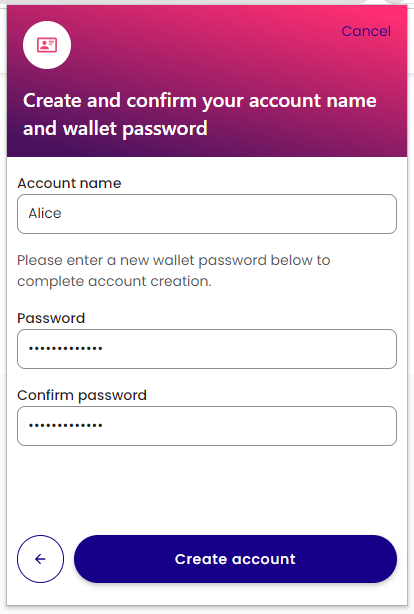
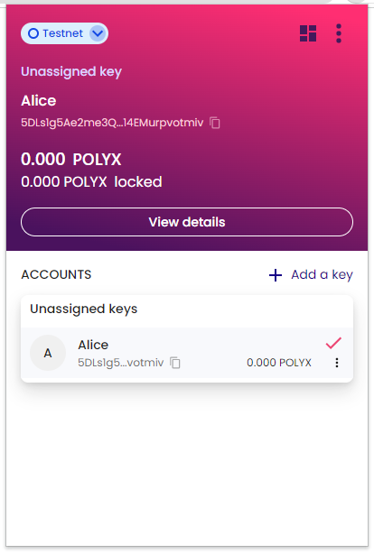

## Introduction

The **Polymesh Wallet** is a **Google Chrome extension** that securely holds your account information and private signing keys. The Polymesh Wallet lets you manage accounts and interact with Polymesh and Polymesh decentralized apps (dApps).

Currently, it's available as a Chrome extension, supporting Google Chrome and Chromium-based browsers (such as Brave and Microsoft Edge).

Get the Polymesh Wallet extension [here](https://chrome.google.com/webstore/detail/polymesh-wallet/jojhfeoedkpkglbfimdfabpdfjaoolaf) or search for "Polymesh Wallet" in the Chrome Store and click "Add to Chrome."

Once installed, find the Polymesh icon in the plugins tray. It may appear under the plugin icon if not pinned. Click it to launch the "welcome screen."

## Create a New Account

Accept the Privacy Policy and Terms of Use, then click `Create new account`.

You will be presented with a 12-word mnemonic, which is a recovery phrase that can be used to regenerate the private signing key stored in the wallet. It's essential to store this phrase in a safe and confidential location to retain access to your key.

On the next screen, you'll need to enter the words **_in the correct order_** to confirm you have recorded the phrase accurately.

Check the box to confirm that you've saved the recovery phrase, press `Continue`, and select the words in the correct order.

Give your account a name and set a password. This password will help protect your account and encrypt your keys in local storage.

Your new account is now created with one unassigned key.

At the top of the window, you can see which network you're connected to by default. Here, we're connected to Testnet.

:::tip

- When connected to Mainnet, addresses will start with a **2**.
- When connected to Testnet, addresses will start with a **5**.

:::

## Links

- [Polymesh Wallet](https://chrome.google.com/webstore/detail/polymesh-wallet/jojhfeoedkpkglbfimdfabpdfjaoolaf)
- [Polymesh Portal](https://portal.polymesh.network/)
