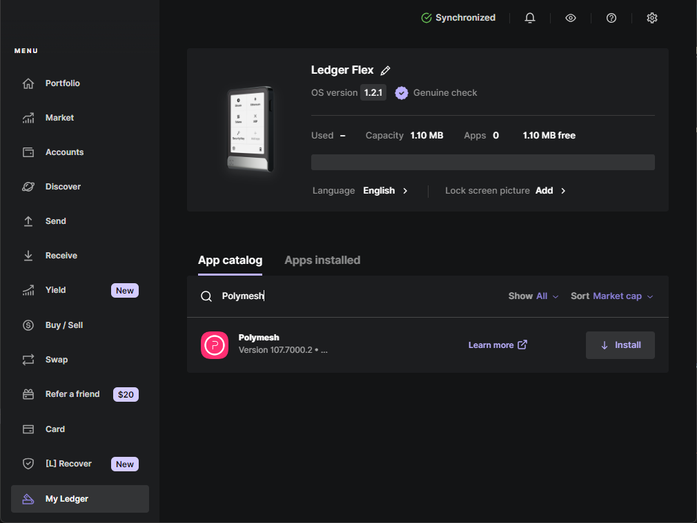
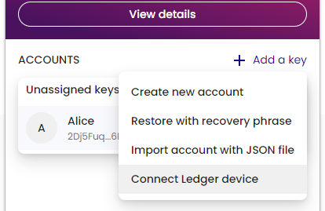
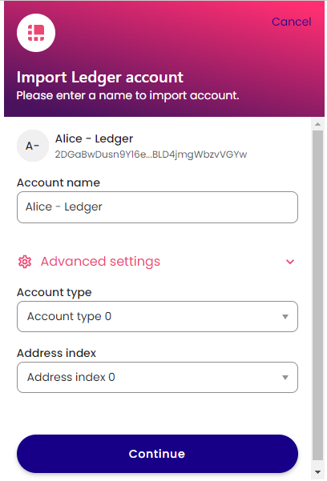
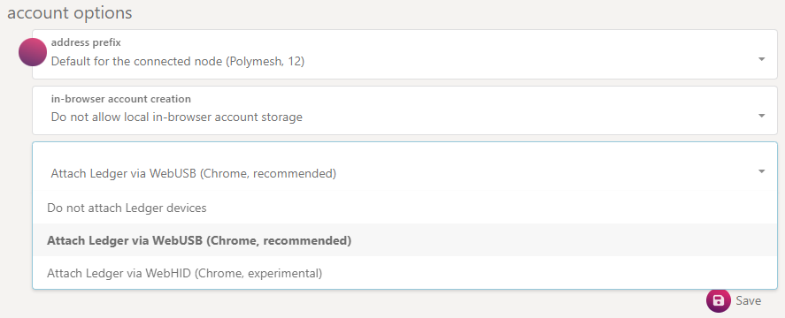
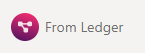
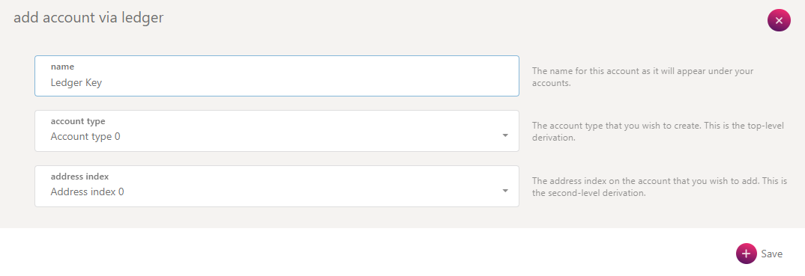
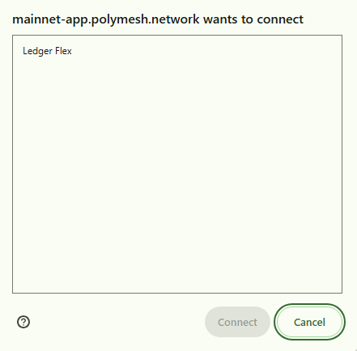

## Overview

As an alternative to storing your password-encrypted private key in a browser wallet extension, to use a Ledger hardware wallet can be used to manage your private key offline.

The Polymesh Ledger application is compatible with both the Ledger Nano S, Nano S+, Nano X, Flex and Stax devices. Ledger devices are hardware wallets that keep your secret secured on a physical device that does not expose it to your computer or the internet.

The Ledger application allows you to manage Polymesh's native assets, POLYX and interact with the Polymesh blockchain.

:::note

Due to memory constraints, the version of the app for the Ledger **Nano S** only supports a subset of possible transactions, primarily POLYX transfers, identity and basic staking operations. You can see the README.md document at [https://github.com/LedgerHQ/app-polymesh](https://github.com/LedgerHQ/app-polymesh/blob/main/README.md) for full details.

:::

## Requirements

Here is a list of what you will need before starting:

- A Ledger Nano S, S+, X, Flex or Stax device.
- The latest firmware installed.
- Ledger Live is installed and updated to the latest version.
- The Polymesh Wallet browser extension - this can be downloaded from the [Chrome Store](https://chrome.google.com/webstore/detail/polymesh-wallet/jojhfeoedkpkglbfimdfabpdfjaoolaf).
- Or a Chromium-based web browser to access the [Polymesh App](https://mainnet-app.polymesh.network/).

:::note

Other Substrate based wallets may support importing of Polymesh keys from Ledger devices. Refer to the wallets documentation to determine if Ledger devices are supported.

:::

## Installing the Ledger Application on Your Device

- Open the "My Ledger" tab in Ledger Live.
- Connect and unlock your Ledger device.
- Allow the Ledger Live to connect by confirming on your device.
- Search for "Polymesh" in the app catalog and select "Install".

## Using via the Polymesh Wallet

The [Polymesh Wallet extension](/getting-started/keys/polymesh-wallet) supports signing with Ledger Hardware Wallets. This allows you to use you to use your Ledger to sign transactions in any application compatible with the Polymesh wallet.

Once installed, open the Polymesh app on your Ledger device.

:::tip

If you don't enter the Polymesh Ledger app first, you'll see a screen saying "Your Ledger is not connected."

:::

IN the Polymesh wallet instead of selecting `Create new account`, you can select `Connect your Ledger` when setting up your first wallet or click `+ Add a key` and then `Connect Ledger device` if you've previously set up a key.

If prompted by a browser popup, select your hardware wallet and click “Connect.”

You can then name your Ledger key and select `Continue` to import it to your wallet. The Advanced settings on the import screen let you choose an alternate derivation path, enabling multiple keys from the same Ledger device. The default for the first key import is Account type 0, Address index 0—think of it as a formula for generating child keys. Subsequent key imports will increment the Account type automatically to use a different key from the same device.

:::note
If using a custom derivation path it is important to remember the **type** and **index** used so you can reconnect it should it become disconnected.
:::

Now, when signing transactions with this key, you must connect your Ledger, open the Polymesh app, and you'll be prompted to confirm the transaction with your Ledger device.

:::info

When imported, Ledger keys are assigned the genesis hash of the chain selected in the wallet at the time of import (i.e., Mainnet or Testnet). If the key is intended for use on Mainnet ensure mainnet is selected in the top left corner of the wallet before adding a Ledger key. It's best not to share keys across Mainnet and Testnet, as some dApps may filter by genesis hash and not display keys imported for Testnet on a Mainnet instance, and vice versa.

:::

## Using via the Polymesh App

Some applications may support connecting your ledger device directly without the need for a compatible browser extension. One example is the [Polymesh App](https://mainnet-app.polymesh.network/) which is a Polymesh specific fork of the [Polkadot.js App](https://github.com/polkadot-js/apps).

### Loading Your Account

The functionality to use a Ledger device directly is currently gated behind a feature setting that you will need to turn on.

To turn on support for Ledger devices, go to the [Settings](https://mainnet-app.polymesh.network/#/settings) tab in the Polymesh App. Find the option for attaching Ledger devices and switch the option from the default "Do not attach Ledger devices" to "Attach Ledger via WebUSB".

Click _"Save"_ to keep your settings.

Now when you go to the [Accounts](https://mainnet-app.polymesh.network/#/accounts) tab you will see a new button that says _"From Ledger"_.

Ensure that:

1. The Ledger device connected to your computer
2. The Ledger device is unlocked
3. The Polymesh Ledger application is open on the device.
4. Other apps that may be using the Ledger Device, such as Ledger Live are closed.

Once the above has been confirmed click the From Ledger button.

A popup will appear asking you to select an key name and derivation path.

The first option lets you select an account type. You can have multiple keys on a single Ledger device. The second dropdown lets you pick a index. The combination of both represent the key derivation path. If in doubt, pick the first option for both. 0 / 0 is a good default.

Once you click "Save" to confirm your selection, you may be prompted to confirm the USB connection through a popup like the one below when adding the Ledger device for the first time:

Select your device from the list of devices and then click the "Connect" button.

You should now see the new key listed on the accounts page under the "hardware" section.

You can now use this key to interact with Polymesh on Polymesh App. If you select your Ledger key when submitting a transaction, you will be prompted to sign it on your Ledger. The Ledger device must be attached when submitting a transaction from your Ledger key.

## Links

- [Ledger Polymesh App GitHub](https://github.com/LedgerHQ/app-polymesh)
- [Ledger Polymesh App support page](https://support.ledger.com/article/4641803176221-zd)
- [Polymesh Association Support Requests](https://polymesh.network/contact-us)
