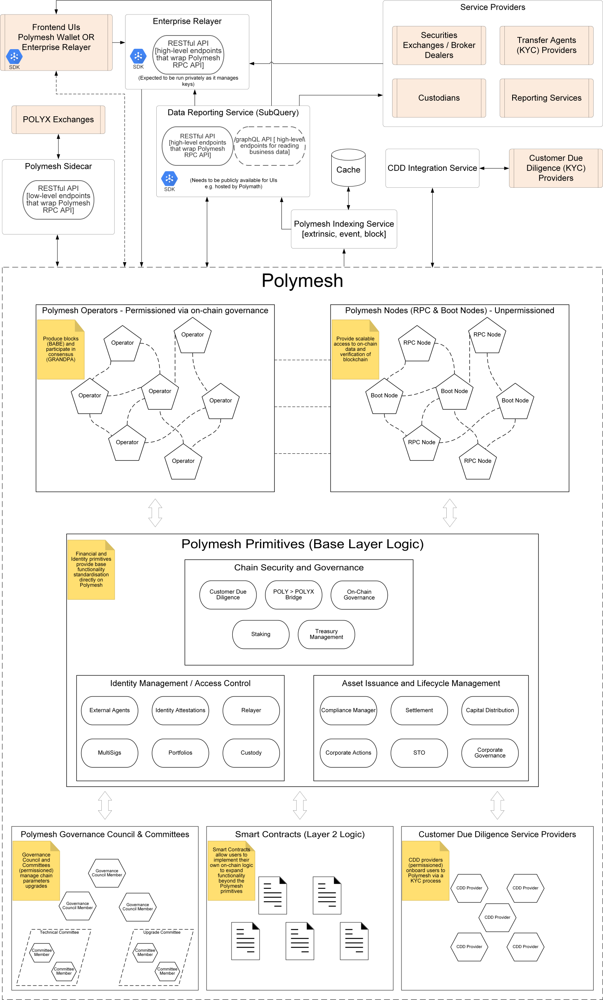

## Overview

The Polymesh blockchain is optimised for regulated assets and markets. This is reflected in its approach to governance, security and consensus, as well as the base layer primitives provided directly by the network for asset origination and lifecycle management.

Polymesh is a public, permissioned blockchain. This means that anyone can run a node and check that the rules enforced by the network are being followed by all participants, and see all the public state secured by the blockchain, but that only certain entities (called operators) are allowed to run nodes that author new blocks, and vote on the finality of other blocks.

Polymesh is built on the [Substrate framework](https://substrate.io/), an open-source project, developed by by [Parity](https://www.parity.io/), that provides a fully customisable, modular and extendable framework for blockchain developers.

Polymesh has a native token, used for security and payments, [POLYX](/polyx/).

Polymesh provides core business logic and financial abstractions at its base layer, called primitives. These provide a rich set of embedded on-chain actions (called extrinsics) that a user can initiate, such as creating an asset, settling securities instructions or participating in on-chain governance.

Polymesh also supports Layer 2 [Smart Contract](../development/smart-contracts/) logic, allowing network users to extend and leverage the base layer primitives to build on-chain financial and identity based protocols. Polymesh smart contracts compile to [WebAssembly (Wasm)](https://webassembly.org/). Using Wasm expands the family of languages available to smart contract developers to include Rust, C/C++, C#, Typescript, Haxe amd Kotlin, as well as allowing for the use of standard development tools. For Polymesh we recommend the use of [Ink!](https://ink.substrate.io/), which is a subset of Rust specifically designed by Parity for Substrate based chains. Ink! offers significantly greater performance and safety when compared with other programming languages such as Solidity.

## Architecture

## Polymesh and Polymesh Private

While Polymesh is a public-permissioned blockchain, [Polymesh Private](/polymesh-private/) is a variant designed for deployment as a private blockchain among participating chain operators. There is a single Polymesh mainnet, but there can be many independent instances of Polymesh Private chains.

Polymesh Private shares much of Polymesh's functionality, with the following differences:

- Polymesh Private chains are intended to run among a limited set of peers on a private network.
- Polymesh Private includes a [Confidential Asset](/confidential-assets/overview/) module to allow private asset settlements between counterparties.
- Polymesh Private does not use the [POLYX](/polyx/) token. While transactions may still incur fees, they are paid in a token specific to each Polymesh Private instance, which is not expected to have intrinsic value. Alternatively, Polymesh Private transactions can be configured to have no fees.
- The use of Polymesh Private is governed by a license; see [the Polymesh Private license details](https://github.com/PolymeshAssociation/polymesh-private?tab=readme-ov-file#license) for more information.

## Polymesh Pillars

Polymesh is tailored to the needs of regulated assets and global capital markets. This approach is guided by the four key pillars of Polymesh - Identity, Governance, Confidentiality and Compliance.

### Identity

[Identity](/identity/) is at the core of Polymesh. Polymesh implements a federated root of trust for onboarding all users, via permissioned Customer Due Diligence service providers. Every transaction in Polymesh is associated with an identity.

Identities provide attestation and key management. All users must act through an on-chain identity when interacting with Polymesh. Identities are referenced through DIDs (decentralised identifiers).

Identity attestations allow asset issuers to enforce compliance on-chain in real-time as assets are issued, traded and settled between different parties.

Identity key management allows users and organisations to flexibly manage their on-chain identities via primary and secondary keys and delegate asset management to other identities via external agent functionality.

An entity (a real world individual or organisation) can have multiple on-chain identities, allowing them to keep their overall positions segregated and confidential.

### Governance

Governance allows the chain to grow and develop. Polymesh has a sophisticated governance mechanism that combines signals from the broader community with technical experts (committees) and a governing council for actioning proposals. Polymesh Improvement Proposals (PIPs) can be proposed by any network user, and possible PIPs include network upgrades, setting the parameters of the network related to consensus and security and many other actions.

The Polymesh governance system is designed to further decentralise over time.

### Confidentiality

Confidentiality allows Polymesh users to maintain privacy over certain aspects of their securities transactions. The [Confidential Asset](/confidential-assets/overview/) protocol, implemented in Polymesh Private, is designed to allow confidentiality within asset transfers using homomorphic encryption and zero-knowledge proofs. There is also ongoing research on how to improve and update confidentiality in Polymesh to support the full spectrum of confidentiality and securities use-cases.

### Compliance

Polymesh facilitates claim based compliance directly in its base layer primitives. Asset issuers can set flexible and extendable rules relating to the claims that their investors are required to have attached to their identity in order to either send or receive the asset. These rules can be combined to create complex transfer restrictions that are tailored to the assets specific type, jurisdiction and regulatory regime.

## Consensus

Polymesh provides financial primitives and business logic, built on top of a distributed storage ledger.

Updates to the ledger are processed across a decentralised network of Polymesh operator nodes. The consensus mechanism consists of three main components:

1. Operator Selection: Nominated Proof-of-Stake (NPoS) determines which permissioned operators will actively participate in block production and finalization. In this system:

   - Node Operators (validators) indicate their intention to submit blocks and make their candidacy public
   - Token holders participate as nominators by staking POLYX tokens behind operators they trust
   - The network through the election algorithm distributes staked tokens to maximize economic security
   - Operators with the highest backing are elected as active validators
   - Both operators and nominators (currently disabled) face risk of slashing (loss of staked tokens) for operator misbehavior

2. Block Production: Elected operators participate in **BABE** (Blind Assignment for Blockchain Extension), which determines which operator can produce blocks in each time slot

3. Block Finality: These same operators also participate in **GRANDPA** (GHOST-based Recursive ANcestor Deriving Prefix Agreement), which provides rapid finality by having operators vote on chains rather than individual blocks

Polymesh is a permissioned network, and in order to run an operator node, the associated identity must first be permissioned through an on-chain [governance process](/governance/). These operators are typically regulated or licensed entities in their home jurisdiction, adding an additional layer of security through real-world accountability.

For more details on Consensus see:

- [Substrate Consensus Details](https://docs.substrate.io/learn/consensus/)
- [Polkadot Consensus Details](https://wiki.polkadot.network/docs/learn-consensus)
