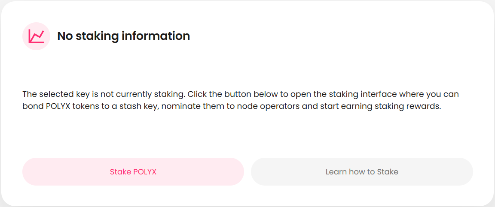
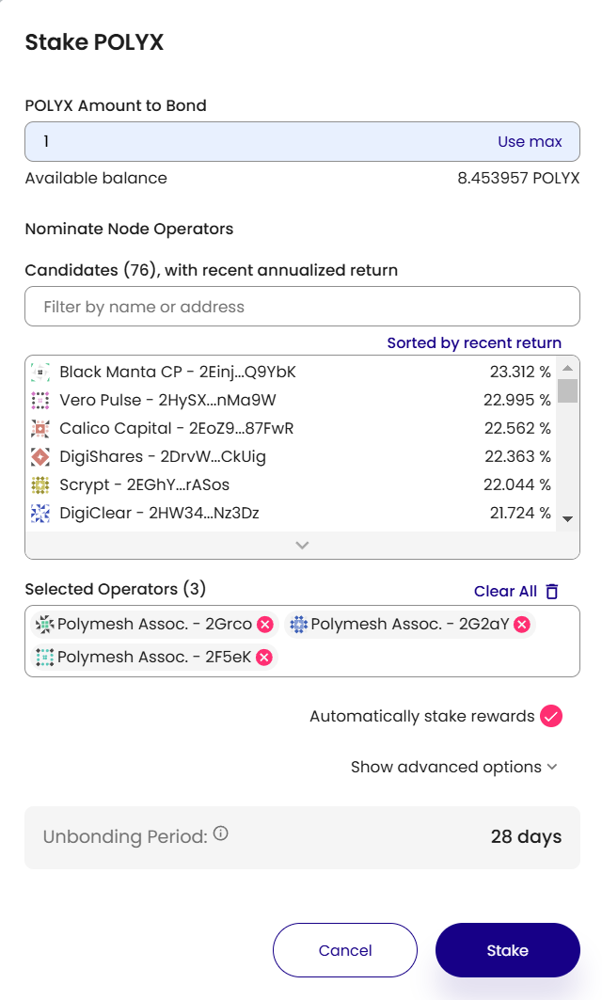
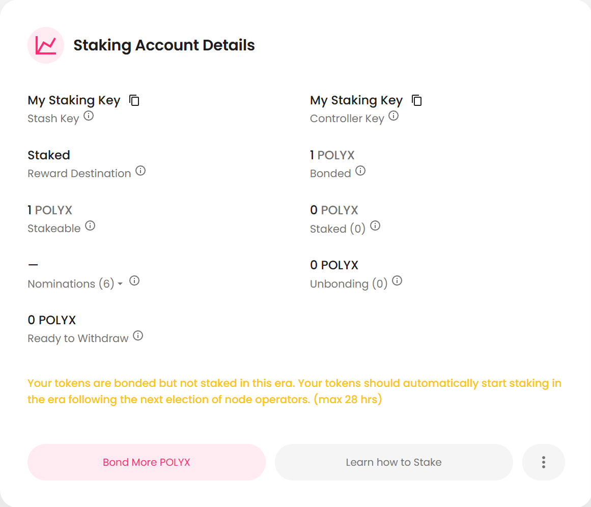

## Introduction

Polymesh uses a Nominate Proof-of-Stake (NPoS) [consensus](/architecture#consensus) mechanism that enables token holders to contribute to securing the network by bonding their POLYX and nominating it to trusted permissioned [Node Operators](/glossary#node-operator). In return, stakers earn rewards and gain influence over network governance. For definitions of key staking terms, please refer to the [glossary](/glossary/#staking--node-operations).

:::note
The Node Operator role on Polymesh is a permissioned role restricted to regulated entities approved by the Polymesh Association and assigned an onchain permission.
:::

## Why Stake?

- Earn staking rewards for securing the chain
- Participate in network governance by actively backing node operators
- Support decentralization by distributing stake across multiple operators

## Staking as a Nominator

1. **Bonding**: [Nominators](/glossary#nominator) bond tokens that they wish to use for staking purposes. Once tokens are locked (bonded), they cannot be transferred without first unbonding, waiting for an unbonding period to elapse, and then withdrawing them so they become freely transferable. The key that holds the bonded tokens is known as the [Stash](/glossary#stash) key.
2. **Nominating**: Select node operators they wish to support (16 maximum).
3. **Election**: The system operates in [eras](/glossary#era). Prior to the commencement of a new era, an election of node operators occurs to determine the node operators for the next era. The election algorithm is designed to maximize the total POLYX at stake by electing the operators with the highest number of tokens supporting them.
4. **Rewards**: At the end of each era, rewards are distributed to node operators and nominators based on the performance of the node(s) their tokens were backing. Rewards are paid from newly minted tokens. The amount of newly minted tokens is determined by the chain's [reward curve](#reward-curve).
5. **Slashing**: Tokens staked by node operators are at risk of being lost if they misbehave. Nominator tokens are not currently subject to slashing, but that could change in the future.

:::note
The unbonding period on Polymesh mainnet is 28 days. This means that once you bond tokens and later initiate an unbonding request, you will have to wait for 28 days before you can withdraw your tokens.
:::

## Reward Curve

<RewardCurve />

The diagram above shows how rewards are calculated based on the total amount of POLYX staked in the network. The curve depicts the **average** APR/APY across the chain and does not reflect rewards after operators' commissions are subtracted, which will reduce the amount received by a nominator.

The APY (Annual Percentage Yield) is based on automatically staking rewards and compounding returns.

The reward curve is designed to incentivize staking by increasing the rewards if the total amount of staked POLYX decreases. The maximum number of tokens that can be minted in a year is capped at 140 million POLYX. Hence, the maximum inflation rate decreases daily as the total supply of POLYX increases. This is reflected by the flat top on the inflation curve.

## How to Stake via the Polymesh Portal

The [Polymesh Portal](https://portal.polymesh.network/) offers a convenient way to stake on the Polymesh Blockchain. Before you get started, you must first have completed the initial steps described in the [Getting Started](/getting-started/) section. Once you have POLYX tokens, you can follow the steps below to stake:

1. Navigate to https://portal.polymesh.network/staking.
2. If you have not previously used the Polymesh Portal, you will be prompted to connect your wallet and authorize the Portal to interact with it. Review the information displayed by the wallet and accept the request to allow the Portal to read the keys stored in your wallet and submit transactions for signing.
3. Once your key is selected, click on the "Stake POLYX" button to start the staking process.
   
4. Complete details in the Stake POLYX form.

- Enter the amount of tokens you wish to stake.
- Select the node operators you wish to nominate (maximum of 16).
- If you do not wish to automatically re-stake rewards, uncheck the "Automatically stake rewards" checkbox.
  

:::warning
If you click the "Use max" button to bond your full available balance, you will not have any unlocked POLYX to cover any subsequent transaction fees. Only bond all your tokens if you understand that you will need to top up your key before you will be able to submit future transactions.
:::

5. Once all details are complete, click the "Stake" button.
6. Review the transaction details and approve it in your wallet to sign the transaction and submit it to the chain.
7. After the transaction completes, the staking page will update to show your staking information.
   

:::note
When you initially bond, you will see a note stating:
"Your tokens are bonded but not staked in this era. Your tokens should automatically start staking in the era following the next election of node operators. (max 28 hrs)".
This is because the election of node operators occurs at the start of each era and the staking process will commence after the next election. Your first reward payout will not be until the end of the era following the next election. This could be up to 52 hours after you initially bond your tokens.
:::

### Advanced Options

When initially configuring staking, you can click the "show advanced options" button to access additional staking options.
This includes:

- defining a [Controller key](/glossary#controller), which is a separate key that can control some aspects of a staking account but does not have direct access to the bonded tokens. This is useful for security purposes as it allows you to keep your [Stash key](/glossary#stash) secure while still being able to perform actions such as updating nominations from a separate key. For a list of actions that can be performed by the controller key, please refer to the [glossary](/glossary#controller).
- setting a reward destination for rewards. This can be set to automatically stake rewards, send rewards to the stash address, send rewards to the controller address, or send rewards to a separate address.

### Additional actions

Once you have staked your POLYX, you will have access to additional actions through updated buttons or by clicking on the 3 dots to the right of the "Learn how to stake" button. These include:

- **Bond More POLYX** - Increases the amount of POLYX you have bonded.
- **Change Nominations** - Update the node operators you are nominating.
- **Change Controller Address** - Update the controller key for the account.
- **Change Reward Destination** - Update the destination for rewards.
- **Remove Nominations** - Remove all nominations from the account.
- **Unbond POLYX** - Initiate the unbonding process for your staked tokens.
- **Rebond POLYX** - Rebond tokens that are in the process of unbonding that have not completed the waiting period.
- **Withdraw Unbonded** - Withdraw tokens that have completed the unbonding waiting period, to make them transferable by the stash.

:::note
Depending on the type of key selected (Controller or Stash), you may not have access to all of these options.
:::

## With the SDK

Use the [Staking Class](https://developers.polymesh.network/sdk-docs/classes/API/Client/Staking/) to implement basic staking functionality.

## Additional Resources

- [Staking Guide](https://community.polymesh.live/hc/en-us/articles/12131464556060-How-to-stake-on-the-Polymesh-Portal)
- [Polymesh Portal](https://portal.polymesh.network/)
