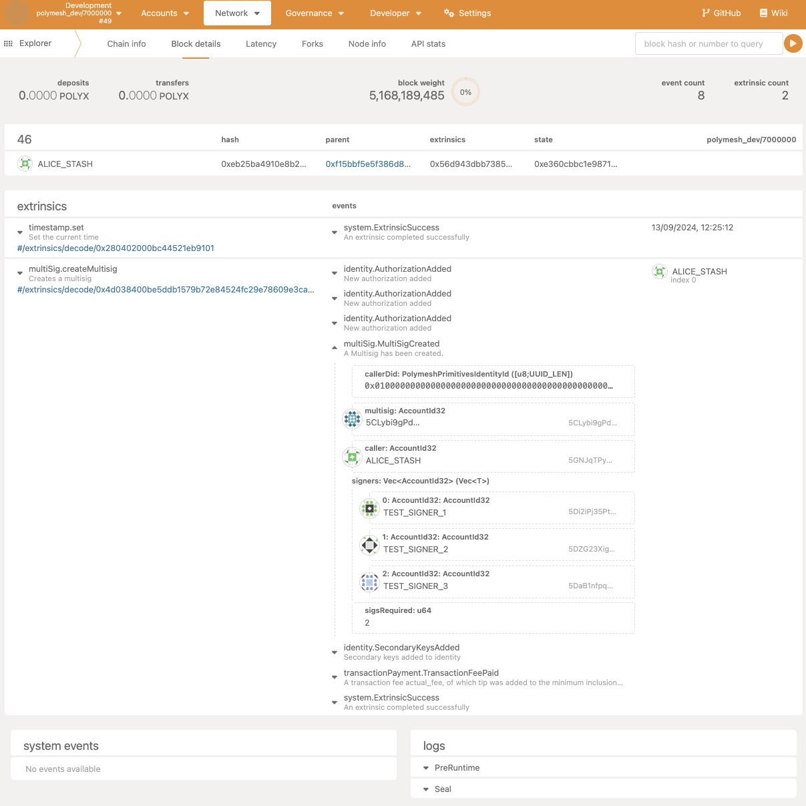

## Overview

Instead of using a public/private key pair as a primary or secondary key on your Polymesh identity, it is possible to use a MultiSig.

MultiSig keys allow specifying a set of associated signers (`n` signers), of which a subset (`m` signers) must agree to execute an on-chain action.

## Creating a MultiSig

In Polymesh, MultiSigs are always created by an existing identity and are attached to that identity as a secondary key during creation.

:::note
The **Paying Identity** of the newly created MultiSig will be set to the creator's identity.
:::

### Step 1 - Setting Up Accounts (Signing Keys)

In this tutorial, we will create a 2 of 3 MultiSig and set it as the primary key of our Polymesh identity.

To begin, we create three new keys, called `TEST_SIGNER_1/2/3`. In practice, these keys can be created and secured by three different parties.

These keys can be created in the Polymesh Wallet or using the Polymesh App (https://mainnet-app.polymesh.network) in the Accounts tab. We've used the latter for this tutorial.

### Step 2 - Creating A MultiSig

We now create the MultiSig key by calling the `multisig::createMultisig` extrinsic. This can only be called by a Primary Key of an existing Identity.

In this tutorial, `ALICE_STASH` is the Primary Key of our identity (`0x01`), so we use this key to submit the `multisig::createMultisig` transaction.

This requires us to pass in the initial set of signers for the MultiSig and specify how many of those signers are required to agree in order to execute a transaction. We specify the three new keys created in Step 1 here.

Once this extrinsic has been executed, the MultiSig is created and added to the creator's identity as a secondary key. We can check for the corresponding event, which will tell us the address of the newly created MultiSig key.

In this case, the MultiSig has an address of `5CLybi9gPdE68Ls6PDkz1KnmVH6UZcQLa7Wmt7WgEWTUFoo6`. You can add this to your address book in the Polymesh App to make it easier to reference in the future.

### Step 3 - Accepting Signer Authorizations

When we created the MultiSig, the signers are not immediately linked to it. You can see in the events emitted that 3 instances of the `AuthorizationAdded` event were emitted. Authorization requests were created for the signers to join the MultiSig, and they must accept the requests to confirm their desire to be linked to the MultiSig. We now need to accept the authorization from each of the three signers specified in Step 2.

To accept these authorizations, we need the authorization ID for each signer. These are available from the events emitted when the MultiSig is created, or alternatively, you can query the `identity::authorizations` storage or view pending authorization requests in the [Polymesh Portal](https://portal.polymesh.network/authorizations).

Once you have the authorization ID for each signing key, you can call `multiSig::acceptMultisigSignerAsKey` separately from each of the signing keys (each signer will have a different authorization ID to accept).

:::info
When accepting these authorizations, the current primary key of the _Paying Identity_ will pay for the transactions.
:::

At this point, your MultiSig is created, and the three signing keys have been associated with it.

### Step 4 - Funding The MultiSig

To fund your MultiSig, you can transfer POLYX to it like any other key.

If you added the MultiSig to your Address Book, you should now see its updated balance.

## Using The MultiSig

You can now use your MultiSig to execute actions as your identity. For example, suppose we want to create a new asset; we can call `asset::createAsset`.

Before executing this transaction from our MultiSig, the MultiSig must be permissioned to call the `asset::createAsset` extrinsic as a secondary key. Unless explicitly specified when creating, the MultiSig is assigned no permissions by default.

To create an asset, you need to first create the transaction from one signer, and then approve it from another signer (since 2 of the 3 signers must agree to execute an action).

When the first signer proposes the transaction, the corresponding event shows the proposal ID, which can be used by the second signer to approve the transaction.

In this case, the proposal ID is 0, which we then approve from the second signer.

You can now see that the `asset::createAsset` transaction is executed!

## Adding Admin Identity

It is possible to assign an _Admin Identity_ to your MultiSig. The Primary Key of the _Admin Identity_ can then add/remove signers and update the number of signers a proposal requires in order to execute.

Once added, an _Admin Identity_ can be removed either by the MultiSig itself or the Primary Key of the _Admin Identity_.

To administer the MultiSig, the Primary Key of the _Admin Identity_ must submit the relevant transactions.

Assigning an _Admin Identity_ can be done through a usual MultiSig proposal to `multisig::addAdmin`, which is then approved in the usual way.

The event confirming the new _Admin Identity_ can then be observed.

Once the _Admin Identity_ has been approved, it can, for example, update the number of approvers needed from 2 to 1.

## Removing Payer Identity

On creation, a MultiSig is assigned the identity of the calling key as its _Paying Identity_.

You may wish to remove this association, leaving the MultiSig to pay for its own transactions from its POLYX balance (rather than relying on the primary key of the _Paying Identity_ to pay for its associated transactions).

A _Paying Identity_ can be removed either by the MultiSig or by the _Paying Identity_ itself. In this example, we do the former.

## Changing Identity

It may be necessary for the MultiSig to detach from its current identity and attach to a new identity.

To join a new identity, the new identity must issue a `JoinIdentity` authorization to the MultiSig.

The MultiSig can then accept this `JoinIdentity` authorization. Note that when accepting a `JoinIdentity` authorization, it is always the primary key of the identity that issued the `JoinIdentity` authorization that pays for the transaction fee to accept the authorization.

To join a new identity, a MultiSig must use the dedicated extrinsic `multisig::approveJoinIdentity` - this ensures that payment is routed correctly (otherwise the transaction cannot complete, as, in this instance, the MultiSig cannot pay for itself as it is not yet attached to an identity).

Note that it is also possible to simplify the workflow using Polymesh's native batching functionality.

Instead, you can create a proposal for an atomic batch of two transactions using `utility::batch`:

- Leave the current identity by executing `identity::leaveIdentityAsKey`
- Join the new identity by executing `identity::joinIdentityAsKey`

The latter approach is recommended provided the `JoinIdentity` authorization can be created before the MultiSig needs to leave its current identity.
