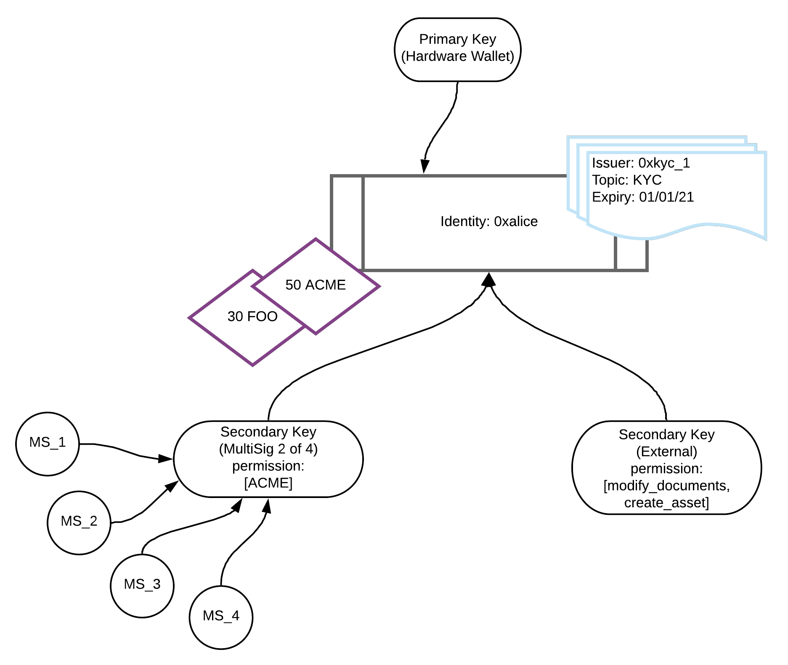

## Overview

Identity is at the core of Polymesh. All network participants must have an on-chain identity to interact with the blockchain and its assets.

Each identity:

- Is created through a [Customer Due Diligence (CDD) process](/identity/verification)
- Is referenced by a pseudo-anonymous decentralized identifier (DID) e.g., `0xfc0d2fc058d02c0a89c2cc2ff11726971dd39886a0b80ecfaa80fa3f196d65ce`
- Can hold [assets](/assets) in associated [portfolios](/portfolios), [claims](/compliance/#claims), and [permissioned roles](/identity/roles)
- Is controlled by a primary key and optional [secondary keys](/identity/advanced/secondary-keys)

## Identity Diagram

## Key Concepts

### Identity Creation & Verification

Identities are created through [permissioned CDD service providers](/identity/verification#cdd-service-providers) who verify user information, create an on-chain DID and issue CDD claims required for network access.

### Asset Management

Native [assets](/assets) (excluding [POLYX](/polyx)) held by users are associated with their identities and can be organized into [portfolios](/portfolios). Each identity can hold multiple assets and manage them through different portfolios. Identities can also be granted [agent permissions](/asset-agents) to perform specific operations on behalf of asset issuers.

### Claims & Compliance

Identities can receive [claims](/compliance#claims) from other identities, which are used to enforce on-chain [compliance rules](/compliance) for assets. Claims have specific [scopes](/compliance#claim-scopes) and can be used to represent various attributes like KYC status or accreditation.

### Key Management

Each identity has:

- A single [primary key](/identity/advanced/secondary-keys#relationship-to-primary-key) with full control
- Optional [secondary keys](/identity/advanced/secondary-keys) with configurable permissions
- Support for [multisig](/identity/advanced/multisig) keys as either primary or secondary keys
- Support for [smart contracts](/development/smart-contracts/) as either primary or secondary keys
- The ability to create [child identities](/identity/advanced/child)

Keys can also enter into a [subsidized](/accounts/subsidized/) relationship with another key to have it pay transaction fees on its behalf.

### Access Control

Polymesh provides robust [authorization](/authorizations) and [permission](/identity/advanced/secondary-keys#secondary-key-permissions) frameworks to manage access between identities and their keys.
