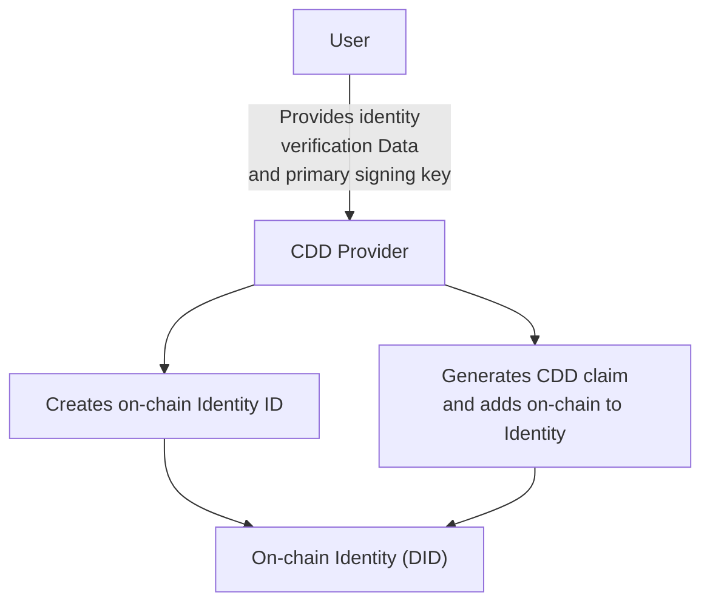
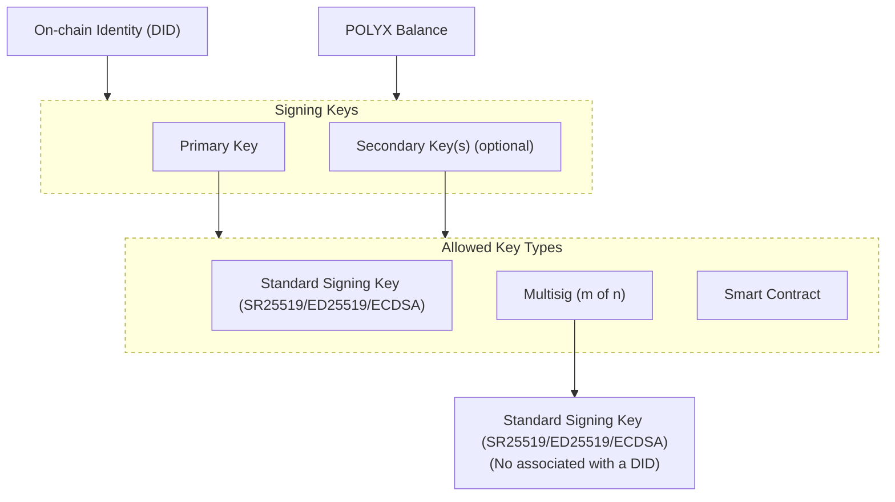
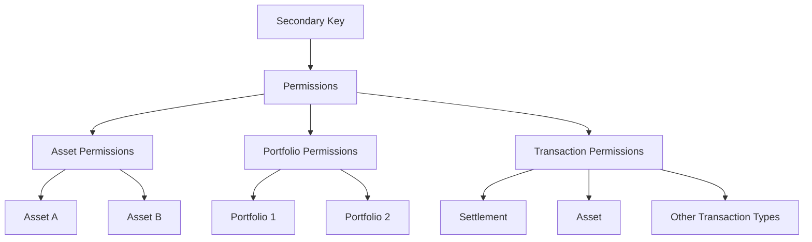
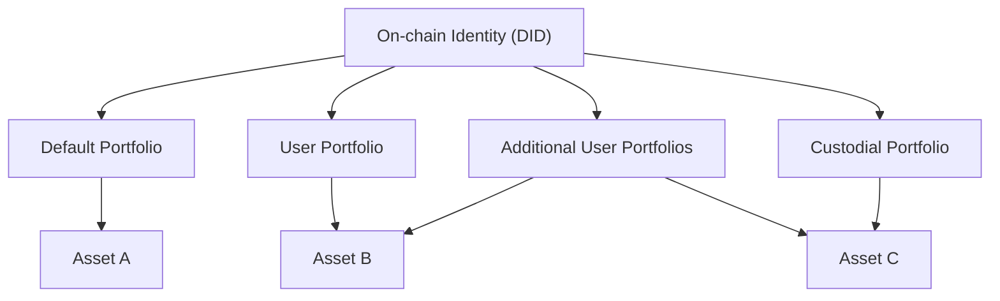
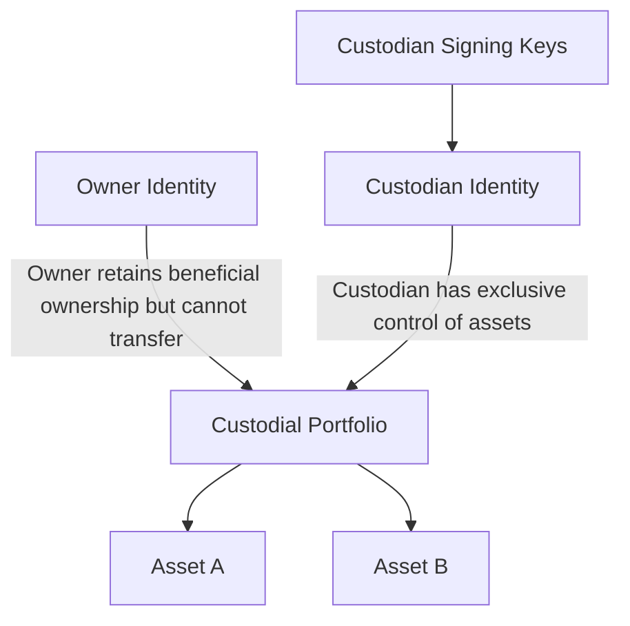
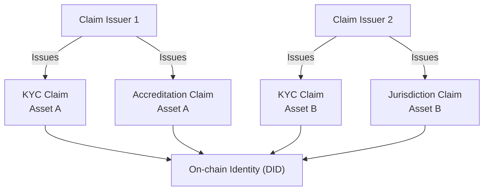
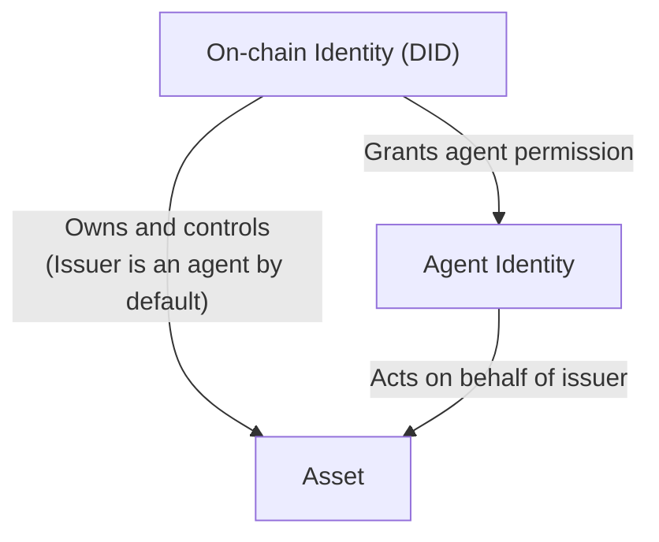
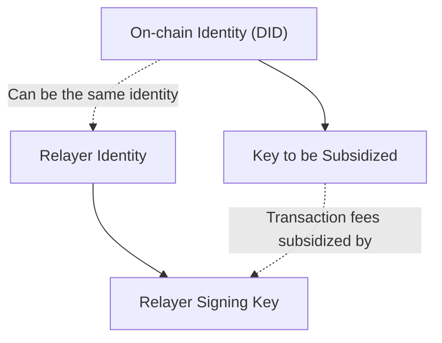
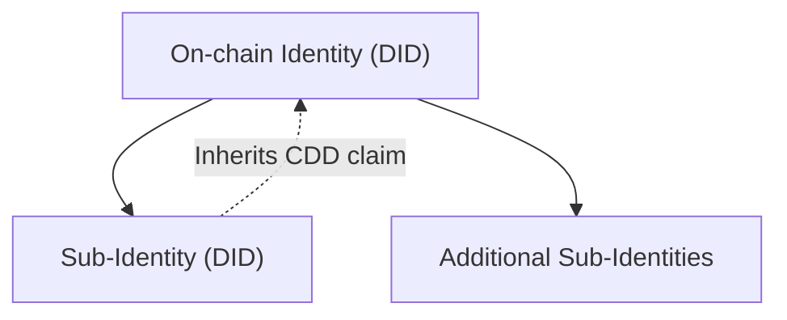

## Overview

Identity is at the core of Polymesh. All network participants must have an on-chain identity to interact with the blockchain and its assets.

Each identity:

- Is created through a [Customer Due Diligence (CDD) process](/identity/verification)
- Is referenced by a pseudo-anonymous decentralized identifier (DID), e.g., `0xfc0d2fc058d02c0a89c2cc2ff11726971dd39886a0b80ecfaa80fa3f196d65ce`
- Can hold [assets](/core/assets) in associated [portfolios](/portfolios), [claims](/compliance/#claims), and [permissioned roles](/identity/roles)
- Is controlled by a [primary key](/identity/advanced/primary-keys) and optional [secondary keys](/identity/advanced/secondary-keys)

## Key Concepts

### Identity Creation & Verification

Identities are created through [permissioned CDD service providers](/identity/verification#cdd-service-providers) who verify user information, create an on-chain DID and issue CDD claims required for network access.

### Asset Management

Native [assets](/core/assets) (excluding [POLYX](/polyx)) held by users are associated with their identities and can be organized into [portfolios](/portfolios). Each identity can hold multiple assets and manage them through different portfolios. Identities may also be granted [agent permissions](/asset-agents) to perform specific operations on behalf of asset issuers.

### Claims & Compliance

Identities can receive [claims](/compliance#claims) from other identities, which are used to enforce on-chain [compliance rules](/compliance) for assets. Claims have specific [scopes](/compliance#claim-scopes) and can be used to represent various attributes, such as KYC status or accreditation.

### Key Management

Each identity has:

- A single [primary key](/identity/advanced/secondary-keys#relationship-to-primary-key) with full control
- Optional [secondary keys](/identity/advanced/secondary-keys) with configurable permissions
- Support for [multisig](/identity/advanced/multisig) keys as either primary or secondary keys
- Support for [smart contracts](/development/smart-contracts/) as either primary or secondary keys
- The ability to create [child identities](/identity/advanced/child)

Keys can also enter into a [subsidized](/accounts/subsidized/) relationship with another key, allowing the subsidizer to pay transaction fees on its behalf.

### Access Control

Polymesh provides robust [authorization](/authorizations) and [permission](/identity/advanced/secondary-keys#secondary-key-permissions) frameworks to manage access between identities and their keys.

## Identity Diagrams

The following diagrams help visualize and clarify the relationships between key aspects of on-chain identities in Polymesh. Each diagram focuses on a specific concept, such as [Customer Due Diligence (CDD)](/identity/verification), [primary and secondary keys](/identity/advanced/secondary-keys), [portfolios](/portfolios), [custody](/portfolios/custody), [claims and compliance](/compliance), [agent permissions](/asset-agents), [subsidized accounts](/accounts/subsidized), and [secondary key permissions](/identity/advanced/secondary-keys#secondary-key-permissions). For more details, see the linked documentation pages for each topic.

### Identity Onboarding & CDD

This diagram shows how a user is onboarded to Polymesh through a [CDD (Customer Due Diligence) provider](/identity/verification), resulting in the creation of an on-chain identity and issuance of a [CDD claim](/identity/verification#cdd-claims).

---

### Keys & Accounts

This diagram shows how an identity (DID) is controlled by signing keys. Both the [primary key](/identity/advanced/primary-keys) and any number of optional [secondary keys](/identity/advanced/secondary-keys) are grouped in a "Signing Keys" subgraph. Each key can be a standard signing key (SR25519, ED25519, or ECDSA), a [multisig](/identity/advanced/multisig), or a [smart contract](/development/smart-contracts/).

---

### Secondary Key Permissions

Secondary keys can be granted fine-grained [permissions](/identity/advanced/secondary-keys#secondary-key-permissions), allowing them to perform only specific actions or access certain resources. Permissions can be scoped to:

- **Assets**: Restrict which assets the key can interact with (e.g., only certain tokens).
- **Portfolios**: Restrict which portfolios the key can access or manage.
- **Transactions**: Restrict which types of transactions the key can sign (e.g., transfers, settlements, etc.).

The diagram below illustrates how secondary key permissions can be configured:

---

### Portfolios & Asset Management

This diagram demonstrates how an identity can have multiple [portfolios](/portfolios) (default, user, custodial) to organize and manage [assets](/core/assets), including both fungible and non-fungible tokens.

---

### Custody & Portfolio Control

This diagram shows how portfolio [control/custody](/portfolios/custody) can be assigned to another identity (the custodian), who then controls the portfolio's assets.

---

### Claims & Compliance

This diagram illustrates how [claims](/compliance#claims) (such as KYC or accreditation) are issued to an identity by a claim issuer (e.g., a [CDD provider](/identity/verification) or another identity), and how they are used for [compliance](/compliance) purposes. Multiple claims from different issuers can be attached to a single identity and may be scoped to specific assets, identities or custom identifiers.

---

### Agent Permissions

This diagram shows how an identity can grant [agent permissions](/asset-agents) to another identity, allowing the agent to act on behalf of the original identity for specific assets or operations. The asset issuer is an agent for its own asset by default.

---

### Relayer & Subsidized Keys

This diagram shows how a [relayer](/accounts/subsidized) can subsidize transaction fees for a signing key (not directly for an identity), allowing another key (owned by a relayer identity) to pay fees on behalf of a key. The relayer's key may be under a different identity than the subsidized key.

---

### Identity Structure: Primary & Sub-Identities

This diagram illustrates the relationship between a primary on-chain identity and its [sub-identities (child identities)](/identity/advanced/child), including inheritance of [CDD claims](/identity/verification#cdd-claims).

