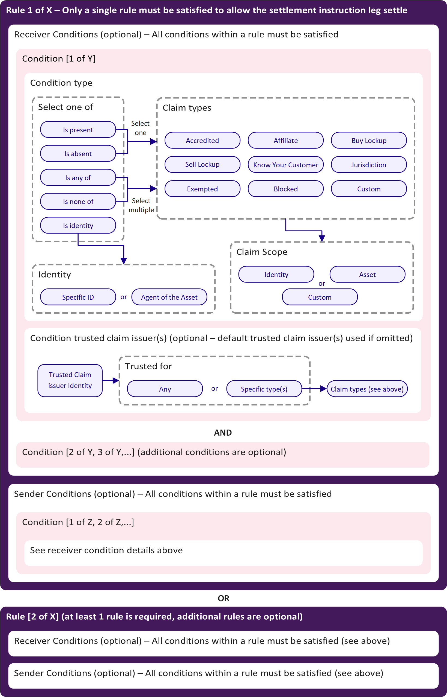

Polymesh enforces compliant asset transfers through on-chain rules based on identity claims. Asset issuers, or their appointed agent, define which claims (such as KYC, accreditation, or jurisdiction) and which claim issuers are required to be present or absent for transfers to be permitted. These rules ensure that only eligible participants can hold or transfer assets, and are checked automatically by the blockchain.

## Overview

Compliance on Polymesh is managed by the on-chain **Compliance Manager** module. Asset issuers (or their agents) can define, update, pause, or reset compliance requirements (rules) for their assets. Each rule specifies which identity [claims](#claims), [claim issuers](#trusted-claim-issuers), and [claim scopes](#claim-scopes) are required for transfers, and can apply to senders, receivers, or both.

Compliance is enforced through a set of requirements (rules) attached to each asset. Each requirement consists of one or more conditions that must be satisfied by the sender, receiver, or both. **If all conditions within at least one rule are satisfied, the transfer is allowed.** Rules are evaluated automatically during every transfer, ensuring that only permitted transactions are executed.

**Key concepts:**

- Multiple **rules** can be defined per asset. Each rule can have multiple sender and receiver conditions.
- Conditions are based on claims held by identities, such as KYC, accreditation, jurisdiction, or custom claims.
- Asset issuers can specify which identities are trusted to issue claims for compliance purposes.
- Rules can specify the required scope for claims (e.g., asset-specific, identity-specific, or custom).
- Claims can have expiry dates, and lockup claims can restrict transfers until a specified time.
- Support for custom claim types and custom claim scopes.

## Claims

Compliance rules are built on top of the Polymesh claims system. **Claims** are attestations made by one identity about another, such as "is accredited" or "is from jurisdiction X." Claims are added on-chain using the `identity::add_claim` extrinsic from the identity pallet.

Claims can be:

- **Standard types:** Accredited, Affiliate, Buy Lockup, Sell Lockup, Know Your Customer, Jurisdiction, Exempted, Blocked, and Custom.
  - The `Jurisdiction` claim takes an additional country code parameter, indicating the user's jurisdiction.
- **Custom types:** Asset issuers can define and use custom claim types for specialized compliance needs.

:::info
`CustomerDueDiligence` (CDD) is a special claim type only issued by permissioned CDD service providers. See [Identity Verification](/identity/verification). This is not typically used in compliance rules.
:::

Each claim has:

- **Scope:** Specifies what the claim applies to (an asset, an identity, or a custom value).
- **Expiry:** (Optional) date after which the claim is no longer valid. When used in conjunction with `Buy Lockup` and `Sell Lockup` claims, an expiry can prevent investors from buying or selling an asset until after the expiry date of the respective claim.
- **Issuer:** The identity that issued the claim.

## Compliance Rules

Compliance rules are structured as follows:

1. **Rules:** Each asset can have multiple rules. At least one rule must be satisfied for a transfer to be allowed (logical OR between rules).
2. **Conditions:** Each rule can have multiple sender and/or receiver conditions. All conditions within a rule must be satisfied (logical AND between conditions).
3. **Condition Types:** Conditions specify the type of claim, the required scope, and (optionally) the trusted claim issuer(s).

:::info
If no compliance requirements are set for an asset, all transfers are allowed by default.
:::

The diagram below illustrates how compliance rules are constructed on Polymesh:

Asset issuers can specify multiple rules for their asset. Each rule includes conditions that either the sender or receiver must satisfy. If the conditions for any rule are met by both parties in a transaction, the transfer leg can proceed.

Each compliance rule's conditions (for both sender and receiver) must be satisfied, although condition lists can be empty. For example, if the sender conditions are blank, all asset holders can send the token without restriction, provided the receiver satisfies the specified receiver conditions.

An asset issuer can also pause compliance on their asset, enabling all transfer legs to execute upon affirmation. Pausing compliance may benefit certain assets, like stablecoins, where the issuer may not wish to impose transfer restrictions. This is managed using the `pause_asset_compliance` and `resume_asset_compliance` extrinsics.

### Condition Types

Each condition within a rule defines a specific requirement (typically [claim](#claims) related) that must be met. The main condition types are:

- **IsPresent:** Requires that a specific claim (and optionally scope and issuer) is present for the sender or receiver.
- **IsAbsent:** Requires that a specific claim is not present.
- **IsAnyOf:** Requires that at least one claim from a specified set is present.
- **IsNoneOf:** Requires that none of a specified set of claims are present.
- **IsIdentity:** Requires that the sender or receiver is a specific identity (by DID) or is an [ExternalAgent](/asset-agents) of the asset. This condition does not rely on claims, but instead checks for a direct match to a specified identity or agent relationship. For example, this can be used to exempt the asset issuer or a designated agent from other transfer requirements.

The **IsIdentity** condition supports two options:

- **Specific:** The sender or receiver must have a specific Decentralized Identifier (DID).
- **ExternalAgent:** The sender or receiver must be an agent of the asset (see [Asset Agents & Permissions](/asset-agents)).

These condition types can be combined within rules to create complex, fine-grained compliance logic.

If any compliance rule is satisfied in a transfer leg, compliance is considered complete, allowing asset issuers to create complex rule sets that ensure asset compliance.

For example, the following rule set requires only a single rule to be satisfied (OR logic between rules):

- Rule 1 - sender does not have a sell lockup scoped to the asset, from the asset issuer; receiver has a KYC claim and is not in the U.S., with claims scoped to the asset or issuer identity and from the issuer's KYC partner.
- Rule 2 - sender does not have a sell lockup scoped to the asset, from the asset issuer; receiver has a KYC claim and an Accredited claim, scoped to the asset or issuer identity and from the issuer's KYC partner.
- Rule 3 - sender's identity is an agent of the asset, with no receiver conditions.
- Rule 4 - no sender restriction; receiver's identity is an agent of the asset.
- Rule 5 - no sender restriction; receiver has an Exempted claim scoped to the asset from the asset issuer.

## Trusted Claim Issuers

While any identity can issue a claim, asset issuers can specify which identities are considered **trusted claim issuers** for compliance purposes. There are two ways to define trusted claim issuers:

- **Default trusted claim issuers:** Set at the asset level, these are used whenever a rule does not specify a claim issuer for a condition. Asset-level defaults are managed using the `complianceManager::add_default_trusted_claim_issuer` and `complianceManager::remove_default_trusted_claim_issuer` extrinsics. When adding a default trusted claim issuer, issuers can specify which claim types the issuer is trusted for, or indicate that the issuer is trusted for all claim types.
- **Rule-defined trusted claim issuers:** Specified directly within a compliance rule condition for a particular claim type or condition. These take precedence over the asset-level defaults for that rule. Rule-defined trusted claim issuers can also be set for specific claim types or for all claim types within the rule, providing granular control over which issuers are accepted for each compliance condition.

Only claims from trusted claim issuers (either default or rule-defined, and for the relevant claim type) will be considered valid for satisfying compliance rules. This allows issuers to:

- Accept claims only from themselves or approved KYC providers
- Restrict certain claim types to specific issuers (e.g., only accept Affiliate claims from the asset issuer)

If a rule does not specify a trusted claim issuer for a claim, the default trusted claim issuers for the asset are used automatically.

## Claim Scopes

Scopes can be considered as a way to group claims. Each claim has a **scope** that determines what it applies to:

- **Asset scope:** The claim is specific to a unique asset ID.
- **Identity scope:** The claim applies to a specific identity.
- **Custom scope:** Arbitrary value for specialized use cases.

Compliance rules can specify which claim scopes are accepted for each condition.

**Examples:**

- A claim scoped to the `ACME` asset UUID (e.g., `12345678-1234-1234-1234-123456123456`) allows the claim to be used with rules that only accept claims scoped to this asset, offering the highest level of control over identity claims.
- A claim scoped to the `ACME Co.` identity (issuer of `ACME-A`, `ACME-B`, and `ACME-C`) enables reuse of identity claims across multiple assets. Here, claim issuers can issue a single KYC claim scoped to the identity rather than multiple asset-specific claims.
- A custom scope such as `ACME Exchange` could apply to claims issued by the ACME Exchange for all onboarded account holders. If an asset issuer lists their token on the ACME Exchange and accepts the exchange as a trusted issuer, the issuer can permit exchange account holders to trade the token by recognizing the exchange's custom scope in compliance rules.

:::info
Identity claim scopes are required to match a condition claim scope to satisfy a condition. However, an Asset type or Identity type claim does not need to match the specific asset or identity involved in the transfer. All scopes should be considered as a way to group claims and can be reused across multiple assets.
:::

:::note
Just because a trusted issuer has issued, for example, a KYC claim on Polymesh, it does not necessarily mean that the KYC was performed to the same requirements as those of a particular asset issuer. Claim issuers may perform KYC for many issuers, each with different standards. Scoping provides a way for issuers to group and recognize only those claims that they are confident meet their own requirements.
:::

## Technical Implementation

Key on-chain extrinsics (dispatchable functions) in the Compliance Manager module include:

- `add_compliance_requirement`: Add a new compliance rule to an asset.
- `remove_compliance_requirement`: Remove a rule from an asset.
- `add_default_trusted_claim_issuer`: Add a default trusted claim issuer for an asset.
- `remove_default_trusted_claim_issuer`: Remove a default trusted claim issuer for an asset.
- `reset_asset_compliance`: Remove all rules for an asset.
- `pause_asset_compliance`: Pause compliance checks for an asset.
- `resume_asset_compliance`: Resume compliance checks for an asset.
- `replace_asset_compliance`: Replace the entire set of compliance rules for an asset (not just a single rule).
- `change_compliance_requirement`: Change the conditions of an existing compliance rule for an asset.

These extrinsics are available via the Polymesh runtime and can be called by asset owners or their appointed agents.

---

## Transfer Restrictions

Polymesh also supports protocol-level transfer restrictions for fungible assets, such as limits on the number of holders, maximum ownership percentages, and claim-based caps. These restrictions are enforced automatically and can be used alongside compliance rules for additional control.

For details and configuration options, see the [Transfer Restrictions](/compliance/transfer-restrictions) page.
