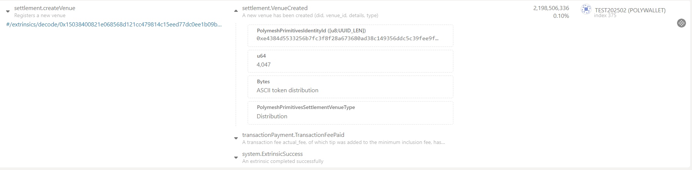
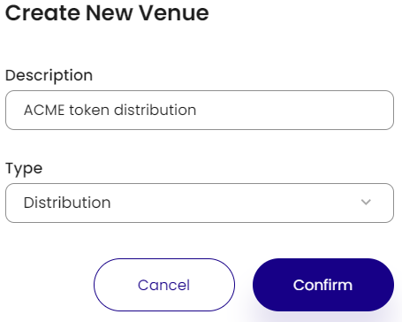

# Overview

Venues on Polymesh are logical groups of instructions and settlements.
Ultimately, an account is responsible for its own venues, for access rights, and for who can create, cancel, and remove instructions within them.
Once an instruction has been created inside a venue, it cannot be moved to another. Venues can be reused at any time.

::: info
Venues are optional for settlement instructions - when creating a new settlement instruction, if the venue is not specified, then the instruction cannot include off-chain legs.
:::

Learn more about venues in the [SDK documentation](https://developers.polymesh.network/sdk-docs/classes/API/Entities/Venue/).

# Creating Venues

Now let's create a venue. Venues can be created via the Polymesh App or on the Polymesh Portal.

## With the Polymesh App

Venues can be created by calling the 'createVenue' extrinsic within the settlement pallet in the Polymesh App.

- 'details' : Extra details about a venue, like the venue name.
- 'signers' : Array of signers that are allowed to sign receipts for this venue.
- 'typ' : Type of venue being created.

The following venue types can be created:
- 'Distribution': Primary issuance.
- 'Exchange': Venue type for exchange.
- 'Other': Default venue type.
- 'Sto': Venue type for Offering/Fundraise.

Once this extrinsic has been executed, the venue is created with a specific ID associated to it.
This Venue ID then can be used to create and approve instructions within this venue.

## With the Polymesh Portal

Venues can be created on the Transfer tab on the Polymesh Portal by clicking on the 'Create Venue' button.

As always, the transaction must be signed with the wallet.
After creating the venue, we can go ahead and create instructions within it.

### Links

[Polymesh Portal](https://portal.polymesh.network/)
[Polymesh App](https://app.polymesh.network/)