## Overview

Settlement in Polymesh is the process by which assets are transferred between identities in a regulated and compliant fashion. It requires all counterparties to affirm (agree) an instruction (a set of asset transfers) before the instruction settles (completes).

Key characteristics of Polymesh settlement:

- **Multi-party coordination**: All counterparties must explicitly authorize transfers
- **Double spending prevention**: Assets are locked upon sender affirmation
- **Flexible execution**: Multiple settlement types accommodate different workflow requirements
- **Unilateral rejection**: Any counterparty can reject an instruction at any time
- **Optional mediation**: Third-party validation through [settlement mediators](/settlement/mediators) (e.g. a transfer agent)

## Settlement Types

Instructions can be configured with different settlement types to accommodate various workflow requirements:

- **SettleOnAffirmation**: Settles automatically when all parties affirm (most common)
- **SettleOnBlock**: Settles at a specific block number defined when the instruction is created
- **SettleManual**: Requires manual execution after all affirmations and after a specified block
- **SettleAfterLock**: Requires [mediator locking](/settlement/mediators#settlement-locking-settleafterlock-instructions) before settlement execution

### Instruction Dates

All instruction types support optional metadata dates:

- **Trade Date**: Indicates when the instruction becomes valid for interaction (informational only)
- **Value Date**: Indicates when the instruction should ideally be settled (informational only)

:::important Date Enforcement
These date fields are purely informational metadata and are **not enforced** by the Polymesh protocol. The only validation is that `value_date` must be greater than or equal to `trade_date` when both are specified.
:::

## Asset Movement Options

Instructions can settle via:

- **On-chain movement**: Direct transfer of on-chain assets between portfolios
- **Off-chain payment receipts**: Signed attestations that off-chain asset transfers occurred. See [Off-Chain Settlement](/settlement/off-chain/) for details.

## Double Spending Prevention

Polymesh prevents double spending through immediate asset locking:

- When a sender affirms an instruction, required assets are immediately locked in their portfolio
- Locked assets cannot be used in other transactions until released
- Asset locks are only released when:
  - The instruction is successfully executed (assets are transferred)
  - The instruction is explicitly rejected by any counterparty
  - Affirmations are manually withdrawn by the sending counterparty
- The asset owner maintains beneficial ownership even when locked

:::note Asset Locks vs Mediator Locks
Asset locks prevent double spending by locking sender assets upon affirmation. This is separate from [mediator locks](/settlement/mediators#settlement-locking-settleafterlock-instructions) used in `SettleAfterLock` instructions, which control execution timing.
:::

## Roles and Permissions

### Asset Issuer

- Controls which identities can create instructions referencing their asset
- Can designate mandatory mediators for all transfers of their asset
- May leave instruction creation unrestricted

Asset issuers may assign permissions to another identity as an agent of the asset to manage these functions on their behalf.

### Venues

- Optional organizational structure for grouping related instructions
- Only venue creators can create instructions within their venue
- Venue creators can cancel pending instructions within their venue
- Required for instructions with off-chain legs (to define authorized signatories)
- Control authorized signatories for payment receipt validation

For more details on venues, see [Settlement Venues](/settlement/venues).

### Counterparties

- Any identity referenced as a payer/receiver in an instruction leg
- Must authorize instructions where they are a counterparty before settlement execution
- Can reject instructions unilaterally
- Assets are locked upon affirmation to prevent double spending

### Mediators

Optional third-party entities that provide additional validation and control. See [Settlement Mediators](/settlement/mediators) for detailed information.

## Affirmation Requirements

By default all instruction legs require explicit affirmations from all counterparties before settlement. This requirement has important implications:

- **No airdropping**: Assets cannot be sent to recipients without their explicit consent, providing multiple protections:
  - **Legal and tax protection**: Prevents unwanted taxable events, regulatory reporting requirements, or legal liabilities from unsolicited asset transfers
  - **Security and reputation**: Avoids accounts being flagged for handling assets linked to hacks, sanctions, or other compliance concerns
  - **Spam and scam prevention**: Blocks unsolicited airdrops that may be phishing attempts, scams, or wallet pollution
  - **Operational clarity**: Maintains clean, auditable portfolios without unwanted tokens that could create confusion or management overhead
  - **Compliance benefits**: Creates a clear, auditable trail of consent and acknowledgment, simplifying regulatory reporting and reducing legal ambiguity
- **Custodian control**: Entities such as custodians have full control over what assets they receive and when they take custody, enabling proper due diligence and risk management
- **Three-step processes**: The affirmation requirement enables on-chain replication of traditional financial three-step settlement processes (instruction → affirmation → execution)

While this affirmation process increases friction compared to simple transfers, it provides essential control and compliance capabilities for regulated financial markets.

### Asset Exemptions and Pre-Affirmation

For certain types of assets or workflows, the default affirmation requirement may not be practical. Polymesh provides several mechanisms to streamline settlement by allowing exemptions or pre-affirmations to receive an asset. The ability to exempt affirmation for certain assets helps reduce friction when not appropriate, but requires explicit opt-in in most cases:

#### Identity-Level Asset Exemptions

Identities can exempt themselves from requiring affirmations when receiving specific assets:

- **Pre-approval**: An identity can pre-approve specific Asset IDs, eliminating the need for explicit affirmations on incoming transfers
- **Identity control**: Each identity manages their own exemption list independently
- **Asset-specific**: Exemptions are granted per asset, allowing granular control
- **Revocable**: Exemptions can be added or removed at any time

This is particularly useful for:

- Stable coins and other high-frequency transfer assets
- Institutional portfolios receiving regular distributions
- Service provider identities that handle many incoming transfers

#### Global Asset Exemptions

The Polymesh governing council can designate certain Asset IDs as globally exempt from requiring affirmations on receipt. This applies network-wide and is typically reserved for:

- Widely-used stable coins or utility tokens
- Assets where universal pre-approval enhances network efficiency

#### Portfolio-Level Exemptions

In addition to identity-level exemptions, portfolio level exemptions can be set. See the [Portfolios](/portfolios/#preapprove-receiving-an-asset-in-a-portfolio) section for further details..

:::note Exemption Scope
Asset exemptions only apply to **receiving** transfers. Sending transfers always require explicit authorization from the asset owner or their authorized custodian, regardless of exemption status.
:::

## Instruction Structure

Settlement instructions are composed of one or more **legs**, each representing a single asset transfer between portfolios.

### Instruction Components

An instruction contains:

- **Settlement type**: Determines execution behavior (SettleOnAffirmation, SettleOnBlock, etc.)
- **One or more legs**: The actual asset transfers to be executed
- **Optional venue**: Organizational grouping and signatory control for off-chain legs (see [Settlement Venues](/settlement/venues))
- **Optional mediators**: Third-party validation entities (see [Settlement Mediators](/settlement/mediators))
- **Optional dates**: Trade date and value date metadata
- **Optional memo**: Descriptive publicly visible text for the instruction

### Leg Components

Each leg within an instruction specifies:

- **Asset**: The specific asset to be transferred (identified by Asset ID)
- **Amount**: The quantity of the asset to transfer (for fungible assets)
- **NFTs**: The specific NFT IDs to transfer (for non-fungible assets, up to 10 NFTs per leg)
- **Sender portfolio**: The portfolio from which assets will be transferred
- **Receiver portfolio**: The portfolio that will receive the assets
- **Leg type**: On-chain transfer or off-chain receipt

### Leg Types

**Fungible legs**:

- Transfer a specific quantity of fungible tokens between portfolios
- Assets are locked when the sender affirms and transferred upon execution
- Most common type for security tokens and other divisible assets

**Non-fungible legs**:

- Transfer specific NFT IDs from a single collection between portfolios
- Can transfer up to 10 individual NFTs per leg from the same collection
- Each NFT is identified by its unique NFT ID within the collection
- Assets are locked when the sender affirms and transferred upon execution

**Off-chain legs**:

- Represent transfers that occur outside Polymesh (e.g., fiat currency, commodities)
- Require a signed payment receipt as proof of transfer
- Must be associated with a venue that defines authorized signatories

For detailed information on off-chain settlement, see [Off-Chain Settlement](/settlement/off-chain/).

### Multi-Leg Instructions

Instructions can contain multiple legs to represent complex transactions:

- **Atomic execution**: All legs execute together or none execute at all
- **Cross-leg dependencies**: One leg's failure causes the entire instruction to fail
- **Mixed asset types**: Instructions can combine fungible, non-fungible, and off-chain legs
- **Portfolio coordination**: Multiple portfolios can be involved across different legs
- **Atomic DvP settlement**: Enable on-chain delivery versus payment transactions where asset transfers and payments settle simultaneously

## Instruction Lifecycle

### Status States

Instructions progress through several status states:

- **Pending**: Created and awaiting affirmations or execution
- **Failed**: Execution was attempted but failed due to constraints
- **Success**: Executed successfully with assets transferred
- **Rejected**: Explicitly rejected by a counterparty
- **LockedForExecution**: Locked by a mediator awaiting execution (`SettleAfterLock` only)

### Basic Workflow

1. **Creation**: Instruction created with specified legs, settlement type, and optional mediators
2. **Affirmation**: Counterparties (and mediators if required) affirm the instruction (assets locked for senders). Where [portfolio custody](/portfolios/custody/) has been assigned, the controller of that portfolio is responsible for affirmation rather than the portfolio owner.
3. **Execution**: Instruction settles based on its settlement type
4. **Completion**: Assets transferred and instruction marked as successful

## Execution Behavior

Settlement instructions execute differently based on their settlement type:

### Automatic Execution (SettleOnAffirmation & SettleOnBlock)

**SettleOnAffirmation**: When the final required affirmation is received, the instruction is automatically **scheduled** for execution. The affirmation transaction succeeding only confirms scheduling - actual settlement occurs in a subsequent block. While this is typically in the next block execution is not guaranteed to be immediate if the chain is congested.

**SettleOnBlock**: Instruction is scheduled for execution at the specified block number. If affirmations are still missing at the target block, the instruction fails permanently.

Both types provide limited immediate feedback since execution is deferred to later blocks.

### Manual Execution (SettleManual & Failed Instructions)

Manual execution provides immediate feedback by attempting settlement within the same transaction:

- Success or failure is reported instantly
- If execution fails, the transaction reverts with clear error information
- Can be used to retry failed instructions once underlying issues are resolved
- Works for any instruction type that has all required affirmations
- **Batched operations**: Affirmation and execution can be combined in a single transaction for atomic settlement with immediate feedback

### Mediated Execution (SettleAfterLock)

See [Settlement Mediators](/settlement/mediators) for detailed workflow information on mediator-controlled execution.

## Failure Recovery

When instructions fail during execution:

1. **Asset locks remain**: Failed instructions do not automatically release locked assets
2. **Status handling varies**:
   - **Scheduled execution failures**: Instruction marked as "Failed" status
   - **Manual execution failures**: Transaction reverts, instruction status unchanged
3. **Recovery options**: Use manual execution to retry once underlying issues are resolved
4. **Asset release**: Locks only release when instruction succeeds or is explicitly rejected

Common failure causes include compliance violations, issuer has frozen the asset or other transfer restrictions.

## Examples

### Peer to Peer Transfer

Alice wants to transfer 10 ACME tokens to Bob.

Alice creates an instruction at a venue (either one she owns or the default venue), with a single leg transferring 10 ACME tokens from her portfolio to Bob's portfolio.

#### Instruction Structure

```mermaid
flowchart LR
    A("🏢 Venue ID: 42") --> B("📋 Instruction ID: 1337<br/>Type: SettleOnAffirmation<br/>Status: Pending<br/>📝 Memo: Gift from Alice")
    B --> C("🔗 Leg 0: Fungible Transfer<br/>━━━━━━━━━━━━━━━<br/>👤 From: Alice (0x01...abc)<br/>📁 Portfolio: Default<br/>💰 Asset: ACME (0x02...def)<br/>📊 Amount: 10 tokens<br/>👤 To: Bob (0x03...ghi)<br/>📁 Portfolio: Default")
```

When Alice creates the instruction she affirms it and her 10 ACME tokens are immediately locked. The instruction now requires affirmation from Bob's portfolio.

Bob affirms the instruction, which triggers scheduling of the instruction for automatic execution since all required affirmations are now in place.

The settlement completes with Bob receiving 10 ACME tokens and Alice's tokens being unlocked from the instruction.

### Exchange Mediated Transfer

ExchangeCo operates a trading venue and matches Alice (seller of ACME) with Bob (buyer of ACME) for an agreed exchange: 100 ACME for 10 USDC.

ExchangeCo creates an instruction at their venue with two legs:

- Leg 1: Transfer 100 ACME from Alice's portfolio to Bob's portfolio
- Leg 2: Transfer 10 USDC from Bob's portfolio to Alice's portfolio

#### Instruction Structure

```mermaid
flowchart LR
    A("🏢 Venue ID: 15<br/>ExchangeCo") --> B("📋 Instruction ID: 2468<br/>Type: SettleManual<br/>Status: Pending<br/>📝 Memo: ACME/USDC trade")

    B --> atomic

    subgraph atomic ["⚛️ Atomic Settlement"]
        direction LR
        C("🔗 Leg 0: Fungible Transfer<br/>━━━━━━━━━━━━━━━<br/>👤 From: Alice (0x01...abc)<br/>📁 Portfolio: Default<br/>💰 Asset: ACME (0x02...def)<br/>📊 Amount: 100 tokens<br/>👤 To: Bob (0x03...ghi)<br/>📁 Portfolio: Default")
        D("🔗 Leg 1: Fungible Transfer<br/>━━━━━━━━━━━━━━━<br/>👤 From: Bob (0x03...ghi)<br/>📁 Portfolio: Default<br/>💰 Asset: USDC (0x04...jkl)<br/>📊 Amount: 10 tokens<br/>👤 To: Alice (0x01...abc)<br/>📁 Portfolio: Default")
    end

    style atomic stroke-dasharray: 5 5
```

When the instruction is created, assets are not locked until the senders affirm. Alice's 100 ACME tokens are locked when she affirms, and Bob's 10 USDC tokens are locked when he affirms.

Both Alice and Bob must affirm the instruction using their respective portfolios. Once both affirmations are received, ExchangeCo (the venue operator) manually executes the instruction.

The settlement completes with Alice receiving 10 USDC and Bob receiving 100 ACME.

### Settlement with Off-Chain Receipt

ExchangeCo operates a hybrid settlement model where some transfers happen off-chain (like fiat payments) while others happen on-chain.

Alice wants to buy 100 ACME tokens from Bob for $1000 USD (paid off-chain via bank transfer).

ExchangeCo creates an instruction with two legs:

- Leg 1: Transfer 100 ACME from Bob's portfolio to Alice's portfolio (on-chain)
- Leg 2: Off-chain leg representing Alice's $1000 payment to Bob

#### Instruction Structure

```mermaid
flowchart LR
    A("🏢 Venue ID: 15<br/>ExchangeCo") --> B("📋 Instruction ID: 3579<br/>Type: SettleOnAffirmation<br/>Status: Pending<br/>📝 Memo: ACME for USD")

    B --> atomic

    subgraph atomic ["⚛️ Atomic Settlement"]
        direction LR
        C("🔗 Leg 0: Fungible Transfer<br/>━━━━━━━━━━━━━━━<br/>👤 From: Bob (0x03...ghi)<br/>📁 Portfolio: Default<br/>💰 Asset: ACME (0x02...def)<br/>📊 Amount: 100 tokens<br/>👤 To: Alice (0x01...abc)<br/>📁 Portfolio: Default")
        D("🔗 Leg 1: Off-Chain Transfer<br/>━━━━━━━━━━━━━━━<br/>👤 From: Alice (0x01...abc)<br/>💵 Asset: USD (Off-chain)<br/>📊 Amount: $1000<br/>👤 To: Bob (0x03...ghi)<br/>🧾 Requires: Signed Receipt")
    end

    style atomic stroke-dasharray: 5 5
```

When created, no assets are locked initially since ExchangeCo (not the asset owners) created the instruction.

Alice makes the $1000 bank transfer to Bob off-chain. Once Bob confirms receipt, an authorized signer of the ExchangeCo venue creates a signed receipt acknowledging the off-chain payment.

Bob affirms the instruction using `affirm_with_receipts`, providing:

- His portfolio for the on-chain leg
- The signed receipt for the off-chain leg

The instruction executes automatically, transferring 100 ACME to Alice while the off-chain receipt is recorded on-chain as proof of the fiat payment.

```mermaid
flowchart LR
    A("ExchangeCo creates<br/>hybrid instruction<br/>No assets locked<br/>initially")

    A --> prep
    subgraph prep ["📋 Off Chain Actions"]
        C("Alice sends $1000<br/>off-chain to Bob")
        D("Venue signer creates<br/>signed receipt")
        C --> D
    end

    A --> affirm
    subgraph affirm ["✅ Affirmation Phase"]
          direction LR
      E("Alice affirms:<br/>No assets to lock<br/>(receiver only)")
      F("Bob affirms:<br/>100 ACME locked")
    end

    G("Receipt submitted<br/>by anyone")
    prep --> G

    affirm ---> H("All requirements met:<br/>Instruction executes")
    G --> H
    H --> I("Alice gets 100 ACME<br/>Receipt recorded<br/>on-chain")

    style prep stroke-dasharray: 3 3
    style affirm stroke-dasharray: 3 3
```

### Netting Process

ClearCo operates a multilateral netting service and receives the following bilateral obligations from trading activity between BankCo_1, BankCo_2, BankCo_3, and BankCo_4. All obligations are in USDC:

**Raw bilateral obligations (pre-netting):**

- BankCo_1 owes BankCo_2: 1,200 USDC
- BankCo_2 owes BankCo_3: 700 USDC
- BankCo_3 owes BankCo_4: 900 USDC
- BankCo_4 owes BankCo_1: 800 USDC
- BankCo_2 owes BankCo_1: 300 USDC
- BankCo_3 owes BankCo_1: 400 USDC
- BankCo_4 owes BankCo_2: 500 USDC

ClearCo processes these and computes net positions per participant:

**Net positions:**

- **BankCo_1**: Net **receive** 300 USDC (receives 300 + 400 + 800 = 1,500, owes 1,200)
- **BankCo_2**: Net **receive** 700 USDC (receives 1,200 + 500 = 1,700, owes 700 + 300 = 1,000)
- **BankCo_3**: Net **send** 600 USDC (receives 700, owes 900 + 400 = 1,300)
- **BankCo_4**: Net **send** 400 USDC (receives 900, owes 800 + 500 = 1,300)

ClearCo constructs a minimal settlement instruction with net legs, reducing 7 gross payment flows down to 4 net settlement legs:

- BankCo_3 sends 600 USDC to ClearCo
- BankCo_4 sends 400 USDC to ClearCo
- ClearCo sends 300 USDC to BankCo_1
- ClearCo sends 700 USDC to BankCo_2

#### Instruction Structure

```mermaid
flowchart LR
    A("🏢 Venue ID: 88<br/>ClearCo") --> B("📋 Instruction ID: 4680<br/>Type: SettleAfterLock<br/>Status: Pending<br/>📝 Memo: Daily multilateral netting")

    B --> atomic

    subgraph atomic ["⚛️ Atomic Settlement"]
        C("🔗 Leg 0: Net Inflow<br/>━━━━━━━━━━━━━━━<br/>👤 From: BankCo_3 (0x33...ccc)<br/>📁 Portfolio: Default<br/>💰 Asset: USDC (0x04...jkl)<br/>📊 Amount: 600 tokens<br/>👤 To: ClearCo (0x88...zzz)<br/>📁 Portfolio: Default")
        D("🔗 Leg 1: Net Inflow<br/>━━━━━━━━━━━━━━━<br/>👤 From: BankCo_4 (0x44...ddd)<br/>📁 Portfolio: Default<br/>💰 Asset: USDC (0x04...jkl)<br/>📊 Amount: 400 tokens<br/>👤 To: ClearCo (0x88...zzz)<br/>📁 Portfolio: Default")
        E("🔗 Leg 2: Net Outflow<br/>━━━━━━━━━━━━━━━<br/>👤 From: ClearCo (0x88...zzz)<br/>📁 Portfolio: Default<br/>💰 Asset: USDC (0x04...jkl)<br/>📊 Amount: 300 tokens<br/>👤 To: BankCo_1 (0x11...aaa)<br/>📁 Portfolio: Default")
        F("🔗 Leg 3: Net Outflow<br/>━━━━━━━━━━━━━━━<br/>👤 From: ClearCo (0x88...zzz)<br/>📁 Portfolio: Default<br/>💰 Asset: USDC (0x04...jkl)<br/>📊 Amount: 700 tokens<br/>👤 To: BankCo_2 (0x22...bbb)<br/>📁 Portfolio: Default")

        %% Grid layout: Row 1: C D, Row 2: E F
        C ~~~ D
        E ~~~ F
    end

    style atomic stroke-dasharray: 5 5
```

When created, no USDC amounts are locked initially since ClearCo (not the asset owners) created the instruction. Assets are only locked when each party affirms the instruction.

Each party affirms the instruction with their portfolio, which locks their sending amounts:

- BankCo_3's affirmation locks 600 USDC
- BankCo_4's affirmation locks 400 USDC
- ClearCo's affirmation locks 1,000 USDC for outgoing payments

Once all parties have affirmed, the instruction executes automatically. The netting settlement completes with significantly reduced payment volume and operational risk compared to settling all 7 bilateral obligations individually.

### Security Token Offering

Security Token Offerings (STOs) are a special case that use Polymesh's settlement engine but behave differently from standard settlement instructions.

AcmeCo wishes to distribute 1000 ACME tokens to investors through a security token offering. When AcmeCo sets up the STO distribution, **their 1000 ACME tokens are immediately locked and committed to the distribution** - this acts as a blanket pre-affirmation for any investor who participates.

When Alice decides to invest and buy 100 ACME tokens for 10 USDC, the STO pallet creates a settlement instruction with two legs:

- Leg 1: Transfer payment (10 USDC) from Alice's portfolio to AcmeCo's portfolio
- Leg 2: Transfer ACME tokens (100 ACME) from AcmeCo's portfolio to Alice's portfolio

However, since AcmeCo's assets are already locked and pre-committed to the distribution, **the instruction can execute immediately in the same block** when Alice affirms with her payment.

#### STO Settlement Flow

```mermaid
flowchart LR
    A("🏢 STO Distribution<br/>AcmeCo") --> B("📋 1000 ACME tokens<br/>locked & committed<br/>to distribution")

    B --> C("📋 Alice's Investment<br/>Instruction ID: 5791<br/>Type: SettleOnAffirmation<br/>Status: Pending")

    C --> atomic

    subgraph atomic ["⚛️ Atomic Settlement"]
        direction LR
        D("🔗 Leg 0: Payment<br/>━━━━━━━━━━━━━━━<br/>👤 From: Alice (0x01...abc)<br/>📁 Portfolio: Default<br/>💰 Asset: USDC (0x04...jkl)<br/>📊 Amount: 10 tokens<br/>👤 To: AcmeCo (0x05...mno)<br/>📁 Portfolio: Default")
        E("🔗 Leg 1: Token Distribution<br/>━━━━━━━━━━━━━━━<br/>👤 From: AcmeCo (0x05...mno)<br/>📁 Portfolio: Default<br/>💰 Asset: ACME (0x02...def)<br/>📊 Amount: 100 tokens<br/>👤 To: Alice (0x01...abc)<br/>📁 Portfolio: Default<br/>✅ Pre-affirmed")
    end

    style atomic stroke-dasharray: 5 5
```

**Key differences from standard settlement:**

1. **Pre-commitment**: When the STO distribution is created, AcmeCo's 1000 ACME tokens are locked and the issuer effectively provides blanket affirmation for any valid investment
2. **Immediate execution**: When Alice affirms with her 10 USDC payment, the instruction executes in the same block since AcmeCo's side is already committed
3. **Streamlined flow**: No separate affirmation step needed from the issuer for each individual investment

:::info STO vs Standard Settlement
STOs use the same underlying settlement engine but with pre-committed issuer assets, enabling immediate execution when investors participate. This differs significantly from standard settlement instructions where all parties must explicitly affirm before execution.

For comprehensive details on STO mechanics, asset distribution, and investor participation, see the [Security Token Offering documentation](/sto/).
::::
