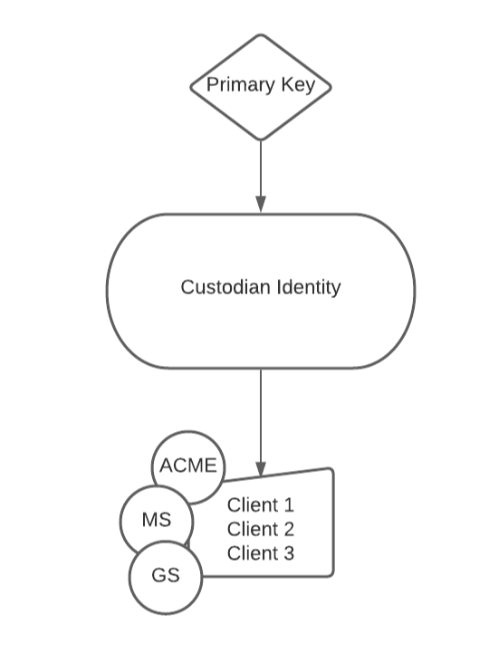
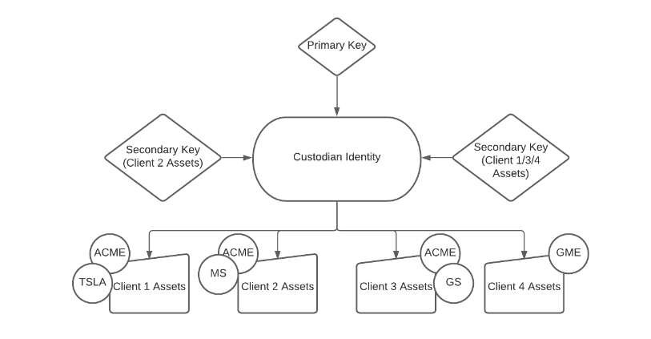
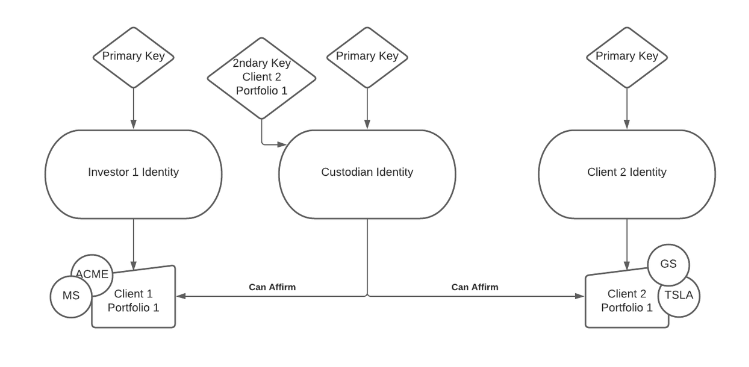

## Overview

On Polymesh, users can assign custodianship of a portfolio to another identity. This cleanly separates beneficial ownership of an asset (which always stays under the beneficiaries identity) used for corporate actions, from custodial ownership where another entity may manage those assets on behalf of their beneficiary.

Any assets in a portfolio which has been assigned a custodian are managed exclusively by that custodian, and include any new assets which are transferred into the portfolio.

A portfolio can only be assigned to a single custodian at a time. Once assigned to a custodian, the custodian can:

- affirm or reject instructions that relate to portfolios managed by the custodian on behalf of the owner

- revoke their custodianship over the portfolio

## Custody Models

The above features allow for different types of custody model that can be used to meet different use-cases and requirements.

**Use cases:**
- The first use-case is when a user wants to delegate the full control and recorded beneficial ownership of assets to a third-party custodian.
- The second use-case is when a user wants to retain beneficial ownership, but delegate settlement responsibilities to a third-party custodian.

### Custody with Full Control and Ownership

Since assets are held at the identity level, this involves transferring the assets from the users identity to the custodians identity.

From the perspective of Polymesh this would mean that the custodian is the beneficial owner of the securities. The custodian would require the appropriate attestations in order to hold any assets they are holding in custody.

The custodian has full rights over these assets in-protocol. For example they can transfer them to another party.

For the purposes of any corporate actions, the custodian would be seen as the beneficial owner of these assets.

The custodian identity(s) would require any compliance claims necessary to hold the assets they are custodying. The custodian (or other agent) would need to enforce any underlying compliance for their clients required to own the assets on the issuers behalf.

#### Omnibus

Custodian creates one omnibus portfolio and holds all clients assets in a single portfolio within the corresponding identity.

Whilst this model is very simple and easy to manage it lacks many useful features available in the below more sophisticated approaches.

#### Omnibus Segregation

Custodian has a single identity and segregates client assets by portfolio (aka sub-accounts).

- Smaller number of keys to manage - since secondary keys can be permissioned at the portfolio level, access to client assets can be flexibly segmented.

- Clear separation of client funds on-chain.

- Primary key can access all client funds.

Note: Omnibus Segregation could be extended to large Asset Managers or Broker-Dealers by creating a separate identity. This identity could be the custodian's identity OR the Asset Manager/Broker-Dealers Identity for which the custodian controls the Primary Key.

### Custody with beneficial interest separated from asset control

In this model the user retains full beneficial interest in their assets, for example for the purposes of dividend payments and corporate actions.

Polymesh has dedicated custody functionality for the on-chain settlement of assets.

This allows a user, who holds assets in a particular portfolio, to delegate control of that portfolio to a third-party identity, for the purposes of affirming settlements that relate to that portfolio.

The custodian can also invest (on behalf of their client) in any STOs using funds from the clients portfolio that they are a custodian of.

NB - this follows a similar approach to ERC-2258 as mentioned in:  
[Regulatory Approaches to the Tokenisation of Assets](https://www.oecd.org/content/dam/oecd/en/publications/reports/2021/03/regulatory-approaches-to-the-tokenisation-of-assets_da7ae482/aea35466-en.pdf)

- The user cannot unilaterally remove a custodian for one of their portfolios - the custodian must relinquish control of the portfolio. This prevents a user who has been “hacked” from being vulnerable to having their assets stolen, and means the custodian has full control over those assets.

- The beneficial owner, for the purposes of cap tables and corporate actions, remains the investor, not the custodian. So if the issuer were to ask all token holders to vote, each token holder could vote using their own identity without the need for the custodian to intervene/participate.

- A user can assign one custodian per portfolio they own. A portfolio can contain any number of different assets.

# Custody Portfolios

Creating custody portfolios on Polymesh allows asset owners to delegate the management of specific portfolios to third-party custodians, while maintaining beneficial ownership. This is particularly useful for regulated entities and institutions needing to separate asset control from ownership.
The custodian receives full rights to manage the portfolio, including transferring assets, just like the owner does.

## Custody Portfolio Lifecycle

### 1. Allowing an identity to create Portfolios

An identity can be permitted to create portfolios by calling `portfolio::allow_identity_to_create_portfolios` and entering the DID of the permitted identity.
This is particularly useful for institutional or custody models, where, for example, a custodian or service provider needs to create and manage portfolios on behalf of clients, but the beneficial ownership remains with the client’s identity.

**Effects**:
- When the portfolio owner calls `allow_identity_to create_portfolios` and specify a `trusted_identity`, the user is authorizing that identity to use the `create_custody_portfolio` function.
- This means the trusted identity can create new portfolios that are owned by the user's identity but will immediately be under the custody of the trusted identity.

**Constraints**:
- The function must be called by the owner of the portfolio.
- Only one custodian can be assigned per portfolio.
- The custodian's identity must possess any required compliance claims (such as CDD or other attestations) to hold or manage assets in the portfolio.

This function can be revoked by calling `revoke_create_portfolios_permission` by entering the permissioned identity.

### 2. Creating a Custody Portfolio

Creating custody portfolios on Polymesh allows asset owners to delegate the management of specific portfolios to third-party custodians, while maintaining beneficial ownership. This is particularly useful for regulated entities and institutions needing to separate asset control from ownership.

Custody Portfolios can be created by calling `portfolio::createCustodyPortfolio`.

**Parameters**:
- `portfolio_owner_id`: The DID that will own the new portfolio.
- `portfolio_name`: The name of the custody portfolio.

**Effects**:
- A new numbered portfolio is created under the owner’s identity. The portfolio is owned by the specified identity but is immediately under the custody of the caller (the custodian).
- Assigning a custodian gives that identity exclusive management rights over the portfolio’s assets, including:
	- Transfer assets in/out of the portfolio.
	- Affirm or reject settlements involving the portfolio.
	- Manage corporate actions for assets in the portfolio.
- The portfolio owner retains beneficial ownership for corporate actions (e.g., dividends, voting), even though the custodian handles day-to-day management.

**Constraints**:
- The caller must be pre-authorized by the portfolio owner id using `allow_identity_to_create_portfolios`. Without this, the call will fail.
- The created portfolio can only have one custodian at a time.
- The owner cannot revoke custody unilaterally - the custodian must use `portfolio::quit_portfolio_custody` to relinquish control.
- The portfolio owner cannot manage assets in the custody portfolio unless the custodian quits or transfers custody back.
- The custodian’s identity must meet compliance requirements (e.g., CDD checks) to hold or manage assets in the portfolio.

### 3. Ending Portfolio Custody

If a custodian no longer wishes to manage the portfolio or cannot fulfill their duties, they can invoke their custodian rights to a portfolio by calling `quit_portfolio_custody`.

**Effects**:
- This function immediately ends the custodian’s management rights over the portfolio. The portfolio owner regains full control and management authority.

**Constraints**:
- Only the current custodian of a portfolio can invoke this function.

## Querying Custody Information

Portfolio owners and custodians can access custody information through several query methods:
- `portfolio::portfolioCustodian` to query the custodian of a particular portfolio.
- `portfolio::allowedCustodians` shows the custodians allowed to create and take custody of portfolios on an owner's behalf.
- `portfolio::portfoliosInCustody`: to track all the portfolios in custody of a particular identity.