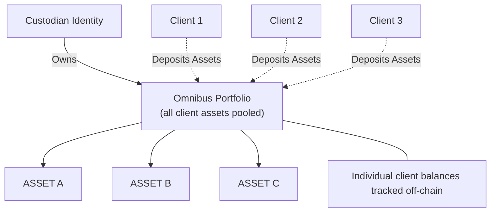
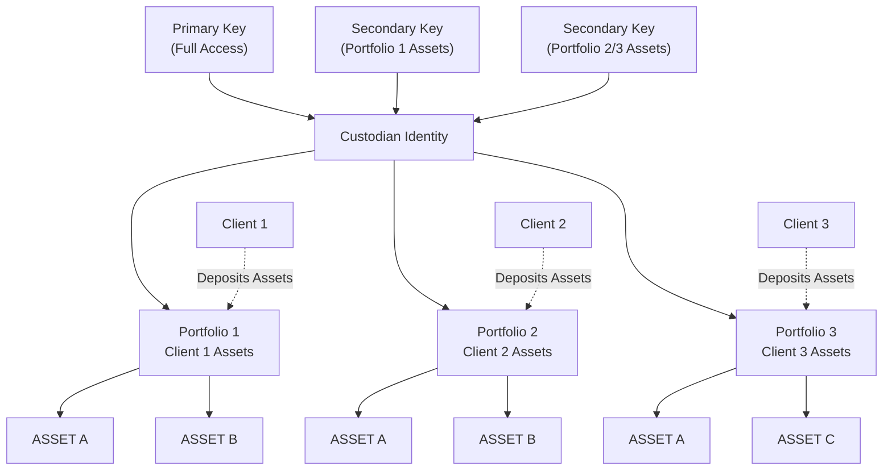
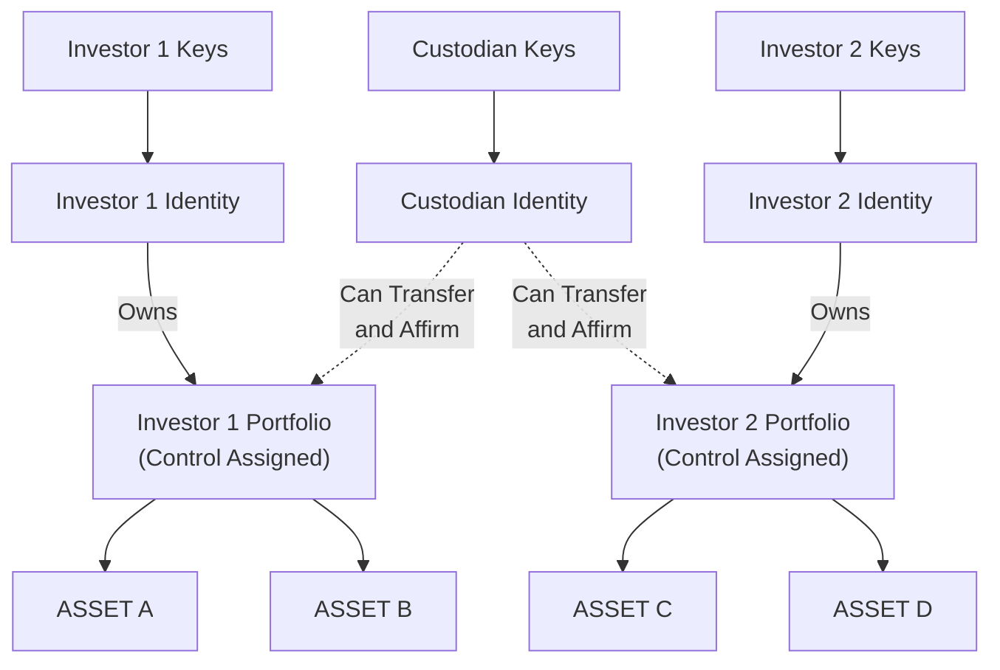
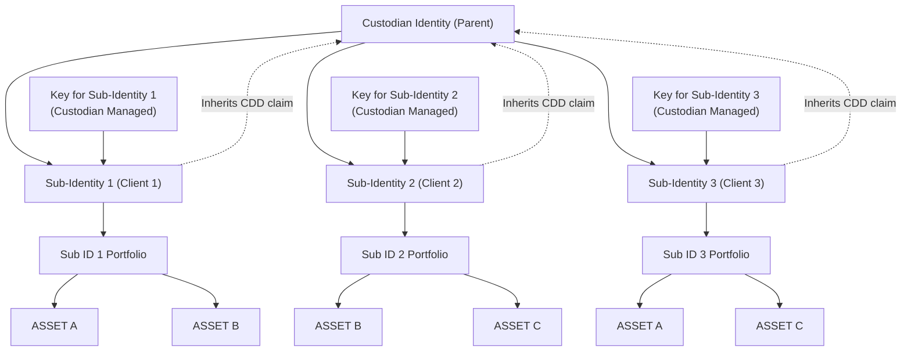

## Overview

Polymesh is designed to support several common custody models, including the ability to assign custodianship of a portfolio to another [identity](/identity). This separates beneficial ownership (which always stays with the beneficiary's identity for corporate actions) from custodial control, where another entity manages the [assets](/core/assets) on behalf of the beneficiary.

When control of a portfolio is assigned, the custodian can:

- **Affirm, reject, and revoke affirmation** for [settlement](/settlement) instructions involving the portfolio.
- **Move assets between portfolios under the same DID**: The custodian can transfer assets between [portfolios](/portfolios) belonging to the same identity, as long as they have custody of the source portfolio.
- **Pre-approve or remove pre-approval for asset receipt** for the portfolio.
- **Leave the custody relationship** (return custody to the owner).

**Restrictions:**

- The custodian cannot move assets to portfolios under a different DID; only between portfolios of the same owner.
- The custodian cannot delete the portfolio.
- The custodian cannot rename the portfolio.

Any assets in a portfolio which has been assigned a custodian are managed exclusively by that custodian, and include any new assets which are transferred into the portfolio.

A portfolio can only be assigned to a single custodian at a time.

## Custody Models

Polymesh supports a range of custody models to meet diverse requirements, allowing users and institutions to select the approach that best fits their regulatory, operational, and business needs.

**Use cases include:**

- **Self-custody:** The asset owner manages their own assets and portfolios directly, retaining both beneficial and operational control.
- **Omnibus custody:** A custodian pools assets for multiple clients in a single portfolio, with client balances tracked off-chain.
- **Segregated custody (omnibus segregation):** A custodian manages assets for multiple clients, but each client’s assets are held in separate on-chain portfolios under the custodian’s identity, providing on-chain segregation.
- **Delegated control (portfolio custody):** The owner retains beneficial ownership, but delegates management and [settlement](/settlement) responsibilities for a specific portfolio to a custodian, who cannot move assets outside the owner’s identity.
- **Sub-identity (full segregation):** The custodian creates a separate on-chain [identity](/identity/advanced/child) for each client, providing the highest level of on-chain segregation and regulatory clarity.

These models can be combined or tailored to meet specific regulatory or operational requirements.

### Self-Custody

In the self-custody model, the asset owner retains full control and beneficial ownership of their assets and portfolios. All actions, including transfers, settlements, and corporate actions, are performed directly by the owner or their authorized keys.

:::note
Some regulated assets or jurisdictions may require the use of an approved custodian, and self-custody may not be permitted for all asset types. Always check the compliance requirements for each asset.
:::

### Custody with Full Control and Ownership

In the full control and ownership model, assets are transferred from the user's identity to the custodian's identity. On Polymesh, this means the custodian becomes both the owner of record and beneficial owner of the securities on-chain.

The custodian has full rights over these assets within the protocol, including the ability to transfer, manage, or dispose of them as they see fit. For all [corporate actions](/corporate-actions), the custodian is recognized as the beneficial owner.

To hold and manage these assets, the custodian must possess the necessary [compliance claims](/compliance) and satisfy all regulatory requirements. The custodian is also responsible for ensuring that any underlying compliance obligations for their clients are met according to the issuer's rules.

#### Omnibus

Custodian creates one omnibus portfolio and holds all clients assets in a single portfolio within the corresponding identity.

While this model is very simple and easy to manage, it lacks many useful features available in the more sophisticated approaches described below. As all assets are held in a single portfolio, the custodian must maintain an off-chain ledger of client balances and transactions. Since asset movements do not use the Polymesh [settlement engine](/settlement), on-chain compliance rules are not enforced. This means that the custodian must ensure that all asset movements are compliant with the rules of the issuer and any other regulatory requirements.

#### Omnibus Segregation

Custodian has a single identity and segregates client assets by portfolio (aka sub-accounts).

**Key features of Omnibus Segregation:**

- Each client's assets are held in a separate on-chain portfolio under the custodian's identity, providing clear on-chain segregation and transparency.
- The custodian can permission secondary keys at the portfolio level, allowing flexible and secure access control for each client's assets.
- The primary key of the custodian can access all client portfolios, while secondary keys can be restricted to specific portfolios or assets as needed.
- Asset movements between portfolios are always recorded on-chain and can be audited, but as these movements remain under a single on-chain identity, Polymesh protocol compliance rules are not automatically enforced for these internal transfers. The custodian is responsible for ensuring compliance and maintaining accurate records.
- The custodian identity is recorded as the beneficial owner for all assets in these portfolios, including for corporate actions.
- The custodian is responsible for maintaining compliance for all assets held in these portfolios, including any regulatory or issuer requirements.

This model is often used by custodians, asset managers, or broker-dealers who want to provide clients with segregated accounts while retaining operational efficiency and compliance oversight. It can also be extended by creating separate identities for large clients or business units, further enhancing segregation and control.

---

### Custody with Beneficial Interest Separated from Asset Control

In this model, the user retains full beneficial ownership of their assets (for example, for [dividend payments](/corporate-actions/distributions) and [corporate actions](/corporate-actions)), but delegates control of a specific portfolio to a third-party custodian. The custodian can affirm or reject settlements, move assets between portfolios under the same DID, and manage day-to-day operations.

Polymesh provides dedicated custody functionality for on-chain [settlement](/settlement), enabling this separation of control and ownership. This approach is particularly useful for regulated entities or investors who must retain beneficial ownership for compliance or reporting purposes, but wish to delegate operational responsibilities.

The custodian can also invest (on behalf of their client) in any [STOs](/sto) using funds from the client’s portfolio that they are a custodian of.

:::note
This model follows a similar approach to ERC-2258 as described in the [Regulatory Approaches to the Tokenisation of Assets](https://www.oecd.org/content/dam/oecd/en/publications/reports/2021/03/regulatory-approaches-to-the-tokenisation-of-assets_da7ae482/aea35466-en.pdf).
:::

**Key features of Portfolio Custody:**

- **Separation of ownership and control**: The investor retains beneficial ownership while delegating operational control to a custodian. The investor's ownership is reflected in corporate actions, dividends, and regulatory reporting.
- **Security model**: The custodian has exclusive control over the assigned portfolio, and only the custodian can relinquish this control. This security design protects assets from unauthorized access, even if an investor's keys are compromised.
- **Compliance enforcement**: Unlike the omnibus models, all asset transfers between investors must go through the Polymesh settlement engine and are fully subject to on-chain compliance rules.
- **Portfolio management**: Each portfolio can only have one custodian at a time, but an investor can create multiple portfolios with different custodians for different purposes or asset types.
- **Operational restrictions**: Custodians can only move assets between portfolios under the same identity (DID), cannot delete portfolios, and cannot transfer assets to external identities without using the settlement engine.
- **Regulatory considerations**: This model is often preferred by regulated entities that must maintain beneficial ownership for compliance reasons but want to delegate operational responsibilities to qualified custodians.
- **Transparent governance**: For voting and other governance activities, the beneficial owner (investor) participates directly, maintaining a clear separation between custody services and ownership rights.

### Sub-Identities (Full Segregation)

In this model, the custodian creates a separate on-chain identity ([sub-identity](/identity/advanced/child)) for each client. Each sub-identity inherits the CDD claim from the parent (custodian) identity but otherwise behaves as a fully independent identity. This allows for complete on-chain segregation of client assets, with each sub-identity requiring its own unique key to transact. The parent (custodian) cannot directly access the assets of the sub-identity. Only those with access to keys associated with the sub identity can transact on behalf of the sub-identity. Each sub-identity can hold its own portfolios, assets, and claims.

This approach is ideal for custodians or organizations that require strict asset segregation and regulatory clarity, as each client's assets are managed under a distinct on-chain identity. It does however require a more complex [key management](/identity/advanced/secondary-keys) strategy and [POLYX](/polyx) management for transaction fees.

In this structure, each sub-identity is fully independent for asset management, compliance, and key control, while benefiting from the parent identity's CDD claim. This is the most robust model for on-chain segregation of client assets.

## Custody Portfolios

Creating custody portfolios on Polymesh allows asset owners to delegate the management of specific portfolios to third-party custodians, while maintaining beneficial ownership. This is particularly useful for regulated entities and institutions needing to separate asset control from ownership.
The custodian receives exclusive rights to manage the portfolio, including transferring assets.

### Custody Portfolio Lifecycle

There are two approaches to establishing portfolio custody in Polymesh:

1. **Creating a new portfolio with a custodian** - The custodian creates a new portfolio that will be owned by the client but immediately under the custodian's control
2. **Assigning custody of an existing portfolio** - The portfolio owner initiates an [authorization request](/authorizations) to transfer custody of an existing portfolio to a custodian

#### Approach 1: Creating New Portfolios with Custody

##### 1. Allowing an identity to create Portfolios

An identity can be permitted to create portfolios by calling `portfolio::allow_identity_to_create_portfolios` and entering the DID of the permitted identity.
This is particularly useful for institutional or custody models, where, for example, a custodian or service provider needs to create and manage portfolios on behalf of clients, but the beneficial ownership remains with the client's identity. This permits the custodian to call `createCustodyPortfolio` by passing the portfolio owner's identity.

This function can be revoked by calling `revoke_create_portfolios_permission` by entering the permissioned identity.

##### 2. Creating a Custody Portfolio

The permissioned custodian can then create a custodial portfolio by calling `portfolio::create_custody_portfolio` with the following parameters:

- `portfolio_owner_id`: The DID that will own the new portfolio.
- `portfolio_name`: The name of the custody portfolio.

The transaction results in a new numbered portfolio being created under the owner's identity. The portfolio is owned by the specified identity but is immediately under the custody of the caller (the custodian).

#### Approach 2: Assigning Custody of Existing Portfolios

For existing portfolios, you can transfer custody through the [authorization process](/authorizations):

##### 1. Requesting Portfolio Custody

The portfolio owner initiates a custody request through the authorization framework by calling `identity::add_authorization` with the authorization type `PortfolioCustody`, the target identity that will receive custody rights, the portfolio ID that will be placed under custody, and an optional expiry time.

When submitted, this creates a pending [authorization request](/authorizations) with a unique ID that the custodian can view and accept.

##### 2. Accepting Portfolio Custody

The target custodian can accept the custody request by calling `portfolio::accept_portfolio_custody` with the [authorization ID](/authorizations).

Upon acceptance, the custodian immediately gains custody rights over the specified portfolio. The portfolio owner retains beneficial ownership but cannot manage assets until custody is relinquished.

#### 3. Ending Portfolio Custody

If a custodian no longer wishes to manage the portfolio or cannot fulfill their duties, they can relinquish their custodian rights to a portfolio by calling `portfolio::quit_portfolio_custody`.

This function immediately ends the custodian's management rights over the portfolio, and the portfolio owner regains full control and management authority. Note that only the current custodian of a portfolio can invoke this function. The portfolio owner cannot unilaterally revoke custody.

## Querying Custody Information

Portfolio owners and custodians can access custody information through several query methods:

- `portfolio::portfolioCustodian` to query the custodian of a particular portfolio.
- `portfolio::allowedCustodians` shows the custodians allowed to create and take custody of portfolios on an owner's behalf.
- `portfolio::portfoliosInCustody`: to track all the [portfolios](/portfolios) in custody of a particular [identity](/identity).
