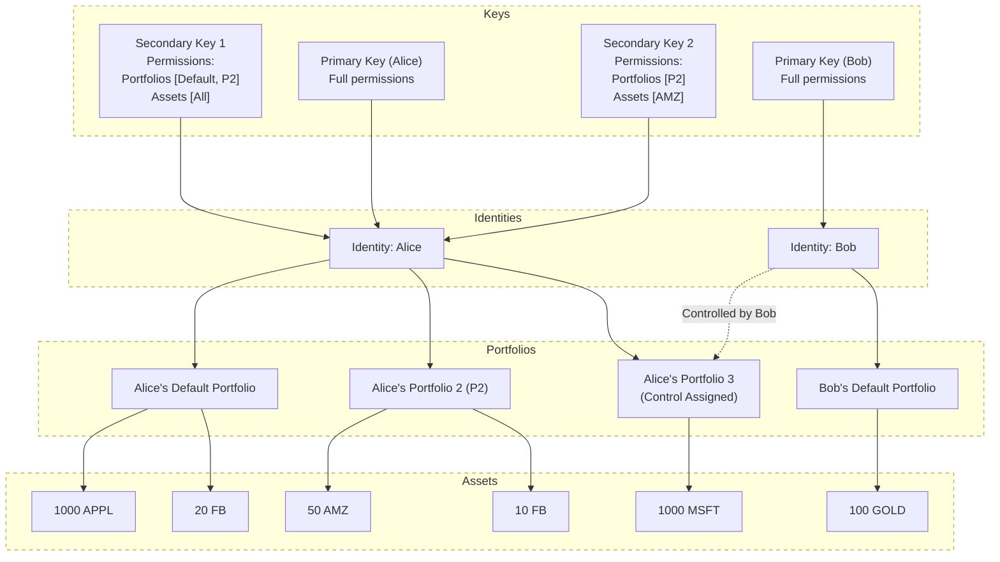

## Overview

In Polymesh, all [assets](/assets) (excluding the network native token [POLYX](/polyx)) are held at the [identity](/identity) level, or more correctly in Portfolios associated with an identity. This allows Polymesh to enforce [compliance](/compliance) in real time based on claims also held at the identity level.

Portfolios allow users to organize their assets underneath their identity, and to flexibly assign key permissions and custody. A particular asset can have different balances across portfolios within the same identity.

[Permissions](/identity/advanced/secondary-keys/#secondary-key-permissions) for keys can be defined at the portfolio level. Secondary keys are managed at the identity level by the [Primary key](/identity/advanced/primary-keys/), and can be granted access to specific portfolios, no portfolios or all portfolios controlled by an identity. This ensures that only authorized keys or can transact with assets in those portfolios.

:::note
For more details on portfolio control and custody models, see the [Custody](/portfolios/custody) page.
:::

## Key Features and Use Cases

- **Asset Management**: Portfolios hold balances of various assets (security tokens, stable coins, etc.) issued on the Polymesh chain.
- **Key Permissions**: Secondary keys can be permissioned to allow them interact with specific portfolios.
- **Portfolio Control**: [Control/Custody](/portfolios/custody) can be granted to other identities, allowing them to act on a portfolio's behalf, such as initiating transfers or moving between portfolios under that identity.
- **Portfolio Movements**: Assets can be transferred between portfolios under the same identity without restrictions, enabling flexible asset management.
- **Portfolio Transfers**: Assets can be transferred between portfolios of different identities, using the [Settlement pallet](/settlement) which enforces compliant transfers.
- **Multiple Portfolio Management**: Users can create, add, remove, or rename portfolios to organize their assets according to different needs or strategies. Each identity has a default portfolio, but additional numbered portfolios can be created for further segregation of assets.
- **Pre-approval for Asset Transfers**: Portfolios can be pre-approved to receive specific assets without manual affirmation, streamlining the transfer process for frequently traded assets.

## Identity, Portfolios, and Assets Diagram

This diagram illustrates how a Polymesh identity is structured, showing the relationships between identities, keys, portfolios, and the assets held within those portfolios. It highlights how permissions and custody can be managed at different levels.

## Managing Portfolios

### The Default Portfolio

Every Polymesh identity has a default portfolio. When a specific numbered portfolio is not designated, this is where assets are received by default for asset transfers. Functionally this portfolio is the same as any other portfolio, but it is the only one that cannot be deleted or renamed.

### User Portfolios

In addition to the Default portfolio, users can create multiple numbered portfolios that can be uniquely named under a single identity. These are useful for segregating assets, managing permissions, or separating business activities.

Users can have as many user portfolios as they like. The ID of user created portfolios increments from 1. User created portfolios can be renamed at any time or deleted if it does not hold any assets.

### Permissions and Access

Most portfolio management functions must be called by the owner of the portfolio, using either the primary key or a secondary key with the appropriate permissions. If control/custody of a portfolio has been assigned to another identity, only the controlling identity can move assets out of that portfolio.

---

### Create a Portfolio

Portfolios can be created by calling `portfolio::create_portfolio` and providing a unique portfolio name as a parameter. If a portfolio is created by a secondary key, it must be given explicit permission for that portfolio to be able to manage the assets within it even if it created it.

### Rename a Portfolio

A portfolio can be renamed by calling `portfolio::rename_portfolio`. The default portfolio cannot be renamed.

### Delete a Portfolio

Portfolios can be deleted by calling `portfolio::delete_portfolio` and providing the portfolio ID as a parameter. Only empty portfolios can be deleted. The default portfolio cannot be deleted.

### Moving funds between Portfolios

Funds can be moved between portfolios by calling `portfolio::move_portfolio_funds`. Transfers between portfolios of the same identity are not subject to compliance restrictions. If the owner has assigned control/custody of the portfolio to another identity, only the controlling identity can move assets out of that portfolio.

Parameters:

- `from`: The DID and the ID of the sender's portfolio.
- `to`: The DID and the ID of the receiver's portfolio.
- `funds`: The type (`Fungible` or `NonFungible`), the asset ID and the amount or NFT IDs of the asset being moved between portfolios.
- `memo`: A short memo can be added to each token amount moved. This is publicly visible on the chain and can be used to identify the transaction.

:::info
To move assets between portfolios of different identities, the [Settlement](/settlement) process must be used.
:::

### Preapprove receiving an asset in a Portfolio

Users can pre-approve receiving an asset in a portfolio by calling `portfolio::pre_approve_portfolio`.
This can streamline the [settlement process](/settlement) for certain assets to be transferred into the portfolio without the need for explicit approval of a settlement instruction. This function is useful for assets such as stablecoins, frequently traded assets, or workflows where manual approval for each transfer is not required.

When a portfolio is pre-approved to receive an asset, and a settlement instruction is created involving that combination of asset and portfolio as the receiver, that leg is automatically marked as approved by the receiver without requiring explicit affirmation or approval for each instruction. This can allow an instruction to settle immediately without manual intervention by the receiver or the controller of the portfolio.

Parameters:

- `asset_id`: The asset that will be exempt from affirmation.
- `portfolio_id`: The ID of the portfolio that can receive the asset without affirmation.

### Remove pre-approval to a Portfolio

To revoke or delete a previously granted pre-approval for a portfolio to automatically receive a specific asset, call the `portfolio::remove_portfolio_pre_approval` function.

Parameters:

- `asset_id`: The asset that will be exempt from affirmation.
- `portfolio_id`: The portfolio that can receive the asset without affirmation.

### Querying Portfolio Information

- `portfolio::allowed_custodians` shows the custodians allowed to create and take custody of portfolios on an identity's behalf.
- `portfolio::portfolio_asset_balances` to query the asset balances of portfolios.
- `portfolio::portfolio_asset_count` shows how many assets with non-zero balance this portfolio contains.
- `portfolio::portfolio_custodian` to query the custodian of a particular portfolio.
- `portfolio::pre_approved_portfolios` to query all portfolios that don't need to affirm the receivement of a given asset.
