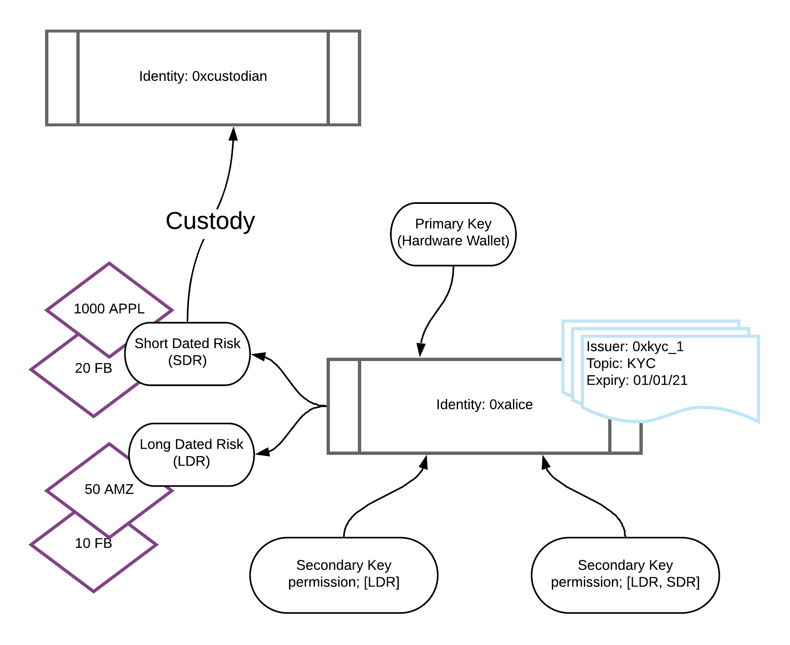

# Overview

In Polymesh, all assets (excluding the network native token POLYX) are held at the identity level. This allows Polymesh to enforce compliance in real time based on claims also held at the identity level.
To allow users to organize their assets underneath their identity, and to flexibly assign key permissions and custody, Polymesh has the concept of portfolios.
A particular asset can have different balances across portfolios within the same identity.
Compliance is applied to the sum of balances across an identities portfolios.
Permissions for keys can be applied at the portfolio granularity. Secondary keys are managed at the identity level, but can be granted access to specific portfolios under an identity. Access can be restricted to specific portfolios, ensuring that only authorized keys or identities can transact with assets in those portfolios

## Key Features and Use Cases

- **Asset Management**: Portfolios hold balances of various assets (security tokens, stable coins, etc.) issued on the Polymesh chain.
- **Portfolio Permissions**: Permissions can be granted to other identities, allowing them to act on a portfolio’s behalf, such as initiating transfers or managing assets.
- **Portfolio Movements**: Assets can be transferred between portfolios (either within the same identity or between different identities), enabling flexible asset management and compliance workflows.
- **Multiple Portfolio Management**: Users can create, add, remove, or rename portfolios to organize their assets according to different needs or strategies. Each identity has a default portfolio, but additional numbered portfolios can be created for further segregation of assets.
- **Transaction History**: Each portfolio maintains a record of its asset movements and transactions, which can be queried for auditing or reporting purposes.

## Portfolio Diagram

# Managing Portfolios

## The Default Portfolio

Every Polymesh identity automatically has a default portfolio, which is the primary holding account for that identity. This is where assets are received by default as part of a transfer or instruction settlement.
The Default Portfolio cannot be renamed or deleted.

## User Portfolios

In addition to the Default portfolio, users can create multiple numbered portfolios under a single identity. These are useful for segregating assets, managing permissions, or separating business activities.
Users can have as many user portfolios as they like. The numbers of User portfolios increments from number 1 and can be renamed or deleted anytime.

## Create a Portfolio

Portfolios can be created by calling 'portfolio::createPortfolio(name)' and entering a portfolio name as a parameter.

Effects:
- This action creates a user portfolio.

Constraints:
- This function must be called by the owner of the portfolio.

## Rename a Portfolio
A portfolio can be renamed by calling 'portfolio::renamePortfolio'.

Effects:
- This action renames an existing user portfolio.

Constraints:
- This function must be called by the owner of the portfolio.
- The default portfolio cannot be renamed.

## Delete a Portfolio
Portfolios can be deleted by calling 'portfolio::deletePortfolio(num)' and entering the number of the portfolio as a parameter.

Effects:
- This action deletes an existing user portfolio.

Constraints:
- This function must be called by the owner of the portfolio.
- A portfolio can be deleted only if it has no funds in it.
- The Default portfolio cannot be deleted.

## Moving funds between Portfolios
Funds can be moved within portfolios by calling 'portfolio::movePortfolioFunds'.
Transfers between portfolios of the same identity are always permitted and are not subject to compliance restrictions.

Parameters:
- 'from': The DID and the ID of the sender's portfolio.
- 'to': The DID and the ID of the receiver's portfolio.
- 'funds': The type, the ID and the amount of the asset being moved between portfolios.
- 'memo': A short memo can be added to to each token amount moved.

::: Information
To move assets between portfolios of different identities, the [Settlement pallet](/settlement/mediators) should be used by calling 'Settlement::Add_and_affirm_with_mediators'.
:::

Effects:
- This function moves fungible or non-fungible tokens from one portfolio of an identity to another portfolio of the same identity.

Constraints:
- This function must be called by the owner of the portfolio.
- Funds with this function can be only moved from a portfolio of an identity to another portfolio of the same
identity.

## Preapprove the receivement of an asset in a Portfolio

Users can pre-approve the receivement of an asset to a portfolio by calling 'portfolio::pre_approve_portfolio'.
This streamlines the process for certain assets to be transferred into the portfolio without additional manual approval steps.
This function is useful for stable coins, frequently traded assets, or institutional workflows where manual approval for each transfer is impractical.

This function directly interacts with the [Settlement pallet](/settlement/index.mdx) to streamline the affirmation process for asset transfers.  Here's how they relate:
- **Settlement workflow**: The settlement pallet handles asset transfers between portfolios. Normally, recipients (or their custodians) must manually affirm each incoming transfer.
- **Exemption via pre-approval**: If a portfolio has been pre-approved for an asset, the settlement pallet skips the affirmation step for transfers of that asset into the portfolio. This enables instant settlement for pre-approved assets.
- **Compliance bypass**: The settlement pallet checks if the recipient’s portfolio has a pre-approval for the asset being transferred. If yes, the transfer proceeds without waiting for manual affirmation.

Parameters:
- 'asset_id`: The asset that will be exempt from affirmation.
- 'portfolio_id`: The ID of the portfolio that can receive the asset without affirmation.

Effects:
-  When this function is called, it exempts the designated portfolio from requiring an explicit affirmation to receive the specified asset.

Constraints:
- This function must be called by the owner of the portfolio.
- Pre-approving an asset could allow unintended or compromised tokens to enter the portfolio automatically. If the asset’s issuer or smart contract is later exploited, the portfolio may receive harmful tokens without manual intervention.
- Automated acceptance might circumvent compliance checks (e.g., KYC/AML) required for incoming assets, potentially violating regulatory frameworks governing security tokens.
- Incorrectly specifying the asset or portfolio could lead to unintended auto-approvals, cluttering the portfolio with unwanted assets.

## Remove pre-approval to a Portfolio

When users like to to revoke or delete a previously granted pre-approval for a portfolio to automatically receive a specific asset, the 'portfolio::remove_portfolio_pre_approval' function should be called.

Parameters:
- `asset_id`: The asset that will be exempt from affirmation.
- `portfolio_id`: The portfolio that can receive the asset without affirmation.

Effects:
- This function removes the pre approval of an asset to a portfolio.
- When this function is called, the designated portfolio will no longer be able to receive the specified asset without explicit affirmation or approval for each incoming transfer.
- When this function is called, the designated portfolio will no longer be able to receive the specified asset without explicit affirmation or approval for each incoming transfer.

Constraints:
- If the removal was accidental, transfers may fail or stall, causing operational delays.
- If the portfolio was part of automated compliance workflows (e.g., corporate actions, dividend distributions), missed transfers due to revoked pre-approval could violate obligations.

## Querying Portfolio Information

- 'portfolio::allowedCustodians' shows the custodians allowed to create and take custody of portfolios on an id's behalf.
- 'portfolio::portfolioAssetBalances' to query the the asset balances of portfolios.
- 'portfolio::portfolioAssetCount' shows how many assets with non-zero balance this portfolio contains.
- 'portfolio::portfolioCustodian' to query the custodian of a particular portfolio.
- 'preApprovedPortfolios' to query all portfolios that don't need to affirm the receivement of a given asset.