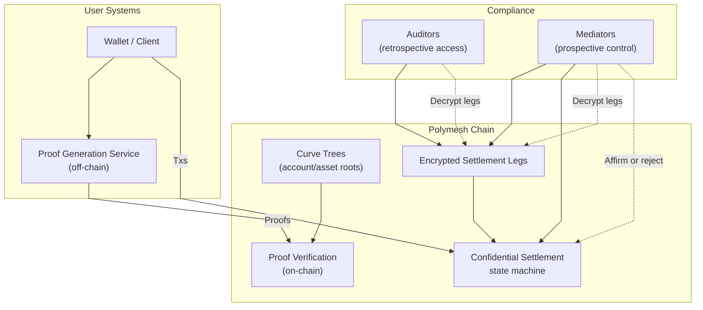

# Confidential Assets Architecture

This page provides an architectural overview of Polymesh Confidential Assets (PCA), explaining the core design principles, system components, and how they work together to enable privacy-preserving transfers with regulatory compliance.

Polymesh Confidential Assets implement a sophisticated protocol for privacy-preserving asset transfers on Polymesh. The implementation uses account-based confidential state with zero-knowledge proofs, enabling fully anonymous transfers while supporting the multi-party settlement workflows required for regulated securities.

## Core Architectural Principles

The architecture is engineered around several non-negotiable principles that guide every design decision:

### 1. Full Anonymity with Constant Complexity

The architecture achieves full confidentiality while maintaining efficient on-chain operations:

- **Full anonymity**: Balances, transaction values, asset types, and participant identities remain private
- **Global anonymity set**: Any transaction's anonymity encompasses all accounts in the system
- **Constant-size proofs**: On-chain proof size is O(1) regardless of anonymity set size

This design resolves the limitation of many account-based privacy systems where transaction size grows with the anonymity parameter.

### 2. Non-Interactivity and Concurrency Handling

The architecture enables:

- **Non-interactive transfers**: Senders can initiate transfers to offline receivers
- **Concurrency resolution**: Circumvents the problem where incoming transactions invalidate pending outgoing proofs—a common issue in account-based anonymous systems

The pending counter mechanism allows multiple in-flight transactions without state conflicts.

### 3. Account-Based Model with Per-Asset State

The architecture uses an account-based model for confidential state:

- **Account-based state**: More intuitive "table of balances" representation compared to UTXO models
- **Per-asset commitments**: One account key can register many assets; each account-asset pair maintains its own commitment and pending counter, so proofs include only the state of the asset being transacted and do not grow with the account's other assets

This simplifies operations like Proof of Balance while maintaining privacy guarantees.

### 4. Regulatory Compliance by Design

Privacy and compliance are not in conflict but architected together:

- **Scoped visibility**: Asset issuers designate auditors/mediators with asset-specific decryption capabilities
- **Dual compliance model**: Retrospective audit access (auditors) and prospective control (mediators)
- **Receiver affirmation**: Explicit accept/reject authority prevents forced asset delivery, aligning with securities regulations

## System Architecture

The key architectural theme is **off-chain proof generation** with **on-chain verification and state transitions**. This separation enables privacy while maintaining public verifiability.

## System Components

### Component Roles

**User Systems:**

- **Wallet/Client**: Manages user keys, account state, and transaction coordination
- **Proof Generation Service**: Computationally intensive ZK proof generation happens off-chain (e.g., WASM library, proof server or remote service)

**Polymesh Chain:**

- **Proof Verification**: Validators verify ZK proofs without learning private values—cryptographic guarantees ensure correctness
- **Curve Trees**: Accumulators that compactly represent valid account/asset states as roots; membership proofs demonstrate state validity without revealing which specific account
- **Settlement State Machine**: Manages the multi-party affirmation lifecycle for transfers
- **Encrypted Legs**: Store transfer details encrypted for designated parties (sender, receiver, auditors, mediators)

**Compliance Layer:**

- **Auditors**: Passive entities with decryption keys for asset-specific legs; enable retrospective compliance checks without gating transactions
- **Mediators**: Active participants who can decrypt and must affirm or reject settlements when required; provide prospective regulatory control

### Privacy and Verification Separation

This architecture achieves privacy through strategic separation:

1. **What chain validators verify**: Proof validity, nullifier uniqueness, accumulator membership, sufficient balance (cryptographically hidden)
2. **What chain validators never learn**: Specific account identities, transaction amounts, asset types, sender/receiver linkage
3. **What compliance sees**: Only asset-specific legs they're authorized for, through encrypted payloads

The curve-tree roots act as a "compressed representation" of all valid account states—validators can verify state transitions against these roots without examining individual account details.

## Confidential Account Structure

A single key pair can register many assets, but each asset gets its own on-chain confidential account state. Think of the key as the identity, and each asset registration as a separate state commitment. This keeps ZK proving scoped to the asset being transacted instead of growing with every asset the key controls.

### Private State (known only to account holder)

These components are never revealed on-chain:

- **Finalized balance** - The spendable amount for the asset
- **Pending counter** - Tracks in-flight transactions awaiting receiver claim; enables concurrent operations and Proof of Balance
- **Account key** - Used to generate zero-knowledge proofs for state transitions
- **Encryption key** - Used to encrypt/decrypt settlement leg payloads
- **Randomness** - Secret values that derive commitments and nullifiers

### Public State (published on-chain)

These components are visible to validators but don't reveal the private state:

- **State commitment** - Cryptographic commitment to the private state, stored in the curve tree accumulator
- **Nullifier** - Emitted when spending an old account state; prevents double-spending without revealing which account was updated

### Cryptographic Relationships

- **State commitment**: Each account state (balance, counter, asset id, etc.) is committed with a one-time PRF-derived randomness seeded from the holder's secret key and public asset context (identity, asset id, counter). After initialization, the randomness evolves deterministically from the prior value for every state update, and each resulting commitment is published to the curve-tree accumulator.
- **Nullifier**: Every state also yields a nullifier derived from the same deterministic chain of secret, per-asset randomness. That chain advances on each transition, so an old state's nullifier can't be reused (prevents double-spends).
- **Deterministic recovery**: Because commitments and nullifiers rely on PRF-derived, forward-evolving randomness (not ad-hoc randomness), a user who retains their secret key and asset context can recompute historical commitments and nullifiers to recover state if local data is lost.

:::info

Pseudorandom Function (PRF): A deterministic, secret-keyed function that produces values indistinguishable from random. It seeds the initial per-asset randomness; later randomness values are derived deterministically from the prior one, so no additional PRF calls are needed after initialization.

:::

### Per-Asset State Handling

The protocol isolates state per account-asset pair, not by forcing separate confidential accounts (separate keys) per asset:

- **Independent account-asset state**: Each registered asset gets its own commitment, balance, pending counter, and randomness. Proof witnesses stay scoped to the asset being transacted regardless of how many assets the account holds.
- **No cross-asset invalidations**: Counters advance independently per asset, so a pending proof for Asset B remains valid if the same account transacts Asset C.
- **Scoped oversight**: Auditor or mediator decryption keys are registered per asset, keeping oversight limited to the assets they govern without revealing holder assets they are not authorized to view.

State isolation lets a holder keep one confidential account key across multiple assets while proofs, counters, and oversight remain scoped per asset; this minimizes settlement scanning and key management overhead. Additional confidential accounts can optionally be used for operational separation.

## Settlement Overview

The settlement lifecycle, roles, and proofs are documented in [Settlement Workflow](/confidential-assets/settlement-workflow). Refer there for detailed mechanics; this page focuses on architectural components and cryptographic structure.

## Proof of Balance (PoB)

For PoB mechanics, trade-offs (auditor-assisted vs. generic), and counter-update transactions, see [Compliance & Regulation](/confidential-assets/compliance-and-regulation) and [Settlement Workflow](/confidential-assets/settlement-workflow).

## Compliance Hooks

Details on auditors, mediators, key privacy, and policy gating live in [Compliance & Regulation](/confidential-assets/compliance-and-regulation). This architecture page references those hooks but avoids duplicating process specifics.

## Architectural Significance

Polymesh Confidential Assets resolve a fundamental tension in blockchain-based asset systems: the need for transactional privacy versus regulatory compliance. The architecture achieves this through:

1. **Privacy by design**: Full anonymity with constant-size proofs integrated at the protocol level
2. **Compliance by design**: Scoped access and control points built into the settlement workflow
3. **Practical settlement**: Multi-party affirmation workflows matching real-world securities processes
4. **Scalable proof system**: Computational work scales with specific transactions, not global state

This architectural foundation enables tokenization of regulated assets while maintaining the privacy properties required for financial markets.
