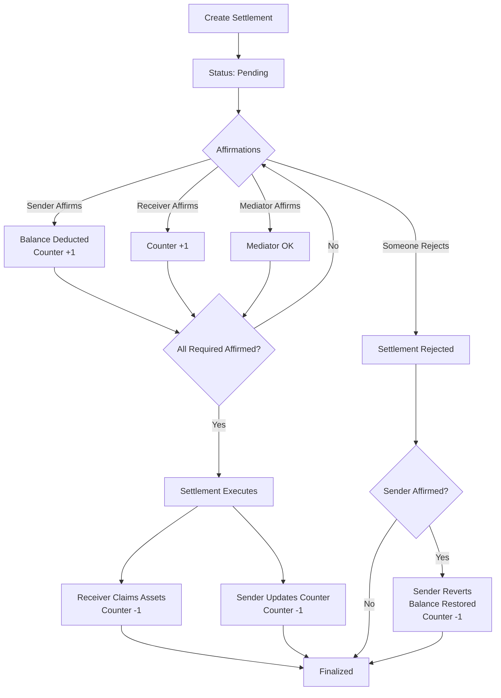
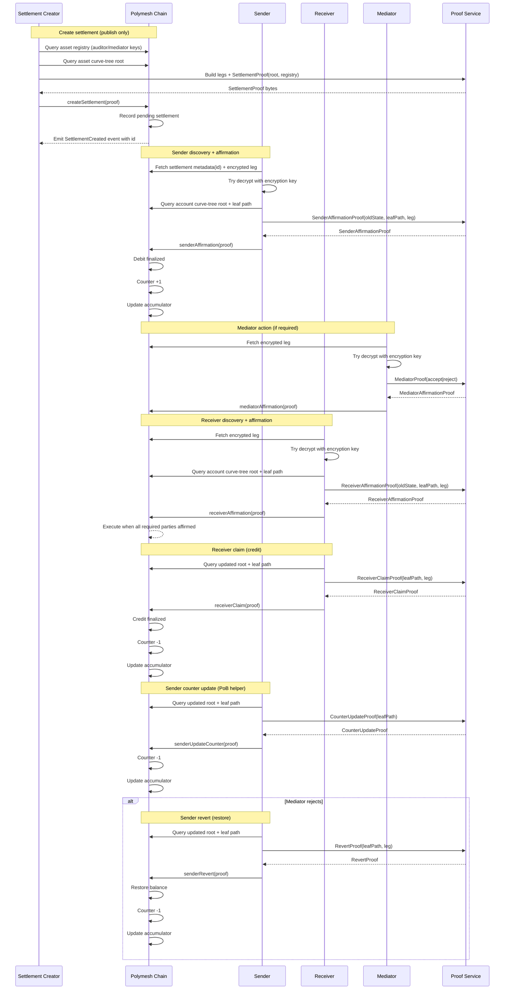

# Confidential Assets: Settlement Workflow

This page describes the lifecycle and mechanics of confidential settlements (transfers) on Polymesh. For related setup and asset flows, see [Onboarding & Accounts](/confidential-assets/onboarding-accounts) and [Asset Operations](/confidential-assets/asset-operations).

## Overview

Confidential settlement is intentionally multi‑phase to align with regulated‑market requirements and architectural constraints:

- **Creation (publish)**: Encrypted legs and a settlement proof are recorded; no balances change.
- **Affirmations (consent)**: Sender/receiver (and mediator, if required) explicitly affirm or reject.
- **Claim (credit)**: Receiver claims to credit value into finalized balance; counters update accordingly.

Why this design?

- **Receiver affirmation**: Mirrors institutional securities workflows where receivers must accept obligations before credit.
- **Non‑interactivity**: Parties act asynchronously; senders can initiate while receivers are offline.
- **Concurrency handling**: Pending counters prevent state conflicts and make Proof of Balance workable.
- **Compliance gating**: Mediators provide prospective control when asset policy requires it.

## Roles in a Settlement

Confidential settlements involve clearly defined roles:

- **Sender:** Affirms the leg that transfers value. When affirmed, their spendable balance is debited and the pending counter increases.
- **Receiver:** Explicitly affirms acceptance of value; later claims to credit the incoming amount into the finalized balance.
- **Mediator (optional):** Active compliance participant who must affirm or reject when required by asset policy; gates execution.
- **Auditor (optional):** Passive compliance participant who can decrypt asset‑specific leg details for retrospective verification; does not gate execution.

This dual model (mediators vs. auditors) provides prospective control and retrospective visibility without sacrificing on‑chain confidentiality.

## Settlement Lifecycle

At a high level, a confidential transfer/settlement has three phases:

1. **Creation**: publish the encrypted legs and a settlement proof.
2. **Affirmations**: sender/receiver (and optionally mediator) record their decision.
3. **Claim/finalization**: the receiver claims and credits the value.

Why split it this way?

- Receiver affirmation is a real-world requirement for institutional securities-style transfers.
- The protocol must support asynchronous parties (senders and receivers do not need to be online at the same time).

### Lifecycle (detailed)

<ZoomableMermaid>

</ZoomableMermaid>

### Core flow diagram

<ZoomableMermaid>

</ZoomableMermaid>

## Creating a Settlement

A settlement is created by defining the transaction legs (sender, receiver, asset type, and value) and generating proofs that ensure both cryptographic validity and regulatory compliance. The creator (who may be a separate entity from the sender or receiver) publishes:

1. **Encrypted leg data** — Encrypted for multiple parties: the sender, receiver, and any designated auditors/mediators retrieved from the on-chain regulatory list. This enables selective visibility for compliance oversight without revealing details to the public.

2. **Zero-Knowledge Settlement Proof** — A non-interactive zero-knowledge proof (NIZK) demonstrating:
   - **Ciphertext well-formedness:** All encrypted values (identities, amounts, asset types) are correctly constructed.
   - **Regulatory consistency:** The asset type and its compliance rules match the on-chain regulatory registry.
   - **Value integrity:** The transfer amount is positive and within system bounds.

The proof also uses accumulator membership to hide which specific asset type is being transferred, maintaining unlinkability while still verifying regulatory compliance.

**Chain Recording:** Upon validation, the chain assigns a unique settlement identifier and records it in a pending state. Importantly, no balances are deducted yet—the sender's funds remain spendable until they explicitly affirm the settlement. The settlement remains "in transit" awaiting affirmations from required parties (sender, receiver, and mediator if applicable), enabling asynchronous participation where parties need not be online simultaneously.

## Find and decrypt a settlement

All parties to a settlement (sender, receiver, mediator, auditor) must first discover the settlement and decrypt the relevant leg details to verify their involvement and inspect the transaction terms before taking action.

**Discovery and decryption process:**

- Fetch settlement by ID from chain (received from another party or discovered via on-chain scan), pull encrypted legs.
- Attempt decryption with your account or encryption keys (sender/receiver/mediator/auditor).
- If decryption succeeds, you are a party to this settlement; save the settlement ID or decrypted leg details locally for verification and proof generation.
- **Verify the details:** Inspect the sender, receiver, asset type, amount, and any regulatory conditions before deciding to affirm or reject.

### Verifiability and Privacy (Decrypting Leg Data)

Leg payloads are encrypted so only designated parties can read them (sender, receiver, and asset‑specific mediator and auditor keys). A public registry maps assets to their mediator and auditor keys, enabling:

- **Selective disclosure:** Authorized parties can decrypt and inspect the leg details.
- **Public confidentiality:** Observers cannot read private values; they only see commitments, nullifiers, and proof validity.

This design preserves privacy on the public ledger while supporting per‑asset auditability and optional prospective control via mediation.

:::note

Account balances are not included in leg ciphertexts. Balances are represented as commitments and validated via zero‑knowledge proofs, so even authorized decryption of a leg does not reveal a participant’s overall balance.

:::

## Sender affirmation

After discovering and decrypting the settlement (see [Find and decrypt a settlement](#find-and-decrypt-a-settlement)), the sender verifies the leg details and submits an affirmation proof to commit their assets to the transfer.

**Effect on balance and counter:**

- The sender's **spendable balance is immediately reduced** by the transfer amount.
- The **pending counter increases by 1**, placing the debited amount in a pending state.
- This prevents double-spending: the same assets cannot be committed to multiple settlements until the original settlement is finalized or reverted.

**Process:**

- Preconditions: account registered on-chain; access to account keys; locally cached account-asset state.
- Build account leaf path (root + curve tree path) and prepare the decrypted leg.
- Proof service produces a **sender affirmation proof** that: (a) spends the old state, (b) debits amount, (c) emits a nullifier, (d) increments counter.
- Submit the `senderAffirmation` transaction to persist the updated state (new commitment/index).

In the underlying construction, the sender proves membership of their old committed state in the accumulator, reveals a nullifier for the old state, and posts a new commitment reflecting the update.

## Receiver affirmation

After discovering and decrypting the settlement (see [Find and decrypt a settlement](#find-and-decrypt-a-settlement)), the receiver verifies the leg details and decides whether to affirm (accept) or reject the incoming transfer.

**Process:**

- Preconditions: account registered on-chain; access to account keys; locally cached account-asset state, leaf path, decrypted leg.
- Proof service produces a **receiver affirmation proof** that increments the pending counter (no balance change).
- Submit the `receiverAffirmation` transaction to store the updated state.

The affirmation step records consent and increments the counter, enabling the receiver to claim the value after settlement execution.

## Mediator affirmation or rejection

After discovering and decrypting the settlement (see [Find and decrypt a settlement](#find-and-decrypt-a-settlement)), the mediator inspects the leg details and decides whether to affirm (permit) or reject the settlement based on regulatory policy.

- Uses only encryption keys (no account balance state).
- Proof service produces a **mediator affirmation proof** with `accept=true` (approve) or `accept=false` (reject).
- Submit `mediatorAffirmation`; rejection halts the settlement until the sender reverts.

Until mediation is complete, the settlement remains pending.

## Receiver claim

After the settlement has been executed (all required parties have affirmed), the receiver submits a **claim** proof that credits the incoming value into their finalized balance and reduces the pending counter.

- Inputs: updated leaf path, decrypted leg, account state.
- Proof service generates the **claim proof** to credit the incoming amount and decrement the counter.
- Submit `receiverClaim`; persist new state.

This separation is important: it allows regulated "accept/reject first, credit later" semantics.

## Sender counter update

- After execution, sender can generate a **counter update proof** to decrement the counter (no balance change) and make future PoB proofs cheaper.
- Submit `senderUpdateCounter`; persist new state.

## Sender revert

- If a mediator rejects, a sender who already affirmed can generate a **revert proof** to restore the debited amount and decrement the counter.
- Submit `senderRevert`; persist new state.

## Counter mechanics (PoB relevance)

- Affirmations add to the pending counter; claims/reverts/counter-updates subtract from it.
- Lower counters shrink the footprint of later Proof of Balance proofs by reducing pending legs that must be referenced.

### Counter System Summary (Impact by Role)

| Role         | Action                         | Impact on Balance | Impact on Counter |
| ------------ | ------------------------------ | ----------------- | ----------------- |
| **Sender**   | Affirm                         | −Amount           | +1                |
| **Sender**   | Revert (after affirming)       | +Amount           | −1                |
| **Sender**   | Update Counter (after execute) | —                 | −1                |
| **Receiver** | Affirm                         | —                 | +1                |
| **Receiver** | Claim Assets (after execute)   | +Amount           | −1                |
| **Mediator** | Affirm or Reject               | —                 | —                 |

Counters make PoB proofs accountable to pending obligations while keeping transaction history private.

## Reversion and counter update

These operations maintain flexibility and efficiency: reversion lets senders reclaim funds from rejected settlements (see [Sender revert](#sender-revert)), while counter updates reduce PoB proof size by batch-finalizing completed legs (see [Sender counter update](#sender-counter-update)).

## Querying On‑Chain Settlement Information

Applications and authorized participants can inspect settlement state via chain queries. Typical queries include:

- **Settlement state:** Returns the current status (e.g., pending, executed, finalized) for a given settlement reference.
- **Encrypted legs:** Returns the encrypted leg payloads by index; only authorized keys can decrypt.
- **Memo:** Returns any optional memo attached to the settlement.
- **Pending affirmations:** Returns how many affirmations are still required before execution.
- **Pending finalizations:** Returns how many post‑execution steps (claims or counter updates) remain before finalization.

These queries enable UIs and services to track lifecycle progression without revealing confidential values.

## Batchability and Multi‑Party Transactions (MPT)

Polymesh Confidential Assets (PCA) support batching multiple proof operations into a single transaction for efficiency. Most operations require an accumulator membership proof (the heaviest part of ZKP computation), so combining related actions reduces transaction count and proving work while preserving confidentiality.

### Supported batching patterns

- **Multi‑party transfers (one sender → many receivers):**

  - A sender publishes multiple encrypted legs to different receivers in one account state transition.
  - The sender’s proof shows the total debit equals the sum of all leg values, requiring just one accumulator membership proof.

- **Multi‑party affirmations (one receiver ← many senders):**

  - A receiver scans for pending legs addressed to them and affirms several in one transaction.
  - The proof demonstrates they can decrypt each selected leg and that the credited amount equals the sum of affirmed values.

- **Aggregatable reversions (sender reclaim):**

  - A sender reclaims funds from multiple un‑affirmed legs in a single submission.
  - The proof shows the sender authored the referenced legs and updates their balance by the aggregate reversed amount in one state transition.

- **Efficient account maintenance (PoB helpers):**

  - **Counter updates (CU):** Batch pointers to finalized legs to reduce the pending counter in one step.
  - **Pending‑balance updates (PBU):** Batch updates to reduce hidden pending balance records in one step.

- **Atomic instant settlements:**

  - Parties can combine `ExecuteInstantSettlement` with `InstantSenderAffirmation` and `InstantReceiverAffirmation` into a single atomic batch.
  - This creates and fully affirms a settlement in one transaction, assuming off‑chain coordination of commitments.

- **Mixed operational batching:**
  - A single submission can include different proof types, for example: a receiver claim for an older leg, a new sender affirmation, and a sender counter update—all verified together.

### Important properties

- **Independent leg tracking:** Even when created or affirmed in a batch, each leg’s status is tracked independently on‑chain. One leg can be reversed or claimed without affecting others.
- **Per‑party decryption responsibilities:** Each receiver must still independently discover and decrypt their leg before affirming; batching does not change who can see what.
- **Constant‑size on‑chain proofs:** Batching reduces how many times expensive membership proofs are generated and verified, while maintaining the constant‑size on‑chain footprint per transaction.

## Operational considerations for batching

Batching improves efficiency but introduces practical nuances you should account for:

- **Concurrency safety:**

  - In PCA, only the account owner can update their confidential state; third‑party re‑randomization is disallowed. This avoids the classic “proof built on state A becomes invalid when someone else updates to state B.”
  - The chain stores a window of recent accumulator roots so a proof against a slightly older root remains valid during broadcast, improving reliability with relayers.

- **Linkability trade‑off in maintenance:**

  - Batching multiple finalized references into one update creates ephemeral linkability between the referenced items (observers can tell those references were processed together in one account update, but amounts and identities remain hidden).
  - If maximum privacy is required, perform updates sequentially; if cost and simplicity are the priority, batch them.

- **Fee proof priority (relayer flow):**

  - The fee proof is verified first. If it fails, the transaction is rejected immediately, preventing unfunded, complex batches from consuming resources.

- **Integrity of batched legs:**
  - Sender‑side MPT proofs must still ensure value conservation (total debit equals sum of leg values) and correct construction of ciphertexts.
  - Receiver‑side affirmation proofs must still prove decryptability and correct crediting, regardless of batching.
