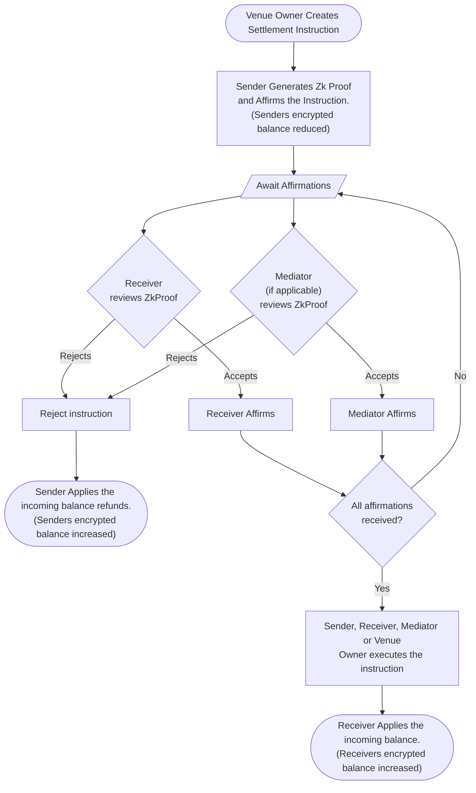

## Overview

Confidential Assets are transferred via Settlement Instructions, which consist of one or more asset transfer legs. Each leg represents a transfer of one or more assets between a sender and receivers' [confidential accounts](../confidential-assets/index.md#confidential-accounts). Once all parties affirm all legs, the instruction can be executed atomically, meaning all legs simultaneously succeed or fail. Settlement Instructions can represent single asset transfers (e.g., ACME), bilateral exchange of assets (e.g., USDC vs. ACME), or netted end-of-period settlements.

To ensure the validity of asset transactions, each user sending assets must provide a zero-knowledge proof, verified on-chain using a sigma protocol.

The proof establishes:

- The user has sufficient funds (a positive balance after the transfer).
- The user is transferring a positive amount.
- A corresponding value is being added to the receiver's balance.

To demonstrate sufficient balance, a user sending assets must provide a proof referencing their current (encrypted) balance. This proof would be invalidated if a user's balance decreased (via another executed settlement instruction) before the associated settlement instruction executed.

To prevent this, we use the following scheme:

- All incoming transfer increases are kept in a pending balance, not immediately applied to a user's current balance.
- All outgoing transfer decreases are immediately debited from a user's current balance when they affirm as a sender.

:::note
In case an instruction is rejected after a sender's encrypted balance has decreased, the returned balance is made available to them through their incoming balance.
:::

This allows users to:

- Participate in concurrent settlement instructions as interleaved senders and receivers.
- Control when their current balance is updated, and hence any outstanding sender proofs not yet submitted to the chain invalidated.

Additionally, the user sending the assets must supply copies of the transaction amounts, encrypted against any required auditors' public keys. They provide a zero-knowledge proof that these encrypted values match those actually being transacted.

## Settlement Venues

Settlement Venues are integral to managing transactions involving Confidential Assets. Each settlement instruction must be linked to a Settlement Venue, which provides a framework to control who can initiate transactions with a Confidential Asset.

When a Settlement Venue is created, it's tied to the creator's DID (Decentralized Identifier). This connection ensures that only the venue owner has the authority to add settlement instructions. In the case of Confidential Assets, venue owners can specify additional parameters such as [Auditors](#auditor) and mandatory [Mediators](#mediator), supplementing those initially defined by the asset creator.

Asset Issuers can optionally restrict transfers of their Confidential Asset(s) to specific venues only, providing a practical framework for efficiently maintaining control over Confidential Asset transactions.

## Roles

Settlement instructions involve multiple parties performing various roles. The number of participants involved in an instruction can range from 2 to many, as some roles are optional or may be shared by the same entity. Each role is described in the following sections.

### Asset Issuer

While the Asset Issuer may not be directly involved in a settlement instruction, they play a crucial role. The Asset Issuer controls Auditors and mandatory Mediators for all settlement instructions, regardless of the settlement venue. They also have the authority to allow or block specific settlement venues and freeze asset transfers for all users or specific confidential accounts.

### Venue Owner

The Venue Owner is responsible for creating the settlement instruction. They specify the sender and receiver confidential accounts for each leg and the confidential asset(s) for each instruction leg. Additionally, they may opt to include additional Auditors and Mediators when creating a settlement instruction.

### Sender

For each settlement leg, a Sender must be defined. This is the confidential account that will be debited when the settlement instruction is affirmed. The Sender is required to generate a Zero Knowledge Proof with their [Confidential Account](./index.md#confidential-accounts)'s private key and submit it to the chain to affirm an instruction leg. The Sender proof includes encrypted transaction details, ensuring the privacy of transaction amounts. The amount being transferred **must** be encrypted with the Receiver's and all required Auditors' Confidential Account public keys to be valid. A Sender must affirm a leg before a Receiver or Mediator can take further action.

### Receiver

Each settlement instruction leg specifies a Receiver's Confidential Account. The Receiver decrypts the asset amount in the zero-knowledge proof to verify its validity. The Receiver affirms or rejects the legs of the settlement instruction where they are the Receiver, ensuring transaction integrity.

### Auditor

Auditors can optionally be specified by an Asset creator and/or the Venue Owner when creating an instruction. Auditors can decrypt the amount in the zero-knowledge proofs, allowing them to maintain a record of asset holders and meet regulatory reporting requirements. Affirmation proofs must include encrypted transaction details with all Auditor Elgamal public keys to allow them to decrypt the details.

Auditor Elgamal keys are not required to be registered on-chain to a DID and do not perform any on-chain actions in the course of a settlement.

### Mediator

Mediators, if specified by the Asset Issuer or Venue Owner, are required to affirm legs of settlement instructions they are involved in before the instruction can be executed. In the course of affirming, Mediators may act as a Transfer Agent, ensuring the Sender and Receiver are eligible to transact before affirming to ensure compliance with regulatory requirements.

It's important to note that a Mediator must also be specified as an Auditor to decrypt the amount being transferred in a leg.

## Affirmation

Senders affirm instruction legs by submitting a valid zero-knowledge proof. Upon submitting, the sender's confidential account balance is reduced by the amount encrypted in the sender's proof.

Receivers and Mediators affirm a leg they are a party to by simply submitting an affirmation transaction specifying the leg(s) they are affirming.

## Rejection

At any point prior to instruction execution, a Sender, Receiver, or Mediator may reject a settlement instruction. A single rejection rejects the entire instruction. Any encrypted amounts debited from sender accounts become available to them in their incoming encrypted balance.

## Instruction Execution

After receiving all affirmations, any party involved in the instruction (Sender, Receiver, Mediator, or Venue Owner) can execute the settlement instruction. Executing the instruction updates the incoming encrypted balances for all receivers atomically. Assets received are added to a user's pending incoming balance and are not immediately added to their current account. The receiver controls when they want to apply the incoming balance.

## Frozen Assets and Confidential Account

Assets can be frozen by the Asset Issuer, as can investor balances in a Confidential Account associated with that asset. This prevents assets from being added to new settlement instructions. When a freeze is applied, assets already committed to current settlement instructions are not frozen, nor is applying pending incoming balances for that asset.

## Settlement Flowchart

Below is a flowchart illustrating the Confidential Asset Settlement process. The flowchart provides a visual representation of the steps involved, from the creation of a settlement instruction to its execution. Each step in the flowchart corresponds to a specific action or decision point in the settlement process described above.

