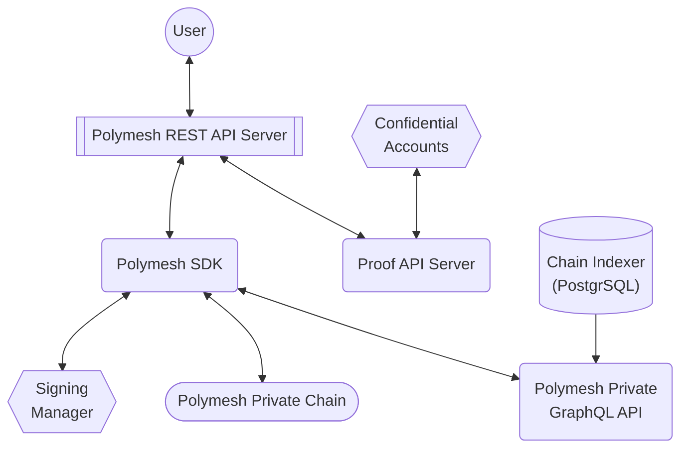
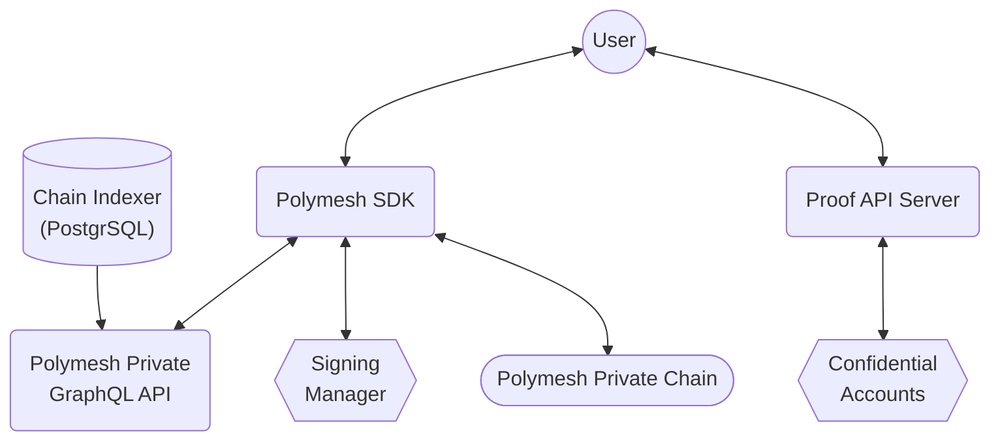

## Overview

Interacting with Polymesh (both Public and Private) is possible through several methods:

- Direct RPC access via HTTP or WebSocket.
- Accessing the chains API directly via the polkadot.js API.
- Utilizing the purpose-built Polymesh SDK (Typescript).
- Utilizing the Polymesh REST API (constructed with the Polymesh SDK).
- Utilizing the Chain indexer (based on SubQuery), which offers a PostgreSQL database and GraphQL API for accessing current state and historical data.
- Utilizing various other generic tools compatible with multiple Substrate-based blockchains.

Managing confidential assets requires additional tooling provided by the Polymesh Proof API.

This tooling facilitates:

- The generation and storage of Elgamal Confidential Accounts (including private keys).
- The creation of zero-knowledge proofs necessary for Confidential Asset transfers.
- Verification and auditing of Confidential Asset transfers.

## Github Repos

The Polymesh Private chain and associated tooling is available within the [Polymesh Association Github](https://github.com/PolymeshAssociation) organisation.

Each repository has its own README.md file to help get started with building and deploying the chain and each tool.

Please see repo licenses for details of usage restrictions.

### Development Environment

To ease the setup of a developer environment for Polymesh Private instances, we provide a Docker compose file that spins up a preconfigured Polymesh Private chain, and associated tooling.

The repository [https://github.com/PolymeshAssociation/Polymesh-private-dev-env](https://github.com/PolymeshAssociation/Polymesh-private-dev-env) provides the required docker files and configuration for this.

This environment includes:

- [A Polymesh Private Node](#polymesh-private-chain)
- [REST API](#polymesh-rest-api)
- [Proof API](#polymesh-proof-api)
- [SubQuery Chain Indexer and GraphQL API](#polymesh-graphql-api)
- Hashicorp Vault (for managing signing keys)

Refer to this projects README for details on how to quickly launch an environment.

Alternatively you can set up and connect the various tools individually by referring to the individual repositories of those tools described in the following sections.

### Polymesh Private Chain

[https://github.com/PolymeshAssociation/polymesh-private](https://github.com/PolymeshAssociation/polymesh-private)

This repository contains the Confidential Asset pallet used by Polymesh Private chain instances. It contains the on-chain logic to manipulate Confidential Assets, and depends on the [https://github.com/PolymeshAssociation/confidential_assets](https://github.com/PolymeshAssociation/confidential_assets) repo for its underlying cryptography functionality.

This repo is where you would source the binary required to run an instance of the Polymesh Private chain.

### Polymesh SDK

[https://github.com/PolymeshAssociation/polymesh-private-sdk](https://github.com/PolymeshAssociation/polymesh-private-sdk)

This repository contains our Polymesh SDK including Confidential Asset functionality for Polymesh Private instances.

It is a Typescript based SDK providing purpose-built objects and APIs to interact with Polymesh and Confidential Assets.

The Polymesh SDK uses the polkadot.js API and the [Polymesh GraphQL API](#polymesh-graphql-api) to source data required for various SDK functionality. For a methods marked as using middleware in the SDK documentation an instance of the Polymesh GraphQL API is required to be connected.

The Polymesh SDK uses a Signing Manager ([https://github.com/PolymeshAssociation/signing-managers](https://github.com/PolymeshAssociation/signing-managers)) to manage keys required to sign and submit messages to the Polymesh chain. Signing Managers are pluggable components allowing a variety of approaches for key management and security, including local storage for development and Hashicorp Vault for production grade security. Signing Managers can also be used to integrate with third-party key custodians such as Fireblocks.

### Polymesh REST API

[https://github.com/PolymeshAssociation/polymesh-private-rest-api](https://github.com/PolymeshAssociation/polymesh-private-rest-api)

This repository provides a REST API interface that under the covers uses the above Polymesh SDK to interact with a Polymesh Private chain instance.

Endpoints related to Confidential Assets will use the below Polymesh Proof API to generate required keys, proofs and proof verifications as required.

### Polymesh Proof API

[https://github.com/PolymeshAssociation/polymesh-private-proof-api](https://github.com/PolymeshAssociation/polymesh-private-proof-api)

The Polymesh Proof API manages cryptographic functions for Confidential Assets. It facilitates the generation of Elgamal Confidential Accounts (key pairs) and the creation and verification of zero-knowledge proofs related to Confidential Assets.

The Polymesh REST API utilizes the Proof API for these tasks, necessitating its endpoint to be provided during Polymesh REST API instance deployment.

Additionally, the Proof API can function independently, serving as a standalone service. For instance, it can be employed by the Polymesh SDK to generate necessary zero-knowledge proofs for Confidential Asset management.

The Polymesh Proof API can operate in two modes:

- Companion Process for Polymesh REST API: It offers limited endpoints tailored for use by the Polymesh REST API, maintaining minimal state limited to Confidential Account key pairs.
- Standalone Process: In this mode, the API supports direct chain transactions and manages additional state, including Polymesh signing accounts.

Primarily, the Polymesh Proof API is intended for use as a companion process alongside the REST API, with the "Standalone Process" mode potentially being deprecated in the future. Refer to the project's README.md for further details.

### Polymesh GraphQL API

[https://github.com/PolymeshAssociation/polymesh-subquery](https://github.com/PolymeshAssociation/polymesh-subquery)

This repository provides a chain indexing service which will ingest the events and extrinsics in each observed Polymesh block, and build an indexed PostgreSQL database that tracks corresponding chain data.

Its GraphQL API can be used to query for historical or current chain data, including data related to Confidential Assets (which will be encrypted where appropriate).

It is used by the Polymesh REST API to gather data required for certain transactions and getter APIs, so its endpoint must be passed as a parameter when starting an instance of the Polymesh REST API.

## Tool Usage

The above tools are designed to be used seamlessly together.

In particular, the Polymesh SDK will use the GraphQL API to gather chain data as needed, and the Polymesh REST API will use both the Polymesh SDK and the Polymesh Proof API to allow users to easily interact with Confidential Assets.

It is of course also possible to use both the Polymesh Proof API and GraphQL API as standalone services, rather than only through the REST API and Polymesh SDK respectively.

### Usage via Polymesh REST API

### Usage via Polymesh SDK

