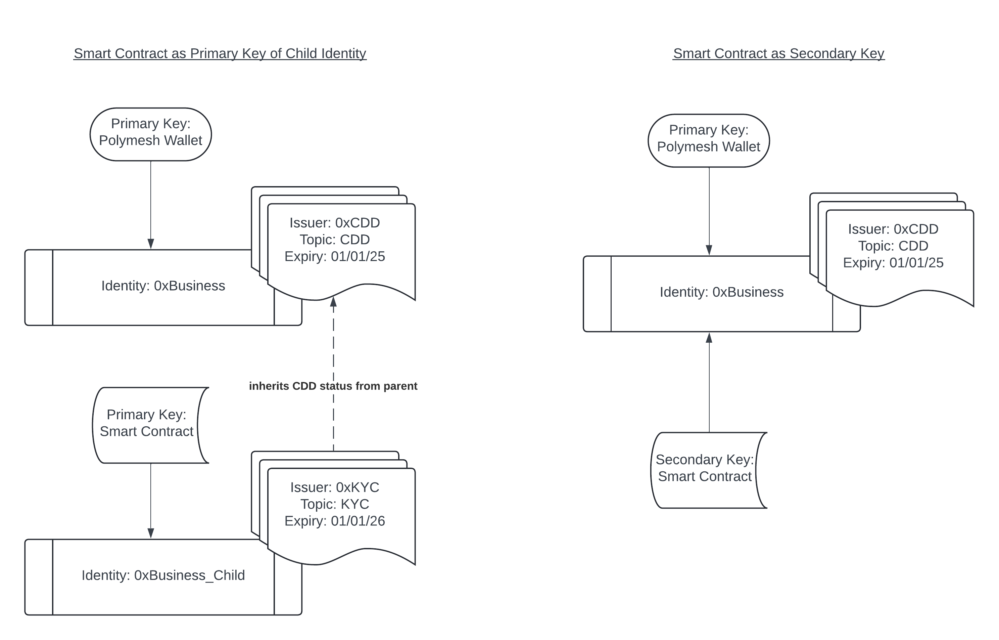

## Overview

Polymesh includes rich native functionality for identity, assets, compliance, portfolio management, and settlement.
Smart contracts are used to add custom workflow and business logic on top of those native capabilities.

This allows teams to keep core regulated operations on the native layer while implementing bespoke behavior in contracts, such as:

- exchange and routing logic
- custody workflow automation
- permissioned operations with custom approval paths
- upgradeable application-level policy logic

## Ink! and Tooling

Polymesh smart contracts are written in Ink! and compiled to WASM.

- [Ink! documentation](https://use.ink/)
- Polymesh App Contracts UI:
  - [Mainnet Contracts UI](https://mainnet-app.polymesh.network/#/contracts)
  - [Testnet Contracts UI](https://testnet-app.polymesh.live/#/contracts)
  - [Staging Contracts UI](https://staging-app.polymesh.dev/#/contracts)

The Contracts UI supports upload, instantiate, and call flows.

## Contract Identity and Ownership Model

Contracts on Polymesh are identity-aware.

:::important
A contract deployment and contract interaction must pass Polymesh permission checks.
At instantiation time, the contract account is linked to the caller's identity.

This does not mean every contract method needs broad identity permissions.
Extra permissions are required when contract logic calls identity-governed native modules such as identity, asset, portfolio, or settlement operations.

Native POLYX balance flows (receiving, holding, and transferring POLYX) do not by themselves require those additional identity-method permissions.
:::

### How identity context works in practice

- A contract call can be initiated by one key, but native runtime calls made by contract logic execute under the contract identity context.
- This enables controlled delegation patterns where external callers can trigger behavior, while the contract identity remains the authority used for governed native actions.
- Method-level permissions are enforced when the contract calls identity-governed native functionality.

### Deployment options

Contracts can be instantiated:

- from uploaded code bytes
- from an existing on-chain code hash

By default, the standard `Contracts` instantiate flow links the new contract as a secondary key with no permissions.

Polymesh also supports deployment with explicit identity linkage behavior:

- as a secondary key with custom permissions
- as a primary key through key-authorization and rotation flows

These are exposed through the `polymeshContracts` pallet instantiate extrinsics.

### Practical deployment patterns

The deployment model affects how much authority the contract has and how tightly it is coupled to other keys.

- A non-custodial DEX or protocol controller may be best isolated from day-to-day operator keys, with the contract later becoming the primary key of a dedicated identity through authorization and rotation flows.
- A workflow contract for asset administration can be attached as a secondary key with tightly scoped permissions, for example only the asset-documentation extrinsics.
- A custody workflow contract can be attached as a secondary key on the custodian identity, allowing external users to trigger contract logic that operates through the custodian's governed permissions.

A contract can also become the primary key of an existing identity by accepting a primary-key rotation authorization. Similarly, a contract acting as a primary key can encode logic to issue additional authorizations, such as adding secondary keys under controlled conditions.



## Using Native Polymesh Functionality from Contracts

Contracts can interact with native runtime logic in two main ways:

- query chain storage
- dispatch whitelisted runtime extrinsics

This enables patterns such as:

- checking identity or portfolio state before execution
- executing asset or settlement operations from contract logic
- building policy and orchestration layers over native primitives

## Runtime Call Whitelist

For safety, runtime extrinsics callable from contracts are whitelisted by governance.

- whitelist storage: `polymeshContracts::callRuntimeWhitelist`
- governance updates this set as needed

If your use case requires additional runtime calls from contracts, request review through Polymesh developer channels.

## Chain Extensions

Polymesh provides chain extensions for contract-side runtime access, including:

- key-to-DID lookup
- storage reads
- runtime call dispatch
- API upgrade discovery helpers

Reference implementation:
[Polymesh chain extension implementation](https://github.com/PolymeshAssociation/Polymesh/blob/develop/pallets/contracts/src/chain_extension.rs)

Example pattern for DID lookup:

```rust
fn get_key_did_example(acc: AccountId) -> Result<IdentityId, Error> {
    Self::env()
        .extension()
        .get_key_did(acc)?
        .ok_or(Error::MissingIdentity)
}
```

## Polymesh API for Ink Contracts

The Polymesh API crates provide typed query and call interfaces so contracts can avoid low-level encoding logic.

Typical flow:

- query counters or state
- construct typed call inputs
- submit runtime extrinsics through API helpers

Example pattern:

```rust
let api = Api::new();

let instruction_id = api
  .query()
  .settlement()
  .instruction_counter()
  .map(|v| v.into())?;

api.call()
  .settlement()
  .execute_manual_instruction(
      instruction_id,
      1,
      None
  )
  .submit()?;
```

The `api.query()` and `api.call()` helpers provide a typed interface for native Polymesh storage access and runtime dispatch, while also handling Polymesh-specific parameter and error types.

Use signatures from the release and branch you are targeting, as APIs can evolve between major versions.

## Upgradable Polymesh Ink Contract

To reduce breakage risk across runtime upgrades, Polymesh provides an upgradable Polymesh Ink API contract and library.

Repository path:
[Upgradable Polymesh Ink contract](https://github.com/PolymeshAssociation/Polymesh/tree/develop/contracts/upgradeable-polymesh-ink)

### Why use it

- presents a stable contract-facing API
- absorbs runtime interface changes across major upgrades
- lets application contracts delegate to maintained API logic

### How it works

- the library resolves the latest API code hash from chain state
- calls are performed through delegate call using that hash
- governance can schedule next upgrades, then activate them at the appropriate chain version

Relevant storage:

- `polymeshContracts::currentApiHash`
- `polymeshContracts::apiNextUpgrade`

### Usage guidance

Within a contract message:

- instantiate `PolymeshInk` at the start of the message
- reuse that instance within the same message call
- create a new instance again on the next message call

This balances freshness and execution cost.

Example pattern:

```rust
let api = PolymeshInk::new()?;
let portfolio_id = api.accept_portfolio_custody(auth_id, portfolio)?;
```

Under the hood, `PolymeshInk` uses delegate calls into the upgradable API contract, allowing application contracts to keep a stable interface while governance updates the underlying implementation across runtime upgrades.

## Polymesh Contracts vs Substrate Contracts Pallet

There are two related layers:

- Substrate `Contracts` capability (upload, instantiate, execute)
- Polymesh-specific contract features in `polymeshContracts`

Polymesh adds identity and permission-aware behavior on top of baseline contract flows, plus:

- deployment with custom secondary-key permissions
- deployment as a primary key through authorization and rotation flows
- runtime call whitelist management
- upgradable API code-hash tracking

## Deterministic Compilation

WASM outputs are not always deterministic across environments by default.
For reproducibility and verification, deterministic build workflows are recommended.

Example deterministic build container:

```bash
docker pull quay.io/subscan-explorer/wasm-compile-build:amd64-stable-1.70.0-v3.2.0
docker run --rm -it -v .:/builds/contract -v ./target:/target/ quay.io/subscan-explorer/wasm-compile-build:amd64-stable-1.70.0-v3.2.0 cargo contract build --release
```

Example reference:
[Verifiable build reference](https://github.com/PolymeshAssociation/Polymesh/blob/develop/contracts/upgradeable-polymesh-ink/README.md#verifiable-build)

## Example Case Study: Wrapped POLYX

Reference contract:
[Wrapped POLYX contract](https://github.com/PolymeshAssociation/Polymesh/tree/develop/contracts/wrapped-polyx)

The wrapped POLYX example shows:

- using `PolymeshInk` for governed native operations
- portfolio custody flows
- mint and redeem logic coordinated with native asset operations
- native POLYX in/out flows around the wrapped asset lifecycle

### Direct API approach vs Upgradable API approach

Direct low-level API calls are possible, but the upgradable `PolymeshInk` approach is preferred for long-lived production contracts because it is designed to remain compatible across runtime upgrades.

Current style for wrapped asset creation through `PolymeshInk`:

```rust
api.asset_create_and_issue(
    AssetName(b"Wrapped POLYX".to_vec()),
    self.ticker,
    AssetType::EquityCommon,
    true,
    None,
)?;
```

### Build and deploy summary

For local development you can build directly with `cargo contract build --release`, while deterministic Docker-based compilation is better for reproducibility and verification.

- build contract artifacts with `cargo contract`
- upload contract bundle using the Contracts UI
- instantiate with the chosen identity linkage model
- configure required permissions and authorizations for governed native operations
- call contract methods through UI or integration tooling

By default, deployment through the standard Contracts UI links the contract as a secondary key with no permissions. If you need custom secondary-key permissions or primary-key deployment flows, use the `polymeshContracts` extrinsics instead.

After compilation, the `target/ink` directory typically includes the WASM binary, the ABI JSON, and the combined `.contract` bundle used by the Contracts UI.

Typical artifacts:

- `wrapped_polyx.wasm`
- `wrapped_polyx.json`
- `wrapped_polyx.contract`
