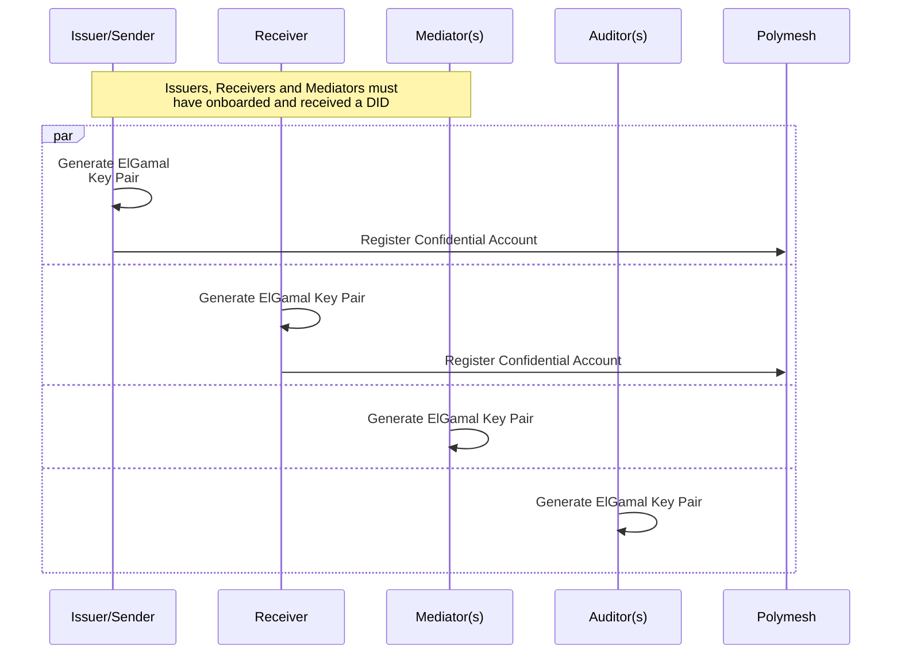
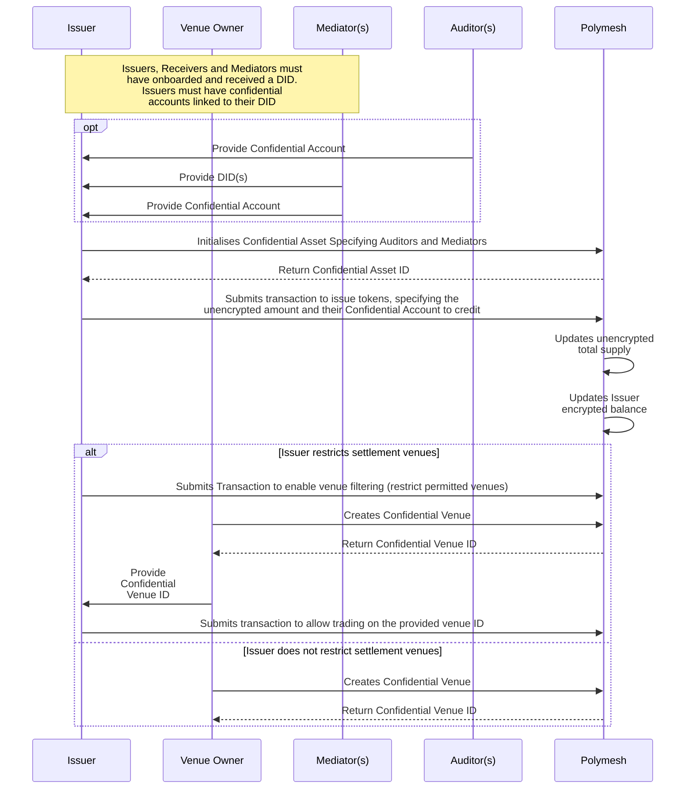
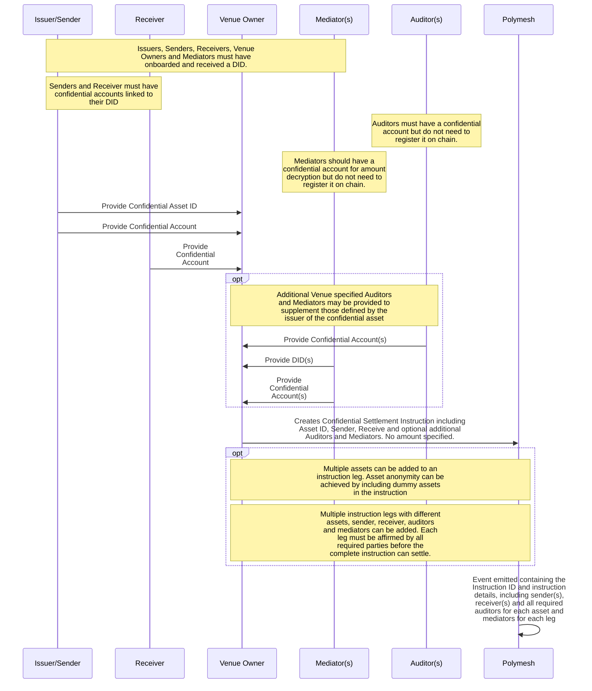
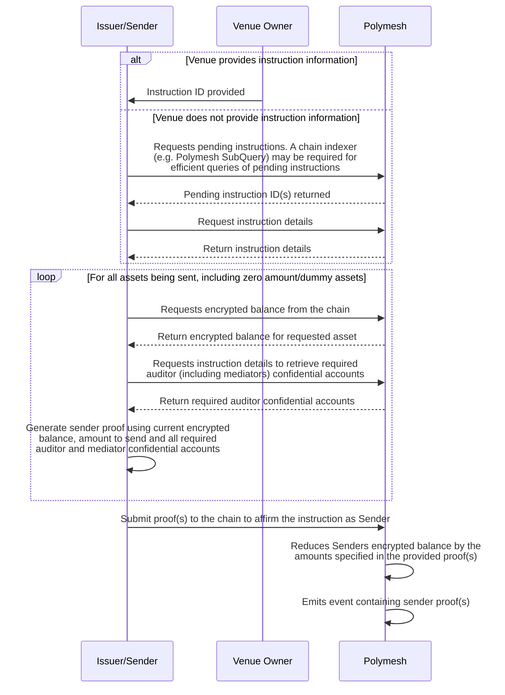
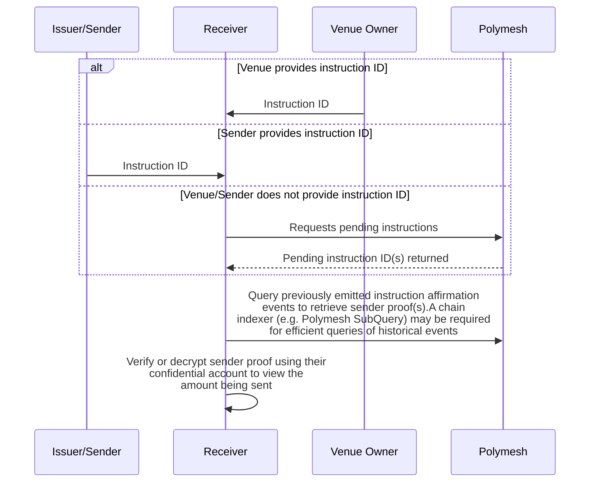
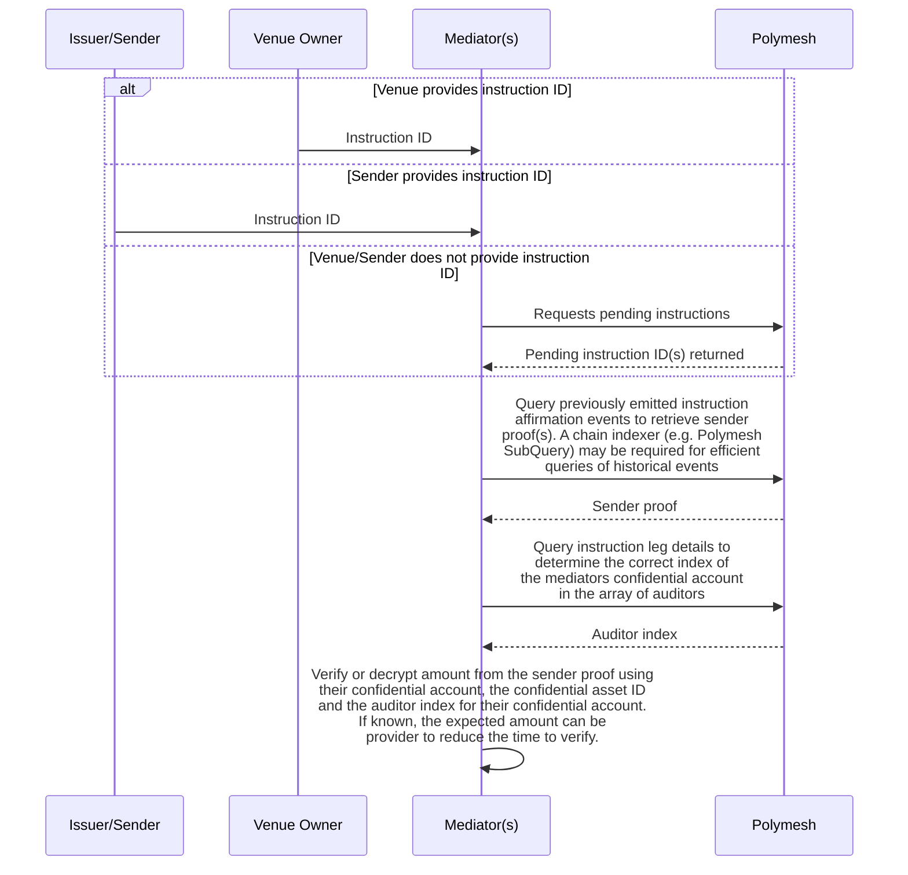
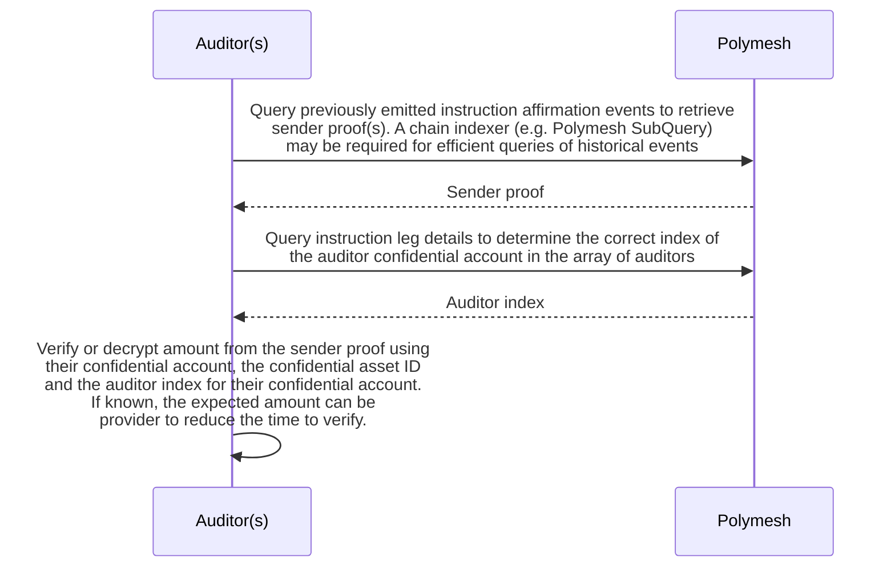
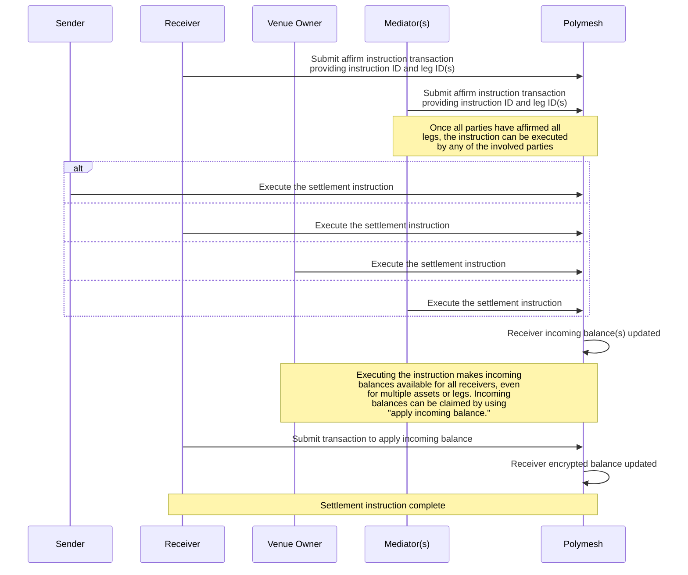
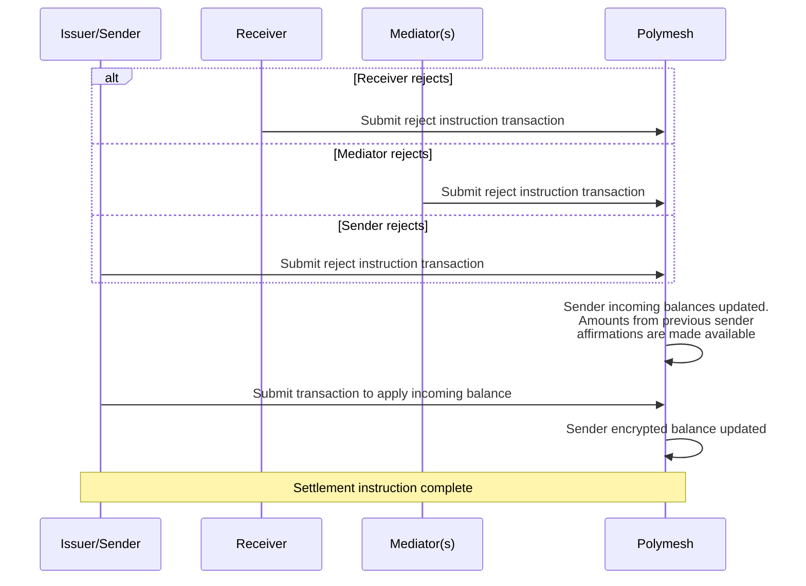

## Purpose of Sequence Diagrams

These sequence diagrams provide a detailed overview of the steps involved in the settlement process for Confidential Assets. They outline each step comprehensively, from account setup to instruction creation, affirmation, rejection, and execution.

It's important to note that these diagrams offer a low-level representation, including all steps of the listed process. This level of detail ensures clarity and precision in understanding the settlement process.

When using tools such as the Polymesh Private REST API or the Polymesh Private Typescript SDK, some of the steps depicted in these diagrams are combined into a single user action. These tools can simplify the process for integrators, streamlining the integration of Confidential Assets.

Follow the steps [here](../tutorials/walkthrough-confidential-assets-rest-api.md) to implement these sequences using the [Polymesh Private Development Environment](../tooling.md#development-environment).

## 1 Confidential Account Setup

## 2 Confidential Asset and Settlement Venue Creation

## Settlement Process

### 3 Instruction Creation

### 4 Sender Proof Generation and Affirmation

### 5 Receiver Zero Knowledge Proof Verification

### 6 Mediator Zero Knowledge Proof Verification

:::note
Mediators can only verify or decrypt confidential amounts for assets or legs that they have been specified as an auditor for.
:::

### 7 Auditor Zero Knowledge Proof Review

:::note
For an issuer to be able to be able to verify or decrypt confidential amounts they must also be an auditor of the asset.
:::

### 8 Instruction Affirmation

### Instruction Rejection

