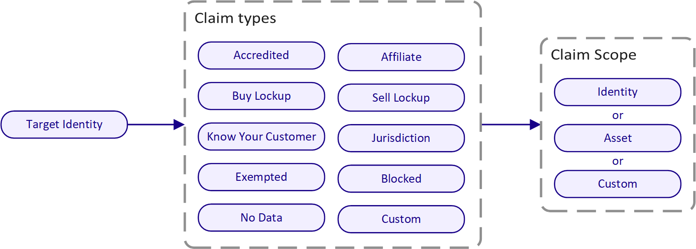
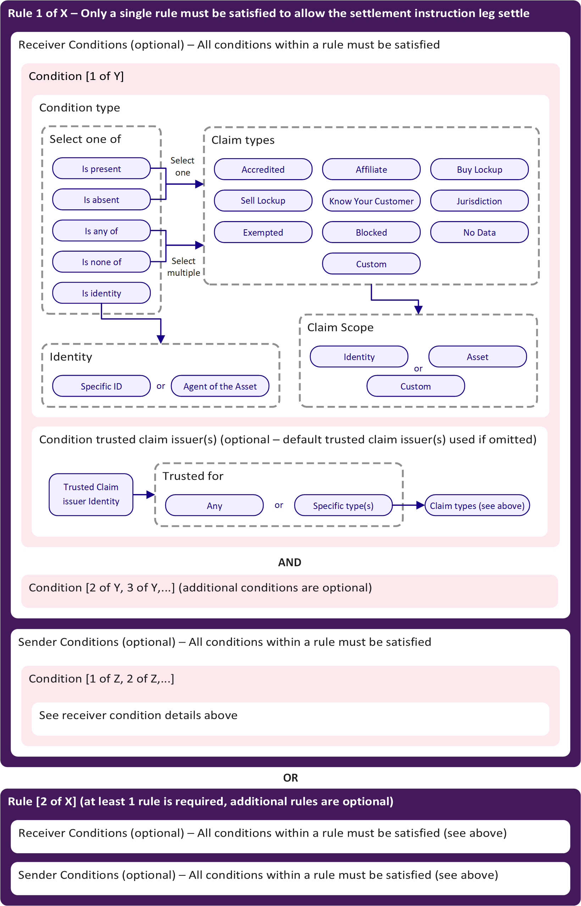

## Overview

Polymesh enables asset issuers to enforce real-time compliance on their assets through claim-based transfer rules and optional additional transfer restrictions.

The compliance manager, implemented in the Polymesh blockchain's base layer primitives, provides a flexible framework allowing asset issuers to configure complex transfer rules based on claims that investors must hold.

## Claims

Polymesh supports several types of claims that can be attested from one identity to another. A claim represents something that is being asserted and generally does not have associated on-chain proof.

The diagram above shows the available claim types. Some claim types include additional parameters relevant to the claim, such as the country code for a `Jurisdiction` claim, indicating the user's jurisdiction.

Each claim has an optional expiry date, after which it is no longer valid. For example, `Buy Lockup` and `Sell Lockup` claims can prevent investors from buying or selling an asset until after the expiry date of the respective claim.

The `Custom` claim type allows for non-default claim types to be used in compliance rules, expanding compliance options.

There is also a "special" claim not shown above:

- `CustomerDueDiligence`: This claim can only be issued by trusted [CDD](../cdd/) service providers, granting general access to the Polymesh network.

## Trusted Claim Issuers and Scopes

While anyone can issue a claim for an identity, issuers need to assess the validity of these claims by specifying trusted claim issuers. Asset issuers define which identities they trust to provide claims on their investors. This allows them to set rules that are only satisfied if a relevant claim is issued by these trusted identities. The issuer may include themselves or partnered KYC organizations in this list and restrict specific claim types from each trusted issuer. For example, an issuer might only accept the `Affiliate` claim from themselves.

Issuers may designate one or more **default** trusted claim issuers. If a rule does not specify a claim issuer for a condition, the default claim issuers are used.

## Claim Scopes

Claim issuers assign a scope to each identity claim. Asset issuers use these scopes in compliance rules to specify which claims are accepted. Scopes can apply to a particular asset, an identity, or a custom category.

Examples of claim scopes:

- A claim scoped to the `ACME` asset UUID (e.g., `12345678-1234-1234-1234-123456123456`) allows the claim to be used with rules that only accept claims scoped to this asset, offering the highest level of control over identity claims.
- A claim scoped to the `ACME Co.` identity (issuer of `ACME-A`, `ACME-B`, and `ACME-C`) enables reuse of identity claims across multiple assets. Here, claim issuers can issue a single KYC claim scoped to the identity rather than multiple asset-specific claims.
- A custom scope such as `ACME Exchange` could apply to claims issued by the ACME Exchange for all onboarded account holders. If an asset issuer lists their token on the ACME Exchange and accepts the exchange as a trusted issuer, the issuer can permit exchange account holders to trade the token by recognizing the exchange's custom scope in compliance rules.

## Compliance Rules

The compliance manager allows asset issuers to configure compliance rules for their assets. The diagram below illustrates how issuer-defined compliance rules are constructed on Polymesh.

Asset issuers can specify multiple rules for their asset. Each rule includes conditions that both the sender and receiver must satisfy. If the conditions for any rule are met by both parties in a transaction, the transfer leg can proceed.

Each compliance rule's conditions (for both sender and receiver) must be satisfied, although conditions lists can be empty. For example, if the sender conditions are blank, all asset holders can send the token without restriction, provided the receiver satisfies the specified receiver conditions.

An asset issuer can also pause compliance on their asset, enabling all transfer legs to execute upon affirmation. Pausing compliance may benefit certain assets, like stablecoins, where the issuer may not wish to impose transfer restrictions.

A condition can require that a particular claim (and its scope) be present or absent, that a group of claims be present or absent, or that at least one claim type be present. Conditions also specify which trusted claim issuers are accepted. A condition can also mandate that the sender or receiver be a particular identity.

If any compliance rule is satisfied in a transfer leg, compliance is considered complete, allowing asset issuers to create complex rule sets that ensure asset compliance.

For example, the following rule set requires only a single rule to be satisfied:

- Rule 1 - sender does not have a sell lockup scoped to the asset, from the asset issuer; receiver has a KYC claim and is not in the U.S., with claims scoped to the asset or issuer identity and from the issuer's KYC partner.
- Rule 2 - sender does not have a sell lockup scoped to the asset, from the asset issuer; receiver has a KYC claim and an Accredited claim, scoped to the asset or issuer identity and from the issuer's KYC partner.
- Rule 3 - sender's identity is an agent of the asset, with no receiver conditions.
- Rule 4 - no sender restriction; receiver's identity is an agent of the asset.
- Rule 5 - no sender restriction; receiver has an Exempted claim scoped to the asset from the asset issuer.

## Additional Transfer Restrictions

Beyond the flexible claim-based compliance manager, asset issuers can apply additional transfer restrictions to control asset trading further.
