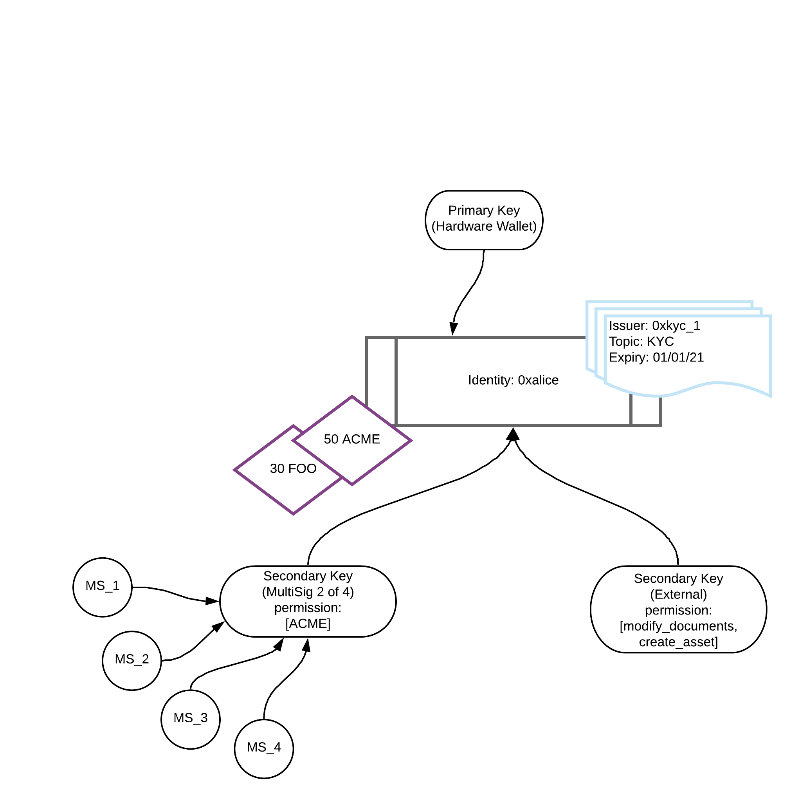
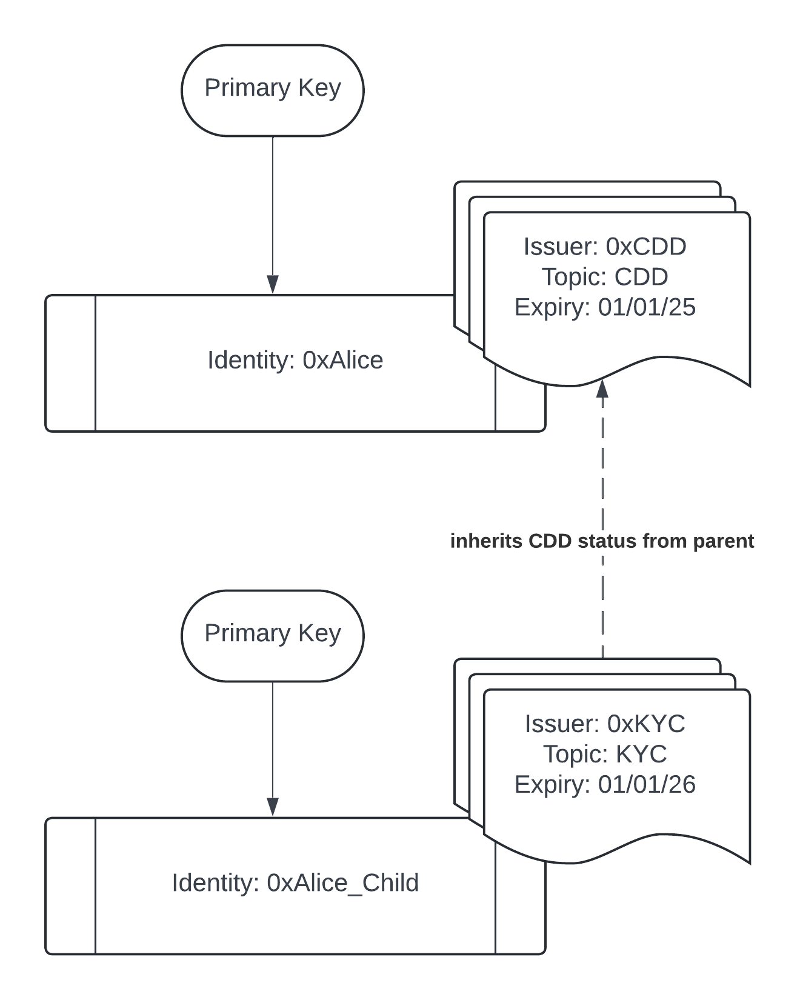

## Overview

Identity is at the core of Polymesh.

To submit a transaction on-chain, the signing key of that transaction must be associated with an identity or authorising an action on behalf of an identity.

Polymesh implements a federated root of trust via permissioned Customer Due Diligence (CDD) service providers. Every transaction in Polymesh is associated with an identity.

Identities in Polymesh are controlled via keys. Each identity must have a single primary key and can optionally have additional secondary keys.

Identities consist of a collection of claims and assets and are controlled via keys.

A user can have multiple identities, which allows them a degree of privacy with respect to their total asset holdings.

Each identity is referenced via a decentralized identifier (DID). A DID is a pseudo-anonymous identifier such as `0xfc0d2fc058d02c0a89c2cc2ff11726971dd39886a0b80ecfaa80fa3f196d65ce`.

## Identity Diagram

## Assets

Assets held by a user are associated with one of their identities. For example, the identity with DID `0xalice` might have a balance of 50 ACME tokens and 30 FOO tokens.

Assets held by an identity can be organized into [portfolios](../portfolios-custody/) under that identity.

## Claims

An identity can add a claim to another identity and, in turn, hold claims that have been added to it by other identities.

To enforce compliance on their assets, asset issuers nominate trusted claim issuers to manage their investors' claims related to their asset compliance rules.

## Authentication and Keys

Identities are created for users by [CDD service providers](../cdd/).

Unlike most blockchains, in Polymesh, all on-chain actions are associated both with a signing key (the key used to sign the transaction) and an on-chain identity.

To facilitate this connection between identities and signing keys, each on-chain identity is associated with keys that are allowed to sign on its behalf. A given key can only be associated with at most one identity at a time.

These keys are known either as primary keys or secondary keys.

POLYX, the native token of Polymesh, is held at the key level. Staking and governance, both of which utilize POLYX, are also associated with keys. Although balances are held at the key level, any transaction involving POLYX must be associated with an identity that has a valid CDD claim.

## Primary and Secondary Keys

An identity is associated with a primary key on creation by the CDD service provider. This key is typically the public half of a public/private key pair held by the user owning the identity.

The primary key of an identity has full permissions to that identity and can add or remove additional secondary keys.

A secondary key can also sign transactions on behalf of its identity but can have its permissions limited to only certain actions, portfolios, or assets. It can also be removed by the primary key of its identity at any time.

For more information on our public/private key cryptography, please see:  
[https://docs.substrate.io/learn/cryptography/](https://docs.substrate.io/learn/cryptography/)

## Key Types

There are three types of keys that can be used in Polymesh:

- Public/Private key pairs
- MultiSigs
- Smart Contracts

Polymesh is generally agnostic to the type of key being used and treats each key type consistently (e.g., for permissioning).

### Public/Private Key Pairs

Polymesh uses public-key cryptography based on the [Ed25519 curve](https://docs.substrate.io/learn/cryptography/#elliptic-curve) and allows keys that use either the Ed25519, SR25519, or ECDSA constructions.

These types of keys can be held on hardware wallets or can be generated offline and stored as paper wallets.

### MultiSigs

In addition to public/private key pairs, a key can also be a MultiSig account.

For a walkthrough on how to create a new MultiSig, please see the [MultiSig Walkthrough](../multisig/).

A MultiSig is a single key controlled by one or more people. An _n_ of _m_ MultiSig requires _n_ of its _m_ members to agree on a transaction before that transaction can be submitted by the MultiSig.

In particular, a MultiSig has the following attributes:

- MultiSig Signers (`multisig::multiSigSigners`): the keys attached to the MultiSig as signers.
- MultiSig Approvals Required (`multisig::multiSigSignsRequired`): the number of MultiSig signers required to approve a transaction.
- Admin Identity (`multisig::adminDid`): the (optional) identity that can manage the MultiSig (e.g., add/remove signers).
- Paying Identity (`multisig::payingDid`): the (optional) identity that pays for MultiSig transactions (both the proposal and approval, as well as the execution).
- MultiSig Identity (`identity::keyRecords` / `identity::didRecords`): the (optional) identity to which the MultiSig is attached as a primary or secondary key.

#### Creating MultiSigs

To create a new MultiSig, an existing key (attached to a valid identity) must call `multisig::createMultisig`, specifying the signers and the number of approvals required. It can also optionally specify the permissions that the new MultiSig will be assigned.

The new MultiSig will automatically:

- Be added to the caller's identity as a secondary key with appropriate permissions.
- Have its _Paying Identity_ set to the caller's identity.
- Issue `AddMultiSigSigner` authorizations to each of the specified signers.

Once created, the specified signers will need to accept the authorizations issued above before they can interact with the MultiSig. This is done via a call to `multisig::acceptMultisigSigner` by each of the signing keys.

:::note
MultiSig signing keys are not permitted to be directly linked to an identity or another MultiSig.
:::

#### Submitting Transactions

MultiSig signers are not directly associated with an identity but are indirectly associated through their linked MultiSig (which may be attached to an identity as a primary or secondary key).

This means that MultiSig signers cannot send or receive POLYX (since they are not directly associated with an identity) and cannot directly pay for transactions to create or approve proposals.

In order to submit a transaction (excluding transactions related to joining or leaving an identity), the MultiSig must be attached to a valid identity as a primary or secondary key. Either the MultiSig itself or the primary key of its _Paying Identity_ must have sufficient funds to pay the transaction fees to create and approve the proposal.

#### Identity Management

When initially created, a MultiSig is:

- Linked to its creating identity as a secondary key.
- Has its _Paying Identity_ set to the creating identity.
- Has no _Admin Identity_ assigned.

However, these relationships can be amended.

An _Admin Identity_ can be assigned via `multisig::addAdmin`, allowing the _Admin Identity_ to add/remove signers from the MultiSig (via `multisig::addMultisigSignersViaAdmin`, `multisig::removeMultisigSignersViaAdmin`) and change the number of approvals needed (via `multisig::changeSigsRequiredViaAdmin`). To make these changes, the primary key of the _Admin Identity_ must call these transactions.

The _Admin Identity_ can be removed either directly by the _Admin Identity_ themselves, or by the MultiSig executing a proposal to remove the _Admin Identity_.

Modifying the signers or number of signers required, on a MultiSig, invalidates any prior un-executed MultiSig proposals.

:::note
Since the _Admin Identity_ associated with a MultiSig can modify the signers and / or the number of signers required on a MultiSig, thus invalidating any pending proposals, they can prevent the MultiSig from directly removing the _Admin Identity_ on a MultiSig. This is by design to provide a _Admin Identity_ with full control over any MultiSig it is administering. 
:::

Additionally, a MultiSig can leave and join new identities, similar to any other key. Changing identity will not update the _Admin Identity_ of the MultiSig, this must be amended separately if needed.

To change identity, a MultiSig must:

- Receive a `JoinIdentity` authorization from another identity.

Then either:

- Leave its current identity by executing a proposal of `identity::leaveIdentityAsKey`.
- Create/approve the `JoinIdentity` authorization by a direct call to `multisig::approveJoinIdentity` by the required number of signers.

Or:

- Create a proposal for an atomic batch of two transactions using `utility::batch`:
  - Leave its current identity by executing `identity::leaveIdentityAsKey`.
  - Join its new identity by executing `identity::joinIdentityAsKey`.

The latter approach is recommended, provided the `JoinIdentity` authorization can be issued before the MultiSig leaves its current identity.

#### Payment Management

MultiSigs can hold funds once they have been attached as a Primary or Secondary key to an identity. If they are removed from the identity, they can continue to hold funds (as per normal external key behavior), but these funds are locked until the key is reattached to a CDD'ed identity.

A MultiSig may opt to pay for its own transactions (to remove the requirement to keep the primary key of its _Paying Identity_ funded with POLYX) via `multisig::removePayer`. This can also be done by the _Paying Identity_ via `multisig::removePayerViaPayer`.

:::note
If you remove the _Paying Identity_ from a MultiSig, it is not possible to re-add it later.
:::

### Smart Contracts

While not conventionally considered key types, Smart Contracts are represented by a public address on Polymesh, similar to other key types. Like other keys, smart contracts must be associated with an identity, either as a primary or a secondary key, to be able to transact on-chain.

Smart contracts allow developers to define custom logic, rules, records, and functions. They are vital tools for automating complex processes, facilitating decentralized applications, and expanding the network's capabilities. Like other keys, Smart Contracts can hold POLYX tokens but require interaction with external keys to initiate actions. These contracts seamlessly integrate with Polymesh through chain extensions, granting access to blockchain data and functionalities, thus supporting diverse decentralized applications and use cases.

## Permissions

Permissions in Polymesh operate with three levels of granularity, which can be combined:

- **Assets**
- **Extrinsics**
- **Portfolios**

The _assets_ granularity allows a key to be limited to interacting with only specific assets held in any portfolio under the identity.

The _extrinsics_ granularity allows a key to be permissioned for specific on-chain actions, such as submitting documentation for an asset or signaling in governance.

The _portfolios_ granularity allows a key to be restricted to interacting with only the assets in specific portfolios under the identity or under the custody/control of that identity.

The access of a particular key is determined by the intersection of these categories. It is possible to grant a key full access to any or all of these categories.

Not all on-chain actions are associated with an asset or a portfolio (e.g., staking). For such actions, these permission types are not checked.

## Child Identities

An identity, as described above, is always created by a [CDD service provider](../cdd/).

This process involves two steps for CDD providers:

1. Creating an on-chain identity for the user, referenced via the returned DID.
2. Issuing a CDD claim to the new on-chain identity.

When a user submits a transaction to the network, the process is as follows:

1. The associated identity is determined by identifying which identity the key signing the transaction is linked to (this can be at most one identity).
2. It is then checked whether the associated identity has a valid CDD claim (issued by a current CDD provider and not expired).

However, for some use cases, it may be beneficial for existing identities created via CDD providers to create additional child identities unilaterally (i.e., without the involvement of a CDD provider).

Possible use cases include:

- Isolating a smart contract from the deployer's identity to protect user funds held or controlled by the smart contract.
- Adding an extra layer of protection, with child identities functioning as "hot wallets" and the parent identity as a "cold wallet." Since assets are held at the identity level, it can be useful to have distinct hot/cold identities.
- Organizing an entity into an internal structure (e.g., one child identity for each department or sub-company).

Polymesh allows any "parent" identity (an identity created via a CDD provider) to create additional child identities. These child identities inherit their CDD claim from the parent, rather than having an explicit CDD claim issued by a CDD provider attached to the child DID.

To create a child identity, there is the `identity::create_child_identity` extrinsic, along with corresponding SDK and RESTful API methods.

Once created, a child identity is assigned its own unique DID and can hold claims and assets like any other identity. However, a child identity cannot create additional child identities underneath it (i.e., recursion is not allowed). A child identity only inherits its CDD status from its parent identity, any other claims related to compliance must be held directly by the child identity.

If desired, a child identity can be unlinked from its parent. In this case, it will no longer inherit its CDD status from its parent's claim and will need to obtain its own CDD claim from a CDD provider.
