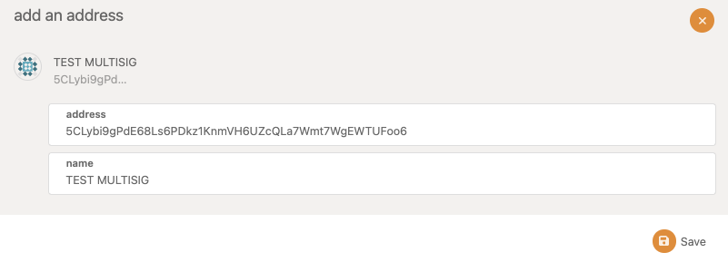
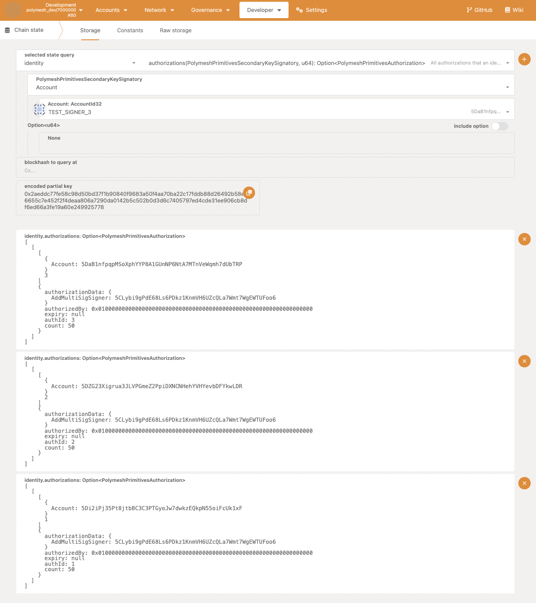
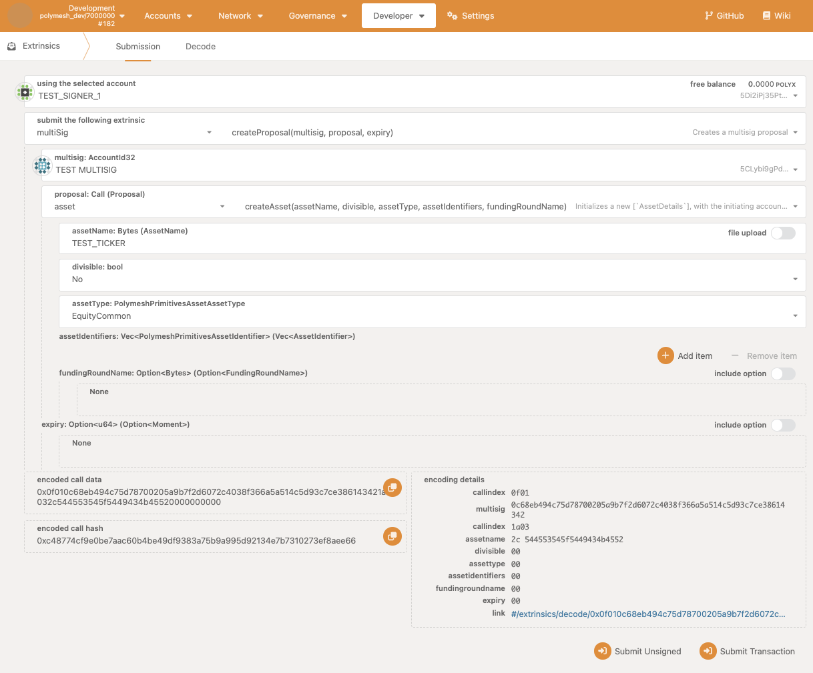
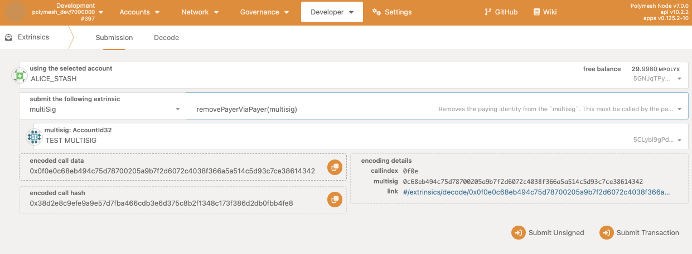

## Overview

Instead of using an public/private key pair address as a primary or secondary key on your Polymesh identity, it is possible to use a MultiSig.

MultiSig keys can specify a set of associated signers (`n` signers) or which a subset (`m` signers) must agree in order to execute an on-chain action.

## Creating a MultiSig

In Polymesh, MultiSigs are always created by an existing identity, and will be attached to that identity as a secondary key on creation. The *Paying Identity* of the newly created MultiSig will also be set to the callers identity.

### Step 1 - Setting Up Accounts

In this tutorial we will create a 2 of 3 MultiSig and set it as the primary key of our Polymesh identity.

To begin, we create three new keys, called `TEST_SIGNER_1/2/3`. In practice these can be created and secured by three different parties.

These keys can be created in the Polymesh Wallet, or using the Polymesh App (https://mainnet-app.polymesh.network) in the Accounts tab. We've used the latter for this tutorial.

### Step 2 - Creating A MultiSig

We now create the MultiSig key, by calling the `multisig::createMultisig` extrinsic. This can only be called by a Primary Key of an existing Identity.

In this tutorial, `ALICE_STASH` is the Primary Key of our identity (`0x01`), so we use this key to submit the `multisig::createMultisig` transaction.

This requires us to pass in the initial set of signers for the MultiSig, and specify how many of those signers are required to agree in order to execute a transaction. We specify the three new keys created in Step 1. here.

Once this extrinsic has been executed, we can check for the corresponding event which will tell us the address of the newly created MultiSig key.

In this case the MultiSig has an address of `5CLybi9gPdE68Ls6PDkz1KnmVH6UZcQLa7Wmt7WgEWTUFoo6`. You can add this to your address book in the Polymesh App to make it easier to reference in the future.

### Step 3 - Accepting Signer Authorizations

We now need to accept the authorisation to be a signer on this MultiSig from each of the three signers that we specified in Step 2.

To accept these authorisations, we need to know the authorisation ID for each signer to accept. These are emitted when the MultiSig is created as events, or alternatively you can query the `identity::authorizations` storage.

Once you have the authorization ID you can call `multiSig::acceptMultisigSignerAsKey` from each of the signer accounts with the correct authorization ID (each signer will have a different authorization ID to accept).

:::info
When accepting these authorisations, the current primary key of the *Paying Identity* will pay for the transactions.
:::

At this point your MultiSig is created, and three signing addresses have been associated with it.

### Step 4 - Funding The MultiSig

To fund your MultiSig you can just transfer POLYX to it like any other key.

If you added the MultiSig to your Address Book, you should now see its updated balance.

## Using The MultiSig

You can now go ahead and use your MultiSig to execute actions as your identity. For example, suppose we want to create a new asset, we can call `asset::createAsset`

Before we can execute this transaction from our MultiSig, the MultiSig has to be permissioned to call the `asset::createAsset` extrinsic as a secondary key. By default MultiSigs are assigned no permissions on creation, and we didn't provide any optional permissions to override this when creating our MultiSig above.

To create an asset you will need to first create this transaction from one of the signers, and then approve it from another signer (since 2 of the 3 signers must agree to execute an action).

When the first signer proposes the transaction, the corresponding event shows the proposal ID which can be used by the second signer when approving the transaction.

In this case the proposal ID is 0, which we then approve from the second signer.

You can now see that the `asset::createAsset` transaction is executed!

## Adding Admin Identity

It is possible to assign an *Admin Identity* to your MultiSig. The *Admin Identity* can then add / remove signers, as well as update the number of signers a proposal requires in order to execute.

Once added, an *Admin Identity* can then be removed, either by the MultiSig itself, or the *Admin Identity*.

In order to administer the MultiSig, it is the Primary Key of the *Admin Identity* that must submit the relevant transactions.

Assigning an *Admin Identity* can be done through a usual MultiSig proposal to `multisig::addAdmin` which is then approved in the usual way.

The event confirming the new *Admin Identity* can then be observed.

Once the *Admin Identity* has been approved it can, for example, update the number of approvers needed from 2 to 1.

## Removing Payer Identity

On creation a MultiSig is assigned the identity of the calling key as its *Paying Identity*.

It may be that you wish to remove this association, leaving the MultiSig to pay for its own transactions, from its POLYX balance (rather than relying on the primary key of the *Paying Identity* to pay for its associated transactions).

A *Paying Identity* can be removed either by the MultiSig, or by the *Paying Identity* itself. In this example we do the former.

## Changing Identity

It may be that the MultiSig needs to be detached from its current identity, and attached to a new identity.

In order to join a new identity, the new identity must issue a `JoinIdentity` authorisation to the MultiSig.

The MultiSig can then accept this `JoinIdentity` authorisation. Note that when accepting a `JoinIdentity` authorisation, it is always the primary key of the identity that issued the `JoinIdentity` authorisation that pays for the transaction fee to accept the authorisation.

To join a new identity, a MultiSig must use the dedicated extrinsic `multisig::approveJoinIdentity` - this ensures that payment is routed correctly (otherwise the transaction cannot complete as, in this instance, the MultiSig cannot pay for itself as it is not yet attached to an identity).

Note that it is also possible to simplify the workflow using Polymesh's native batching functionality,

Instead you can create a proposal for an atomic batch of two transactions using `utility::batch`:
  - leave the current identity by executing `identity::leaveIdentityAsKey`
  - join the new identity by executing `identity::joinIdentityAsKey`

The latter approach is recommended provided the `JoinIdentity` authorization can be issued before the MultiSig needs to leave its current identity.