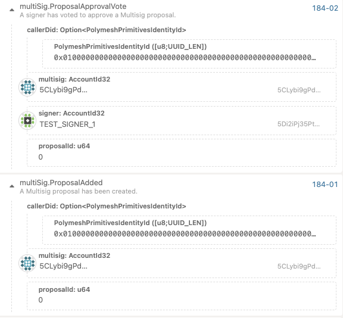

## Overview

Instead of using an public/private key pair address as a primary or secondary key on your Polymesh identity, it is possible to use a MultiSig.

MultiSig keys can specify a set of associated signers (`n` signers) or which a subset (`m` signers) must agree in order to execute an on-chain action.

## Creating a MultiSig

In Polymesh, MultiSigs are always created by an existing identity, and will be attached to that identity as a secondary key on creation. The *Paying Identity* of the newly created MultiSig will also be set to the callers identity.

### Step 1 - Setting Up Accounts

In this tutorial we will create a 2 of 3 MultiSig and set it as the primary key of our Polymesh identity.

To begin, we create three new keys, called `TEST_SIGNER_1/2/3`. In practice these can be created and secured by three different parties.

These keys can be created in the Polymesh Wallet, or using the Polymesh App (https://mainnet-app.polymesh.network) in the Accounts tab. We've used the latter for this tutorial.

### Step 2 - Creating A MultiSig

We now create the MultiSig key, by calling the `multisig::createMultisig` extrinsic. This can only be called by a Primary Key of an existing Identity.

In this tutorial, `ALICE_STASH` is the Primary Key of our identity (`0x01`), so we use this key to submit the `multisig::createMultisig` transaction.

This requires us to pass in the initial set of signers for the MultiSig, and specify how many of those signers are required to agree in order to execute a transaction. We specify the three new keys created in Step 1. here.

Once this extrinsic has been executed, we can check for the corresponding event which will tell us the address of the newly created MultiSig key.

In this case the MultiSig has an address of `5CLybi9gPdE68Ls6PDkz1KnmVH6UZcQLa7Wmt7WgEWTUFoo6`. You can add this to your address book in the Polymesh App to make it easier to reference in the future.

### Step 3 - Accepting Signer Authorizations

We now need to accept the authorisation to be a signer on this MultiSig from each of the three signers that we specified in Step 2.

To accept these authorisations, we need to know the authorisation ID for each signer to accept. These are emitted when the MultiSig is created as events, or alternatively you can query the `identity::authorizations` storage.

Once you have the authorization ID you can call `multiSig::acceptMultisigSignerAsKey` from each of the signer accounts with the correct authorization ID (each signer will have a different authorization ID to accept).

:::info
When accepting these authorisations, the current primary key of the *Paying Identity* will pay for the transactions.
:::

At this point your MultiSig is created, and three signing addresses have been associated with it.

### Step 4 - Funding The MultiSig

To fund your MultiSig you can just transfer POLYX to it like any other key.

If you added the MultiSig to your Address Book, you should now see its updated balance.

## Using The MultiSig

You can now go ahead and use your MultiSig to execute actions as your identity. For example, suppose we want to create a new asset, we can call `asset::createAsset`

Before we can execute this transaction from our MultiSig, the MultiSig has to be permissioned to call the `asset::createAsset` extrinsic as a secondary key. By default MultiSigs are assigned no permissions on creation, and we didn't provide any optional permissions to override this when creating our MultiSig above.

To create an asset you will need to first create this transaction from one of the signers, and then approve it from another signer (since 2 of the 3 signers must agree to execute an action).

When the first signer proposes the transaction, the corresponding event shows the proposal ID which can be used by the second signer when approving the transaction.

In this case the proposal ID is 0, which we then approve from the second signer.

You can now see that the `asset::createAsset` transaction is executed!

## Adding Admin Identity

## Removing Payer Identity

## Changing Identity

## Rotating MultiSig To Primary Key