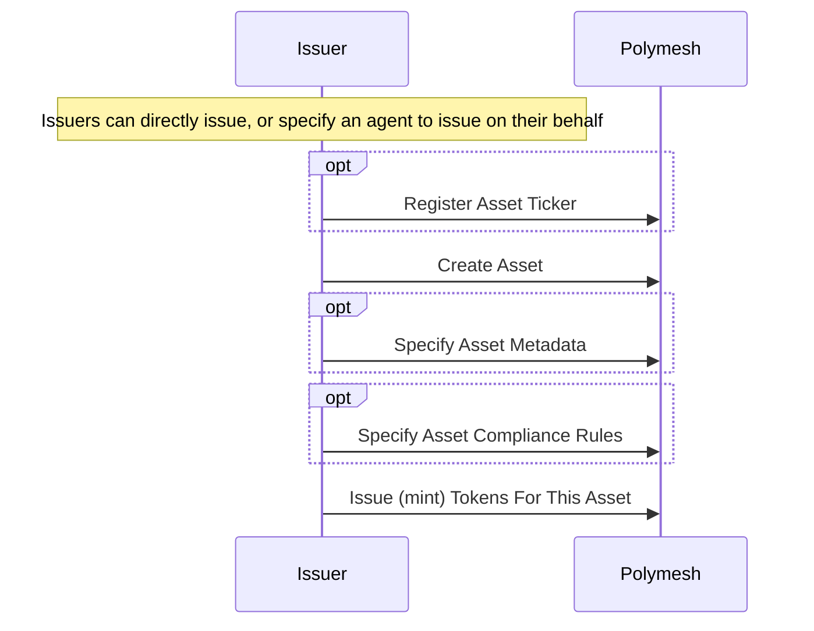
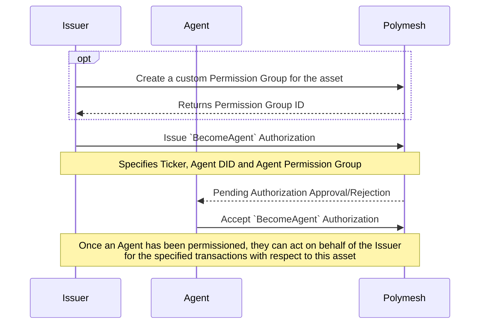
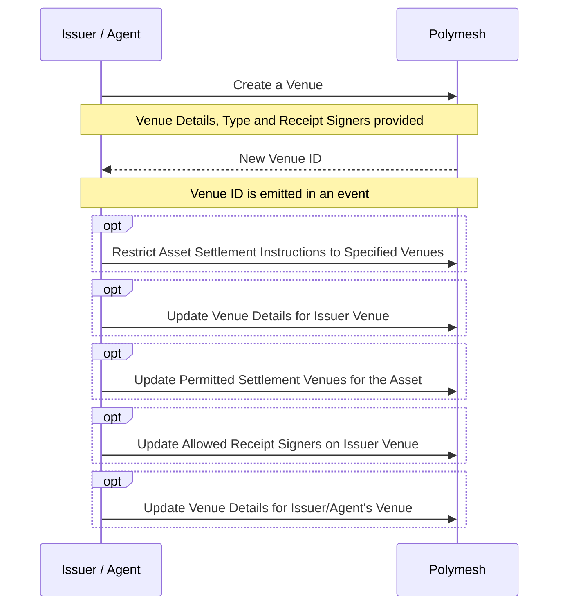
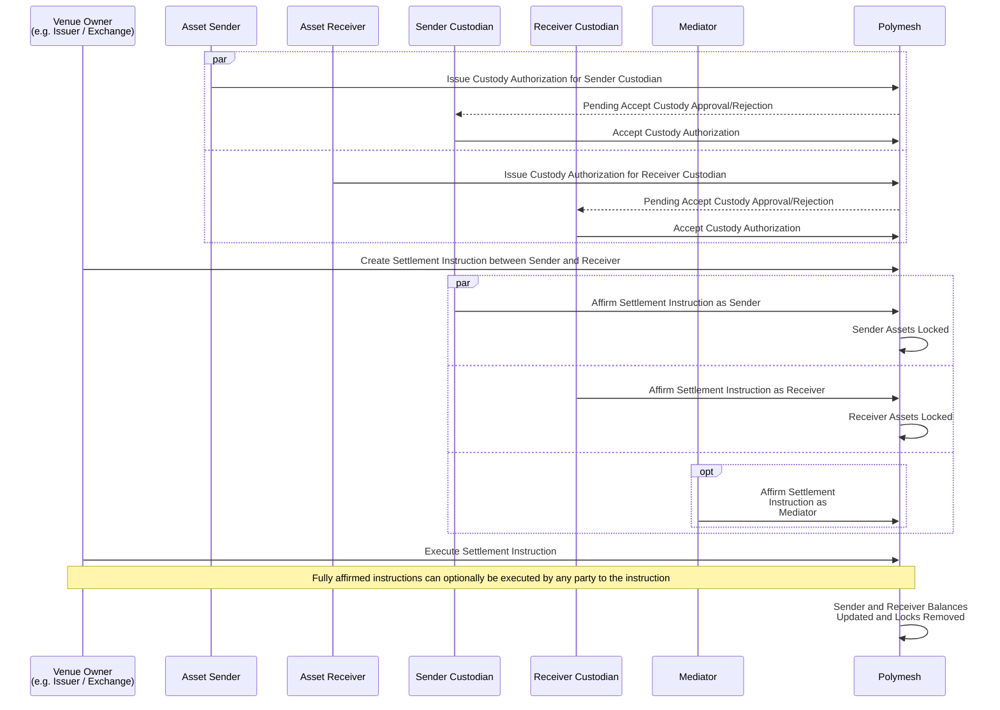
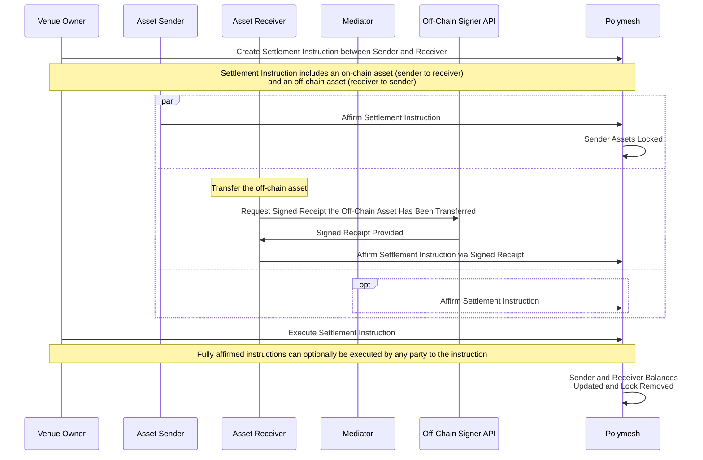

## Purpose of Sequence Diagrams

These sequence diagrams provide a detailed overview of the steps involved in the settlement process for Assets. They outline each step comprehensively, from account setup to instruction creation, affirmation, rejection, and execution.

It's important to note that these diagrams offer a low-level representation, including all steps of the listed process. This level of detail ensures clarity and precision in understanding the settlement process.

When using tools such as the Polymesh REST API or the Polymesh Typescript SDK, some of the steps depicted in these diagrams are combined into a single user action. These tools can simplify the process for integrators, streamlining the integration of Assets.

## Asset Creation

In this sequence diagram, the asset issuer creates, configures and issues an asset. In this flow the issuer does this directly, but it is also possible to delegrate the configuration and issuance steps to an agent once the asset has been created.

## Asset Agent Management

In this optional sequence diagram, the asset issuer permissions an external agent to operate their asset on their behalf.

Agents can be granted granular permissions so that they can only operate specific features (e.g. documentation updates) as needed.

## Asset Venue Creation

In this step the asset issuer (or their agent) creates a new distribution venue to distribute their asset. Every settlement instruction in Polymesh is related to a particular settlement venue, and only the creator of that venue can create settlement instruction under that venue and optionally specify who is allowed to sign receipts for off-chain asset transfers.
In addition the issuer of an asset can optionally manage which venues they allow their asset to trade within.

## Asset Settlement / Distribution

In this step an asset is settled between a sender and receiver. In this example both the sender and receiver configure a custodian who does the affirmation step on their behalf - this approach is optional, and you can see in the next example that we have the sender and receiver affirming directly rather than via a custodian.

For clarity roles have been clearly separated however some entities may perform multiple roles e.g. the asset issuer may also be the sender in the case of primary distribution.

:::note
If the settlement instruction creator is also a sender or receiver in the instruction then creating the instruction will also affirm legs of the instruction that apply to them.  
:::

## Asset Settlement / Distribution with Off-Chain Leg

In this step we show the sequence when a settlement instruction involves both an on-chain leg (to move an asset issued directly on Polymesh) as well as an off-chain leg representing an asset or payment moving on a chain or payment system outside of Polymesh.

In this case we have synchronised settlement between the off-chain and on-chain legs (rather than atomic settlement) with signed data being provided via an "OffChain Signer API" to verify that the off-chain leg was completed, before the settlement instruction is finalised on Polymesh.

:::note
The role of the "Off-Chain Signer API" entity in the below sequence diagram is:

- monitor Polymesh for settlement instructions related to specified venues which involve off-chain legs
- observe whether or not the off-chain leg has been completed on the external payment / chain
- once the above steps have completed successfully sign a receipt (referencing the Polymesh settlement instruction and off-chain leg) using a private key which has been permissioned as an allowed signer on the venue associated with the settlement instruction

This signed data can then be used on Polymesh to affirm the off-chain leg, meaning that the Polymesh settlement instruction cannot be finalised until the "Off-Chain Signer API" has confirmed the payment (off-chain) leg.
:::

