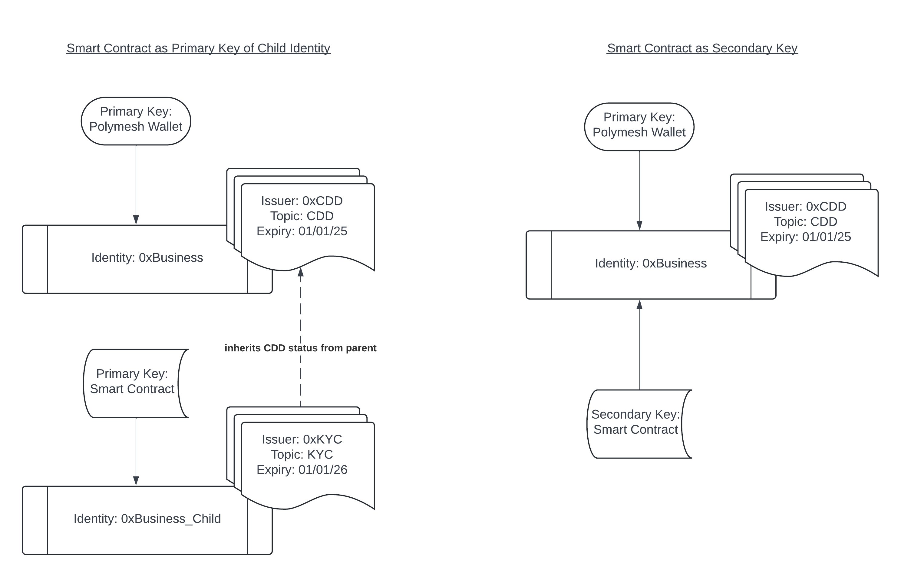
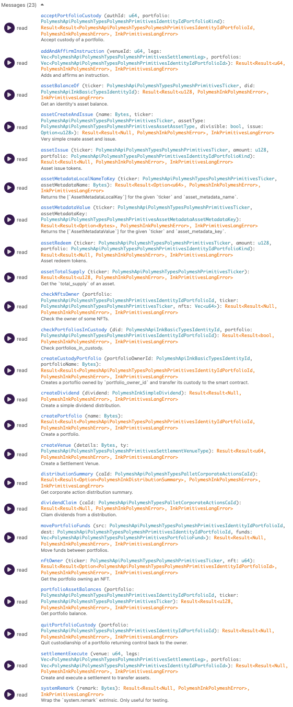
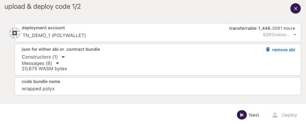
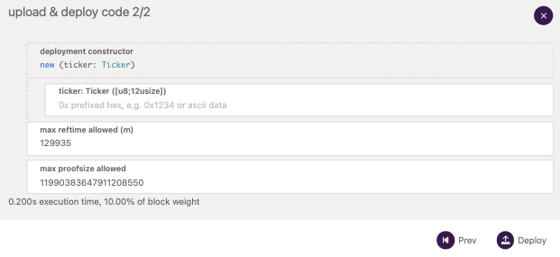
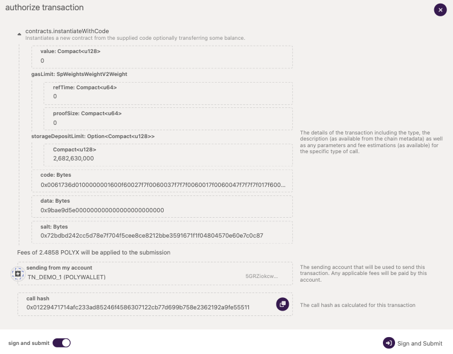
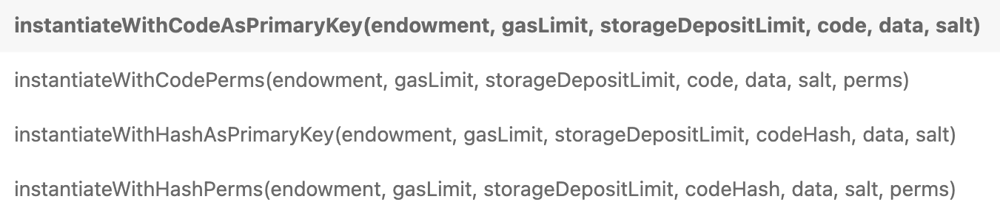
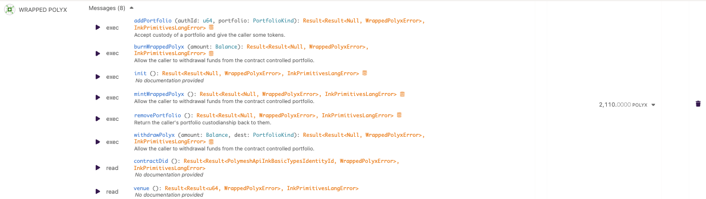

## Overview

Polymesh aims to incorporate all of the general functionality needed to issue and manage tokenised securities at its native layer.

The native layer of Polymesh consists of a number of modules, each associated with a number of possible transactions (API) to facilitate this. This includes modules to manage identity and associated attestations / claims, as well as issue, distribute and settle tokenised securities.

However, in addition to this general business logic encoded in the native layer of Polymesh, that does not require smart contracts to work with, Polymesh has support for smart contracts that are deployed on top of this native logic where needed.

For example, a business may wish to deploy some form of DEX on top of Polymesh, that uses the native custody and settlement functionality, but defines additional business logic on top of this to manage deposits, swaps and withdrawals.

Alternatively it may be that a custodian wishes to enforce additional logic on top of the native custody logic provided (for example to allow a user to unilaterally exit the custodial relationship) - this can also be managed via a smart contract that acts as a primary or secondary key attached to the identity that has custody.

## Ink! and Tooling

Polymesh smart contracts use the Substrate Ink! language - more details on this can be found at:
https://use.ink/
which covers the basic approaches to managing code and storage in smart contracts.

The Polymesh App, has a dedicated Contracts tab found at:
https://mainnet-app.polymesh.network/#/contracts
https://testnet-app.polymesh.live/#/contracts
https://staging-app.polymesh.dev/#/contracts
which provides a simple UI to upload, deploy and call smart contracts.

## Contract Ownership

Contracts can be deployed either directly from code, or by referencing code that has been previously uploaded to the chain, via its hash.

Contracts are attached to identities as keys in Polymesh. When a contract interaction triggers a call to the native Polymesh layer (for example to interact with issued assets or act as a custodian to a users portfolio) it will do so through the DID of the identity to which it is attached, regardless of what key initiated the contract interaction.

When instantiating a contract, you can choose to:
- attach the new contract as a secondary key to your identity (by default with empty permissions)
- generate a new Child Identity and attach the new contract as the primary key of this identity

This establishes a provenance for every smart contract (via a link to an Identity) whilst still allowing fine-grained control over the role and permissions of the smart contract.

Only keys which are attached to identities with a valid CDD claim are allowed to interact with smart contracts via the `Contracts::call` extrinsic, and pay for these transactions like any other. The smart contract itself must also be attached to an identity with a valid CDD call, otherwise the transaction will fail.

For example, a contract that represents a non-custodial DEX may be best deployed as a primary key on its own (child) identity, so that no other key (e.g. primary key on the same identity) has the ability to detach the smart contract from its identity thus rendering it uncallable.

Alternatively if you wanted to allow someone to update asset documentation with some bespoke logic (e.g. time delay) you could deploy a smart contract representing this bespoke logic, callable by your documentor, with the contract acting as a secondary key on your identity, with limited permissions to the asset documentation extrinsics.

If the smart contract includes logic that calls into the native Polymesh layer, it is important to rememeber that these calls will be interpreted by Polymesh as originating with the identity to which the smart contract is attached, not the identity of the key which initiated the transaction via `Contracts::call`. This allows smart contracts to express powerful functionality, taking direct ownership over assets and other roles, whilst having the flexibility to allow managed access to outside callers (through delegating that management to logic implemented inside the smart contract).

For example, a custodian may attach a smart contract as a secondary key, with the smart contract exposing an API that allows the owner of a custodied portfolio to request the smart contract (via its attached custodian identity) that the portfolio be uncustodied.

Note that it is possible to have a smart contract be the primary key of a parent identity (rather than a child identity when it is deployed as such) - this can be achieved by including logic in the smart contract to accept a primary key rotation authorisation. In a similar fashion a smart contract that is a primary key, could allow additional secondary keys to be added to its identity by encoding appropriate logic that issues these authorisations in the smart contract.



## Using Native Polymesh Functionality

It's important that smart contracts can interact with native Polymesh logic, specifically by reading storage (e.g. to determine the holders of an asset issued on the native layer) and calling extrinsics (e.g. to accept authorisations, or execute settlements).

Through these interactions with native logic, and because smart contracts are attached as keys to identities in Polymesh, a smart contract can control, or mediate the control of, any assets, roles (e.g. external agents / custody), attestation issuance or so on.

Polymesh smart contracts can interact with native Polymesh logic in powerful and different ways.

### Whitelist

Polymesh is designed to allow smart contracts interact with its native layer. However in order to introduce this powerful functionality responsibly and cautiously there is a whitelist of allowed extrinsics that can be called from smart contracts, maintained by the chains governance layer.

This whitelist (index of module and extrinsic) can be found in chain storage at `polymeshContracts::callRuntimeWhitelist`.

Please raise via our developer channels on Discord any requests to whitelist additional extrinsics and they'll be reviewed.

### Chain Extensions

Substrate defines a generic approach called Chain Extensions which allows the runtime to define certain custom features that can be used by smart contracts. The Polymesh Chain Extension logic can be found at:
https://github.com/PolymeshAssociation/Polymesh/blob/develop/pallets/contracts/src/chain_extension.rs

Any chain extension can be called directly by a smart contract, and this is useful for example to efficiently return the DID associated with a key.
```
Self::env().extension().get_key_did(acc)?
  .map(|did| did.into())
  .ok_or(Error::MissingIdentity)
```

### Polymesh API

The Polymesh chain extensions also include the ability to read native chain storage and call any extrinsic (if permitted by the whitelist). To ease working with these generic extensions (`read_storage`, `call_runtime_with_error`) the Polymesh API Ink Client can be used.

The Polymesh API library provides a simple and readable API, alongside Polymesh types, to facilitate easy interactions with Polymesh, and can be built for several clients, including Ink! based smart contracts.

For example, executing a manual settlement instruction in a smart contract may involve getting the next instruction identifier:
```
// Get the next instruction id.
let instruction_id = api
  .query()
  .settlement()
  .instruction_counter()
  .map(|v| v.into())?;
```
and then executing a corresponding manual settlement instruction:
```
  api.call()
  .settlement()
  .execute_manual_instruction(
      instruction_id,
      1,
      None
  )
  .submit()?;
```

The `api.query()` and `api.call()` hooks provide easy ways to query and call into the native Polymesh layer, with the API also providing the necessary types to manage parameters and returned data, alongside any errors.

### Upgradable Polymesh Ink Contract

One concern with (possibly immutable) smart contracts calling into the Polymesh native layer is that Polymesh allows this native functionality (logic and storage) to be upgraded via chain upgrades. Typically these upgrades are backwards compatable, but in the case of major releases may not be.

To help mitigate this Polymesh provides a proxy contract (Upgradable Polymesh Ink Contract) through which interactions with the native layer can be mediated. This provides a stable interface for smart contracts to interact with, across any breaking Polymesh upgrades.

The Upgradable Polymesh Ink Contract can be found at:
https://github.com/PolymeshAssociation/Polymesh/tree/develop/contracts/upgradeable-polymesh-ink
and is a normal Polymesh smart contract, that has an API designed to be called by other smart contracts (rather than directly through the `Contracts::call` extrinsic).

This contract is maintained by the Polymesh Association, with the intention that if there are breaking changes during an upgrade that mean any of its functionality no longer works, a new fixed version will be deployed and made available ahead of these breaking changes.

It presents a clean API such as:
```
let api = PolymeshInk::new()?;
// Accept portfolio custody and ensure we have custody.
let portfolio_id = api.accept_portfolio_custody(auth_id, portfolio)?;
```

Under the covers, the call to `api.accept_portfolio_custody` uses a delegate call (`ink::env::call::build_call::<ink::env::DefaultEnvironment>().delegate`) into the Upgradable Polymesh Ink Contract, to submit (in this case) an extrinsic to accept portfolio custody.

The Upgradable Polymesh Ink Contract uses the Polymesh API extensively to interact with the native Polymesh layer via storage queries and executing extrinsics.

#### Updating the Upgradable Polymesh Ink Contract

Polymesh provides dedicated Chain Extensions to allow smart contracts to discover the latest version of the Upgradable Polymesh Ink Contract. These Chain Extensions are used by the API associated with the Upgradable Polymesh Ink Contract to help ensure it is always using the correct underlying logic via the latest contract hash / code.

In particular, from the `polymesh-ink` crate, using `let api = PolymeshInk::new()?;` will look up the latest Upgradable Polymesh Ink Contract hash from chain storage (`polymeshContracts::currentApiHash`) and use this address when dispatching calls to the Upgradable Polymesh Ink Contract via its API.

Since this latest Upgradable Polymesh Ink contract hash may change (for example if a Polymesh upgrade necessitates releasing a new version with updated logic, maintaining the same external API) it is important to either re-instantiate the Polymesh Ink API everytime it is used (when constructed the API checks it is referencing the latest Upgradable Polymesh Ink Contract hash). This is preferred over using the API function `check_for_upgrade` which will do the same on an already instantiated API object, which is more expensive. In general the `PolymeshInk` API object should be reused within a single contract call as much as possible, and recreated on each contract call.

The latest hash is maintained via governance, using the chain storage at `polymeshContracts::apiNextUpgrade` to allow new Upgradable Polymesh Ink Contracts to be deployed ahead of the Polymesh upgrade to which they correspond. Following the upgrade, the next contract which uses an API constructed from this contract will trigger the chain storage (polymeshContracts::currentApiHash`) to be updated as appropriate.

The API of the Upgradable Polymesh Ink Contract includes cover functions to do useful and common actions, and wraps up multiple native Polymesh transactions and chain storage queries as needed.



## Polymesh Contracts vs. Contracts Modules

Substrate provides a library module called `Contracts` that presents most functionality needed to interact with smart contracts (e.g. uploading code, instantiating new contracts, calling contracts) - this module has been modified slightly to enforce Polymesh specific rules that a contract must be attached to an identity with a valid CDD claim.

In addition there is a module `polymeshContracts` which provides an additional layer of Polymesh specific contract functionality. In particular it allows contracts to be deployed with customised permissions as a secondary key, or allow it to be deployed as a primary key (by creating a new child identity under the callers identity, and associating the contract as a primary key of this child identity).

The `polymeshContracts` module also manages the latest and any upcoming Upgradable Polymesh Ink Contract hashes, as well as the whitelist of extrinsics that can be called by smart contracts.

## Deterministic Compilation

Smart contracts are compiled to WASM and run via an on-chain WASM VM. WASM compilation is not deterministic out-of-the-box, meaning that two individuals compiling the same smart contract, may end up generating two different WASM blobs, with different code hashes.

This can make verifying the logic of a smart contract hard, as this relies on a user being able to match the hash of the on-chain smart contract when compiling locally (to ensure that the logic on-chain matches expectations).

It is possible to compile smart contracts deterministically, which allows the above verification, either manually or via the contracts tool in SubScan.

To compile deterministicically you can use:
```
docker pull quay.io/subscan-explorer/wasm-compile-build:amd64-stable-1.70.0-v3.2.0
docker run --rm -it -v .:/builds/contract -v ./target:/target/ quay.io/subscan-explorer/wasm-compile-build:amd64-stable-1.70.0-v3.2.0 cargo contract build --release
```

For more details see an example at:
https://github.com/PolymeshAssociation/Polymesh/blob/develop/contracts/upgradeable-polymesh-ink/README.md#verifiable-build

## Example Case Study

In this case study we're going to analyse, compile and deploy a smart contract that wraps POLYX (the transaction payment token of Polymesh) as a Polymesh asset, potentially allowing it to be used in settlement instructions alongside any other Polymesh asset.

The smart contract code can be found at:
https://github.com/PolymeshAssociation/Polymesh/tree/develop/contracts/wrapped-polyx

Its README file includes a description of the approach and logic used in this contract. Below we focus on the Polymesh specific interactions using various mechanisms discussed above.

### Analysis

The Wrapped POLYX contract uses the Upgradable Polymesh Ink Contract for its interactions with the Polymesh native layers. It would be possible to do this directly via Chain Extensions, or by using the lower-level Polymesh API, but both of these approaches would be brittle if the underlying Polymesh native layer logic or API were to change during a Polymesh upgrade.

By using the Upgradable Polymesh Ink Contract, this can be avoided, but instead relying on this contract to be updated via governance, in advance of any breaking upgrades, to reflect the new logic, and retain a consistent API.

**Direct Polymesh API**

The `polymesh-api` and `polymesh-api-ink` crates are authored in https://github.com/PolymeshAssociation/polymesh-api and should be imported via:
```
polymesh-api = { version = "3.7", default-features = false, features = ["ink"] }
polymesh-api-ink = { version = "1.3.0", default-features = false, features = ["use_call_runtime_with_error"] }
```

Note the feature flag of `"ink"` which means we're using the version of Polymesh API compiled for Ink! contracts.

Whilst the Wrapped POLYX contract does not directly use the Polymesh API (it uses it indirectly via the Upgradable Polymesh Ink Contract that uses it under the covers) it would be possible to use this instead of the Upgradable Polymesh Ink Contract via:
```
use polymesh_api::{
  Api,
  ink::{
    extension::{PolymeshEnvironment, PolymeshRuntimeErr},
    basic_types::IdentityId,
    Error as PolymeshError,
  },
  polymesh::types::{
    polymesh_primitives::{
      ticker::Ticker,
      asset::{
        AssetName,
        AssetType,
      }
    },
  },
};

...

fn create_wrapped_polyx(&mut self) -> Result<()> {
    let api = Api::new();
    // Create asset.
    api.call().asset().create_asset(
      AssetName(b"Wrapped POLYX".to_vec()),
      self.ticker,
      true, // Divisible token.
      //TODO: Create Other asset type for wrapped tokens
      AssetType::EquityCommon,
      vec![],
      None,
      true // Disable Investor uniqueness requirements.
    ).submit()?;
    // Pause compliance rules to allow transfers.
    api.call().compliance_manager().pause_asset_compliance(self.ticker).submit()?;
    Ok(())
}
```

This contrasts to the Upgradable Polymesh Ink Contract approach, which uses the API `api.asset_create_and_issue` that wraps up the asset creation and pausing the compliance rules:
```
fn create_wrapped_polyx(&self, api: &PolymeshInk) -> Result<()> {
  api.asset_create_and_issue(
    AssetName(b"Wrapped POLYX".to_vec()),
    self.ticker,
    AssetType::EquityCommon,
    true, // Divisible token.
    None,
  )?;
  Ok(())
}
```

**Upgradable Contract Approach**

The Wrapped POLYX contract uses the Upgradable Polymesh Ink Contract via its API.

This is included via the dependency:
```
polymesh-ink = { version = "3.2.0", default-features = false, features = ["as-library"] }
```
noting the `"as-library"` feature.

Within the contract file itself (`lib.rs`) the package is imported via:
```
use polymesh_ink::*;
```
and can then be accessed via either direct calls to its immutable API:
```
PolymeshInk::get_our_did()?
```
or via its mutable API:
```
api.asset_create_and_issue(
    AssetName(b"Wrapped POLYX".to_vec()),
    self.ticker,
    AssetType::EquityCommon,
    true, // Divisible token.
    None,
)?;
```

Note that everytime the API is used within an Ink! message we re-initialise it, for example:
```
#[ink(message)]
/// Accept custody of a portfolio and give the caller some tokens.
pub fn add_portfolio(&mut self, auth_id: u64, portfolio: PortfolioKind) -> Result<()> {
    self.ensure_initialized()?;
    let api = PolymeshInk::new()?;
    // Accept portfolio custody and ensure we have custody.
    let portfolio_id = api.accept_portfolio_custody(auth_id, portfolio)?;
    ...
}
```

This ensures that we're always using the most up to date version of the Upgradable Polymesh Ink Contract code, as re-initialising checks whether the hash has been updated (via governance) and always references the latest associated with the current chain version.

### Compilation

To compile the contract you can either compile directly (non-deterministic) via:
`cargo contract build --release`
or by compiling within docker deterministically via:
```
docker pull quay.io/subscan-explorer/wasm-compile-build:amd64-stable-1.70.0-v3.2.0
docker run --rm -it -v .:/builds/contract -v ./target:/target/ quay.io/subscan-explorer/wasm-compile-build:amd64-stable-1.70.0-v3.2.0 cargo contract build --release
```

Once compiled, you'll see various compilation artefacts in the `target/ink` folder, in particular:
```
wrapped_polyx.wasm
wrapped_polyx.json
wrapped_polyx.contract
```

The json file describes the ABI (interface) of the smart contract, the wasm file contains its logic as WASM, and the contract file includes both these pieces of data in a single file.

### Deployment

The easiest approach to deploying a smart contract is using the Polymesh App's Contract UI, passing in the contract file. For example on the testnet, this would be via the link:
https://testnet-app.polymesh.live/#/contracts







You can note both the constructor parameters (in this case a single parameter which takes the ticker of the wrapped POLYX asset) and the `max reftime allowed` and `max proofsize allowed` parameters whose values are automatically calculated by the UI.

This approach is the default, and will deploy the contract as a secondary key, with no permissions, of the identity which is associated with the signing key that submits the transaction.

If you'd like to either specify a set of secondary permissions, or deploy the contract as a primary key of a child identity, you can use the extrinsics in the `polymeshContracts` pallet instead.



These allow you to deploy a contract (via code or the hash of a previously uploaded contract) and specify either secondary key permissions or that it be deployed as a primary key.

The values such as `reftime` can be copied over from the calculated values provided by the Contracts tab when deploying using the default approach.

### Usage

Once the contract has been deployed, it can be called by any key which is attached to an identity with a valid CDD.

The easiest approach to calling a contract is to use the same Polymesh App's Contract UI, which allows you to easily call any function in the smart contract, passing parameters as needed.


